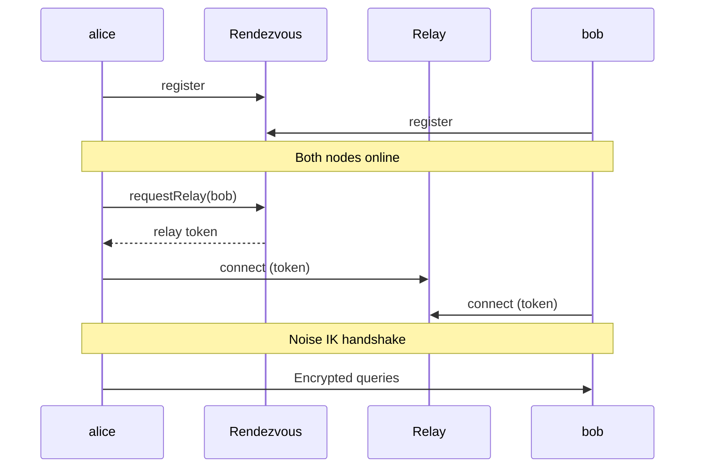

# Multi-Machine Setup

Run Mecha agents across multiple machines and route queries between them.

Mecha supports two connection modes. Choose based on your network:

| Mode | Best For | Requirements |
|------|----------|-------------|
| **P2P (invite)** | Internet, NAT, no port forwarding | Both machines can reach `rendezvous.mecha.im` |
| **HTTP (direct)** | LAN, VPN, controlled networks | Network connectivity + shared API keys |

---

## P2P Setup (Recommended)

No firewall rules, no port forwarding, no shared secrets. Just exchange an invite code.

### Prerequisites

- Mecha installed on each machine
- Internet access (to reach the rendezvous server)

### Step 1: Initialize Nodes

On each machine:

```bash
mecha node init
```

This creates an Ed25519 identity keypair and X25519 Noise key in `~/.mecha/identity/`.

### Step 2: Create an Invite

On machine A (alice):

```bash
mecha node invite
```

Output:

```
mecha://invite/eyJpbnZpdGVyTm...
Expires: 2026-02-28T12:00:00Z (24h)
Share this code with your peer.
```

### Step 3: Accept the Invite

On machine B (bob):

```bash
mecha node join mecha://invite/eyJpbnZpdGVyTm...
```

Output:

```
Invite accepted on server (inviter notified)
Peer added: alice (managed)
```

Both nodes now know each other. Alice is also notified in real-time via the rendezvous server.

### Step 4: Spawn Agents

```bash
# On alice
mecha spawn coder ~/project --tags dev

# On bob
mecha spawn analyst ~/data --tags data
```

### Step 5: Set Up Permissions

```bash
# On alice — allow coder to query analyst on bob
mecha acl grant coder query analyst@bob

# On bob — allow incoming queries from alice
mecha acl grant coder@alice query analyst
```

Both sides must approve — double-check enforcement.

### Step 6: Test

```bash
# On alice — verify bob is reachable
mecha node ping bob

# On alice — send a cross-node query
mecha chat coder "Ask analyst@bob to summarize the sales data"
```

The query routes through an encrypted SecureChannel — no HTTP ports exposed, no API keys exchanged.

### Connection Flow



### Invite Options

```bash
# Longer expiry
mecha node invite --expires 7d

# Custom rendezvous server
mecha node invite --server wss://my-rendezvous.example.com
```

---

## HTTP Setup

For LAN/VPN environments where you prefer direct connections with full control.

### Prerequisites

- Mecha installed on each machine
- Network connectivity between machines (same LAN, VPN, or public IP)
- An API key shared between nodes for authentication

### Step 1: Initialize Nodes

On each machine:

```bash
mecha node init
```

### Step 2: Start Agent Servers

Each machine needs an agent server to accept incoming queries:

```bash
# On alice
export MECHA_AGENT_API_KEY=shared-secret-alice
mecha agent start --host 0.0.0.0

# On bob
export MECHA_AGENT_API_KEY=shared-secret-bob
mecha agent start --host 0.0.0.0
```

::: warning
Using `--host 0.0.0.0` exposes the agent server to the network. Only do this on trusted networks or behind a firewall.
:::

### Step 3: Register Nodes

Each machine registers the other as a known node:

```bash
# On alice — register bob
mecha node add bob 192.168.1.50 --port 7660 --api-key shared-secret-bob

# On bob — register alice
mecha node add alice 192.168.1.100 --port 7660 --api-key shared-secret-alice
```

### Step 4: Spawn Agents

```bash
# On alice
mecha spawn coder ~/project --tags dev

# On bob
mecha spawn analyst ~/data --tags data
```

### Step 5: Set Up Permissions

```bash
# On alice
mecha acl grant coder query analyst@bob

# On bob
mecha acl grant coder@alice query analyst
```

### Step 6: Test

```bash
# On alice
mecha node ping bob
mecha chat coder "Ask analyst@bob to summarize the sales data"
```

---

## Verifying Node Connections

```bash
# List all registered nodes with their type
mecha node ls
```

Example output:

```
Name    Type      Host           Port   Added
alice   managed   —              —      2026-02-27T10:00:00Z
bob     http      192.168.1.50   7660   2026-02-27T10:00:00Z
```

- **managed** — P2P node (connected via invite, routes through relay)
- **http** — direct node (connected via `node add`, routes through agent server)

## Network Requirements

### P2P Mode

| Direction | Destination | Protocol | Purpose |
|-----------|-------------|----------|---------|
| Outbound | `rendezvous.mecha.im:443` | WSS | Peer discovery + signaling |
| Outbound | `relay.mecha.im:443` | WSS | Encrypted channel transport |

No inbound ports needed. Works behind NAT and firewalls.

### HTTP Mode

| Direction | Port | Protocol | Purpose |
|-----------|------|----------|---------|
| Inbound | 7660 | HTTP | Agent server (mesh queries) |
| Internal | 7700-7799 | HTTP | CASA runtime APIs (localhost only) |
| Internal | 7600 | HTTP | Metering proxy (localhost only) |

Only port 7660 needs to be accessible between machines.

## Troubleshooting

### P2P Mode

**"rendezvous server unreachable"**

- Check internet connectivity
- Verify the rendezvous URL: `mecha node ping bob --server wss://rendezvous.mecha.im`
- Check if WebSocket connections are blocked by a proxy/firewall

**"offline (not registered on rendezvous)"**

- Ensure the peer has run `mecha node init` and their machine is online
- The peer may need to run a command that triggers rendezvous registration

**"Cannot accept own invite"**

- You cannot join your own invite code — share it with a different machine

### HTTP Mode

**"Connection refused" to remote node**

- Check that the agent server is running: `mecha agent status`
- Verify the host/port: `mecha node ls`
- Check firewall rules for port 7660

**"Unauthorized" from remote node**

- Verify the API key matches: the key in `mecha node add` must match the remote node's `MECHA_AGENT_API_KEY`

### Both Modes

**"Access denied" for cross-node query**

- Check ACL on both sides — source node AND target node must have matching grants
- Use `mecha acl show` on each machine to verify rules
