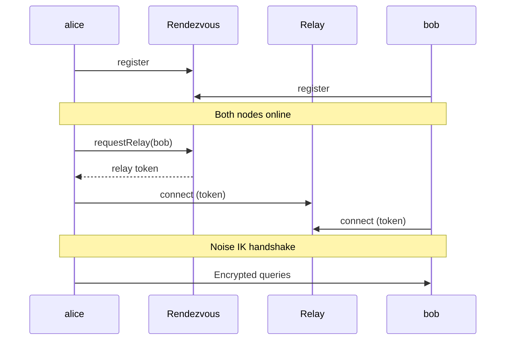

# Multi-Machine Setup

Run Mecha agents across multiple machines and route queries between them.

Mecha supports two connection modes. Choose based on your network:

| Mode | Best For | Requirements |
|------|----------|-------------|
| **P2P (invite)** | Internet, NAT, no port forwarding | Both machines can reach `rendezvous.mecha.im` |
| **HTTP (direct)** | LAN, VPN, controlled networks | Network connectivity between machines |

---

## P2P Setup (Recommended)

No firewall rules, no port forwarding, no shared secrets. Just exchange an invite code.

### Prerequisites

- Mecha installed on each machine
- Internet access (to reach the rendezvous server)

### Step 1: Initialize Nodes

On each machine:

```bash
mecha node init
```

This creates an Ed25519 identity keypair and X25519 Noise key in `~/.mecha/identity/`.

### Step 2: Create an Invite

On machine A (alice):

```bash
mecha node invite
```

Output:

```
mecha://invite/eyJpbnZpdGVyTm...
Expires: 2026-02-28T12:00:00Z (24h)
Share this code with your peer.
```

### Step 3: Accept the Invite

On machine B (bob):

```bash
mecha node join mecha://invite/eyJpbnZpdGVyTm...
```

Output:

```
Invite accepted on server (inviter notified)
Peer added: alice (managed)
```

Both nodes now know each other. Alice is also notified in real-time via the rendezvous server.

### Step 4: Spawn Agents

```bash
# On alice
mecha bot spawn coder ~/project --tags dev

# On bob
mecha bot spawn analyst ~/data --tags data
```

### Step 5: Set Up Permissions

```bash
# On alice — allow coder to query analyst on bob
mecha acl grant coder query analyst@bob

# On bob — allow incoming queries from alice
mecha acl grant coder@alice query analyst
```

Both sides must approve — double-check enforcement.

### Step 6: Test

```bash
# On alice — verify bob is reachable
mecha node ping bob

# On alice — send a cross-node query
mecha bot chat coder "Ask analyst@bob to summarize the sales data"
```

The query routes through an encrypted SecureChannel — no HTTP ports exposed, no API keys exchanged.

### Connection Flow



### Invite Options

```bash
# Longer expiry
mecha node invite --expires 7d

# Custom rendezvous server
mecha node invite --server wss://my-rendezvous.example.com
```

---

## HTTP Setup

For LAN/VPN environments where you prefer direct connections with full control.

### Prerequisites

- Mecha installed on each machine
- Network connectivity between machines (same LAN, VPN, or public IP)

### Step 1: Initialize Nodes

On each machine:

```bash
mecha node init
```

### Step 2: Start Agent Servers

Each machine needs an agent server to accept incoming queries:

```bash
# On alice
mecha agent start --host 0.0.0.0

# On bob
mecha agent start --host 0.0.0.0
```

::: warning
Using `--host 0.0.0.0` exposes the agent server to the network. Only do this on trusted networks or behind a firewall.
:::

### Step 3: Register Nodes

Each machine registers the other as a known node:

```bash
# On alice — register bob
mecha node add bob 192.168.1.50 --port 7660 --api-key <key>

# On bob — register alice
mecha node add alice 192.168.1.100 --port 7660 --api-key <key>
```

### Step 4: Spawn Agents

```bash
# On alice
mecha bot spawn coder ~/project --tags dev

# On bob
mecha bot spawn analyst ~/data --tags data
```

### Step 5: Set Up Permissions

```bash
# On alice
mecha acl grant coder query analyst@bob

# On bob
mecha acl grant coder@alice query analyst
```

### Step 6: Test

```bash
# On alice
mecha node ping bob
mecha bot chat coder "Ask analyst@bob to summarize the sales data"
```

---

## Auto-Discovery Setup

For Tailscale (or other overlay) networks, Mecha can automatically discover peers without manual `node add`.

### Step 1: Set Cluster Key

On each machine, add the same cluster key to `.env`:

```bash
MECHA_CLUSTER_KEY=my-secret-cluster-key
```

### Step 2: Start Agent Servers

```bash
mecha agent start --host 0.0.0.0
```

The agent scans Tailscale peers every 60 seconds and performs a timing-safe handshake with each one. Nodes with matching cluster keys are added to `nodes-discovered.json` automatically.

### Step 3: View Discovered Nodes

```bash
mecha node ls
```

The `Source` column shows `manual` or `discovered` for each node.

### Step 4: Promote (Optional)

To make a discovered node permanent:

```bash
mecha node promote bob
```

This moves the node from `nodes-discovered.json` to `nodes.json`, so it persists even if discovery is disabled.

See the [Mesh Networking](/features/mesh-networking#auto-discovery) page for full details on discovery behavior and security.

---

## Verifying Node Connections

```bash
# List all registered nodes with their type
mecha node ls
```

Example output:

```
Name    Type      Host           Port   Added
alice   managed   —              —      2026-02-27T10:00:00Z
bob     http      192.168.1.50   7660   2026-02-27T10:00:00Z
```

- **managed** — P2P node (connected via invite, routes through relay)
- **http** — direct node (connected via `node add`, routes through agent server)

## Network Requirements

### P2P Mode

| Direction | Destination | Protocol | Purpose |
|-----------|-------------|----------|---------|
| Outbound | `rendezvous.mecha.im:443` | WSS | Peer discovery + signaling |
| Outbound | `relay.mecha.im:443` | WSS | Encrypted channel transport |

No inbound ports needed. Works behind NAT and firewalls.

### HTTP Mode

| Direction | Port | Protocol | Purpose |
|-----------|------|----------|---------|
| Inbound | 7660 | HTTP | Agent server (mesh queries) |
| Internal | 7700-7799 | HTTP | bot runtime APIs (localhost only) |
| Internal | 7600 | HTTP | Metering proxy (localhost only) |

Only port 7660 needs to be accessible between machines.

## Troubleshooting

### P2P Mode

**"rendezvous server unreachable"**

- Check internet connectivity
- Verify the rendezvous URL: `mecha node ping bob --server wss://rendezvous.mecha.im`
- Check if WebSocket connections are blocked by a proxy/firewall

**"offline (not registered on rendezvous)"**

- Ensure the peer has run `mecha node init` and their machine is online
- The peer may need to run a command that triggers rendezvous registration

**"Cannot accept own invite"**

- You cannot join your own invite code — share it with a different machine

### HTTP Mode

**"Connection refused" to remote node**

- Check that the agent server is running: `mecha agent status`
- Verify the host/port: `mecha node ls`
- Check firewall rules for port 7660

### Both Modes

**"Access denied" for cross-node query**

- Check ACL on both sides — source node AND target node must have matching grants
- Use `mecha acl show` on each machine to verify rules

---

## API Reference

This section documents the discovery registry functions from `@mecha/core` that power the auto-discovery and node management features.

### Discovered Node Registry

**Source:** `packages/core/src/discovered-registry.ts`

The discovered node registry manages nodes found via auto-discovery (Tailscale scan, mDNS). These nodes are stored in `nodes-discovered.json`, separate from manually added nodes in `nodes.json`.

#### `DiscoveredNode`

```ts
interface DiscoveredNode {
  name: string;
  host: string;
  port: number;
  apiKey: string;
  fingerprint?: string;
  source: "tailscale" | "mdns";
  lastSeen: string;   // ISO 8601 datetime
  addedAt: string;     // ISO 8601 datetime
}
```

| Field | Description |
|-------|-------------|
| `name` | Node name (unique identifier). |
| `host` | IP address or hostname of the discovered node. |
| `port` | Agent server port (typically 7660). |
| `apiKey` | API key exchanged during the discovery handshake. |
| `fingerprint` | Optional Ed25519 fingerprint (16-char hex). |
| `source` | How the node was discovered: `"tailscale"` (Tailscale peer scan) or `"mdns"` (mDNS, future). |
| `lastSeen` | ISO 8601 timestamp of the last successful health check. |
| `addedAt` | ISO 8601 timestamp of when the node was first discovered. |

#### `readDiscoveredNodes(mechaDir)`

```ts
function readDiscoveredNodes(mechaDir: string): DiscoveredNode[]
```

Read all discovered nodes from `nodes-discovered.json`. Returns an empty array if the file does not exist or contains invalid data.

**Parameters:**

| Parameter | Type | Description |
|-----------|------|-------------|
| `mechaDir` | `string` | Path to the `.mecha` directory. |

**Example:**

```ts
import { readDiscoveredNodes } from "@mecha/core";

const nodes = readDiscoveredNodes("/home/alice/.mecha");
for (const node of nodes) {
  console.log(`${node.name} at ${node.host}:${node.port} (${node.source})`);
}
```

#### `writeDiscoveredNode(mechaDir, node)`

```ts
function writeDiscoveredNode(mechaDir: string, node: DiscoveredNode): void
```

Write or update a discovered node entry. If a node with the same name already exists, its fields are updated (except `addedAt`, which is preserved from the original entry). Uses atomic file write (write to temp file, then rename).

**Parameters:**

| Parameter | Type | Description |
|-----------|------|-------------|
| `mechaDir` | `string` | Path to the `.mecha` directory. |
| `node` | `DiscoveredNode` | The node entry to write. Validated against the Zod schema before writing. |

**Example:**

```ts
import { writeDiscoveredNode } from "@mecha/core";

writeDiscoveredNode("/home/alice/.mecha", {
  name: "bob",
  host: "100.100.1.9",
  port: 7660,
  apiKey: "exchanged-key",
  source: "tailscale",
  lastSeen: new Date().toISOString(),
  addedAt: new Date().toISOString(),
});
```

#### `refreshDiscoveredNodes(mechaDir, hosts, lastSeen)`

```ts
function refreshDiscoveredNodes(mechaDir: string, hosts: Set<string>, lastSeen: string): number
```

Bulk-update `lastSeen` timestamps for nodes matching the given hosts. Performs a single file write for efficiency.

**Parameters:**

| Parameter | Type | Description |
|-----------|------|-------------|
| `mechaDir` | `string` | Path to the `.mecha` directory. |
| `hosts` | `Set<string>` | Set of host addresses to match. |
| `lastSeen` | `string` | ISO 8601 timestamp to set as the new `lastSeen`. |

**Returns:** The number of nodes that were updated.

#### `removeDiscoveredNode(mechaDir, name)`

```ts
function removeDiscoveredNode(mechaDir: string, name: string): boolean
```

Remove a discovered node by name. Returns `false` if the node was not found.

**Parameters:**

| Parameter | Type | Description |
|-----------|------|-------------|
| `mechaDir` | `string` | Path to the `.mecha` directory. |
| `name` | `string` | Name of the node to remove. |

#### `cleanupExpiredNodes(mechaDir, ttlMs)`

```ts
function cleanupExpiredNodes(mechaDir: string, ttlMs: number): string[]
```

Remove nodes whose `lastSeen` timestamp is older than `ttlMs` milliseconds ago. Returns the names of removed nodes.

**Parameters:**

| Parameter | Type | Description |
|-----------|------|-------------|
| `mechaDir` | `string` | Path to the `.mecha` directory. |
| `ttlMs` | `number` | Time-to-live in milliseconds. Nodes not seen within this window are removed. |

**Example:**

```ts
import { cleanupExpiredNodes } from "@mecha/core";

// Remove nodes not seen in the last hour
const removed = cleanupExpiredNodes("/home/alice/.mecha", 60 * 60 * 1000);
console.log("Removed expired nodes:", removed);
```

#### `promoteDiscoveredNode(mechaDir, name)`

```ts
function promoteDiscoveredNode(mechaDir: string, name: string): NodeEntry | undefined
```

Promote a discovered node to the manual `nodes.json` registry. The node is removed from `nodes-discovered.json` and added to `nodes.json` (if not already present). Returns the new `NodeEntry`, or `undefined` if the node was not found in discovered nodes.

**Parameters:**

| Parameter | Type | Description |
|-----------|------|-------------|
| `mechaDir` | `string` | Path to the `.mecha` directory. |
| `name` | `string` | Name of the discovered node to promote. |

**Example:**

```ts
import { promoteDiscoveredNode } from "@mecha/core";

const entry = promoteDiscoveredNode("/home/alice/.mecha", "bob");
if (entry) {
  console.log(`Promoted ${entry.name} to manual node`);
}
```

### Discovery Filter (`@mecha/core`)

**Source:** `packages/core/src/discovery.ts`

These types and functions power bot discovery across the mesh, enabling queries like `+research` (all bots tagged "research").

#### `DiscoverableEntry`

```ts
interface DiscoverableEntry {
  tags: string[];
  expose: string[];
}
```

A bot entry that can be matched against discovery filters.

#### `DiscoveryFilter`

```ts
interface DiscoveryFilter {
  tag?: string;
  tags?: string[];
  capability?: string;
}
```

Filter criteria for discovering bots. All specified fields are AND-ed together.

| Field | Description |
|-------|-------------|
| `tag` | Entry must have this single tag. |
| `tags` | Entry must have ALL of these tags. |
| `capability` | Entry must expose this capability (in its `expose` list). |

#### `DiscoveryIndex`

```ts
interface DiscoveryIndex {
  version: 1;
  updatedAt: string;
  bots: DiscoveryIndexEntry[];
}
```

The discovery index file persisted at `mechaDir/discovery.json`.

#### `DiscoveryIndexEntry`

```ts
interface DiscoveryIndexEntry {
  name: string;
  tags: string[];
  expose: string[];
  state: string;
}
```

A single bot entry in the discovery index.

#### `matchesDiscoveryFilter(entry, filter)`

```ts
function matchesDiscoveryFilter(entry: DiscoverableEntry, filter: DiscoveryFilter): boolean
```

Returns `true` if the entry matches all provided filter criteria.

**Example:**

```ts
import { matchesDiscoveryFilter } from "@mecha/core";

const entry = { tags: ["research", "data"], expose: ["query"] };

matchesDiscoveryFilter(entry, { tag: "research" });           // true
matchesDiscoveryFilter(entry, { tags: ["research", "data"] }); // true
matchesDiscoveryFilter(entry, { capability: "query" });        // true
matchesDiscoveryFilter(entry, { tag: "dev" });                 // false
```
