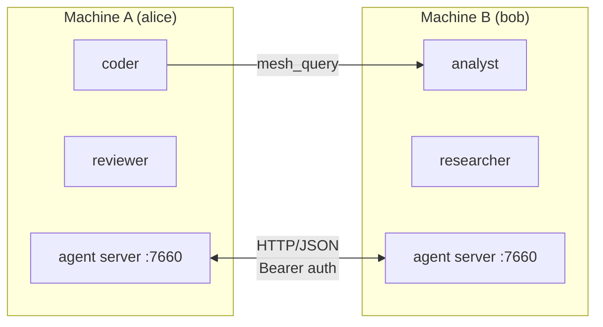

# Mesh Networking

Mecha agents can communicate across machines through the mesh. Each node runs an **agent server** that routes queries between local and remote CASAs.

## Architecture



## Setting Up Nodes

### Initialize Your Node

```bash
mecha node init
```

This generates an Ed25519 keypair for your node's cryptographic identity.

### Add a Remote Node

```bash
mecha node add bob --host 192.168.1.50 --port 7660 --api-key secret-key
```

### List Known Nodes

```bash
mecha node ls
```

### Remove a Node

```bash
mecha node rm bob
```

## Starting the Agent Server

The agent server handles incoming queries from remote nodes:

```bash
# Start with API key
mecha agent start --api-key my-secret

# Or use an environment variable
export MECHA_AGENT_API_KEY=my-secret
mecha agent start

# Custom host/port
mecha agent start --host 0.0.0.0 --port 7660
```

By default, the agent server binds to `127.0.0.1` (localhost only). Use `--host 0.0.0.0` to accept connections from other machines.

```bash
# Check status
mecha agent status
```

## Cross-Node Queries

Once nodes are connected, queries route automatically:

```bash
# Query an agent on another node
mecha chat coder "Ask analyst@bob about the sales data"
```

The routing path:

1. `coder` on alice makes a `mesh_query` MCP call targeting `analyst@bob`
2. Alice's router looks up `bob` in the node registry
3. Alice sends an authenticated HTTP request to bob's agent server
4. Bob's agent server validates the request and checks its local ACL
5. Bob forwards the query to `analyst`
6. The response flows back through the same path

## Security

### Authentication

Every cross-node request includes:

- **Bearer token** — the target node's API key (timing-safe comparison)
- **X-Mecha-Source** — the fully qualified source address (e.g., `coder@alice`)

### SSRF Protection

The agent fetch layer validates remote hosts before connecting:

- Private/loopback IPs are rejected by default (`127.0.0.1`, `10.x`, `192.168.x`, etc.)
- IPv4-mapped IPv6 addresses are detected and blocked (`::ffff:127.0.0.1`)
- Bracketed IPv6 literals are canonicalized before validation

### Ed25519 Signatures

Nodes have Ed25519 keypairs for message signing. Signature verification is available on routing endpoints — when a node's public key is configured, requests must include a valid `X-Mecha-Signature` header.

## Multi-Turn Mesh Conversations

The `mesh_query` MCP tool supports an optional `sessionId` parameter for multi-turn conversations across the mesh:

```
mesh_query({ target: "analyst@bob", message: "Analyze the data", sessionId: "abc123" })
```

When a mesh query creates a new session on the target, the response includes `_meta.sessionId`. Passing this ID in subsequent queries continues the same conversation on the remote CASA — the target retains full context from prior turns.

## Addressing

| Format | Meaning |
|--------|---------|
| `analyst` | Local CASA on this node |
| `analyst@bob` | CASA on remote node "bob" |
| `+research` | All CASAs tagged "research" (local + remote) |
