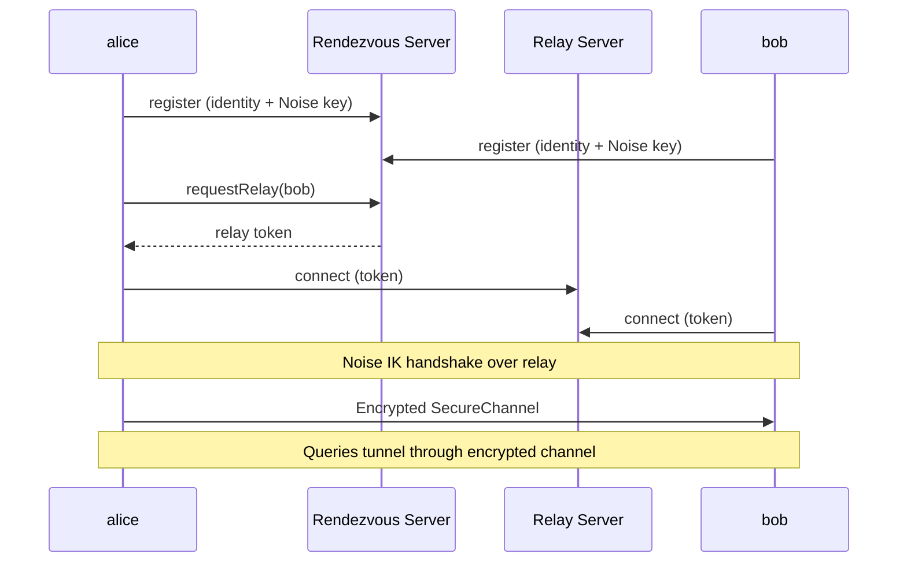
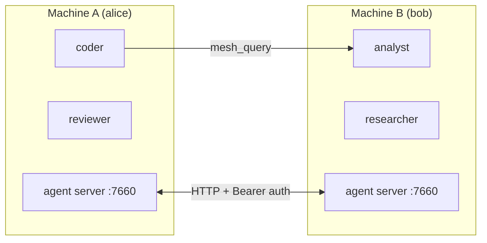
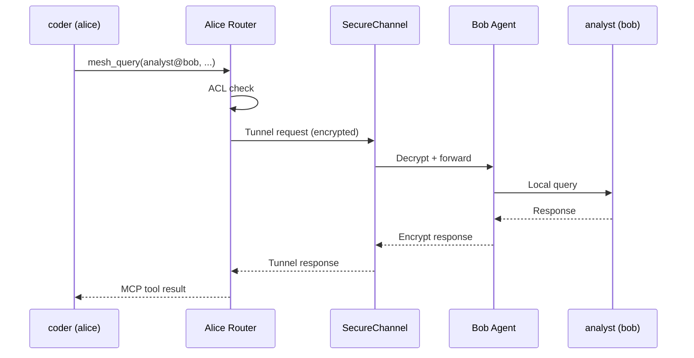
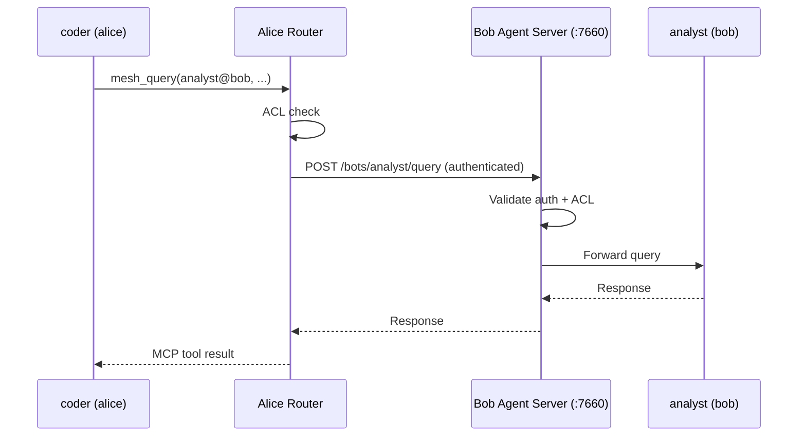

# Mesh Networking

Mecha agents can communicate across machines through the mesh. Nodes connect via two modes: **P2P** (invite-based, encrypted channels) and **HTTP** (direct agent server connections).

## Connection Modes

Mecha supports two types of node connections:

| Mode | Setup | Transport | Use Case |
|------|-------|-----------|----------|
| **P2P (managed)** | `node invite` + `node join` | Encrypted channel via relay | Zero-config, NAT-friendly, no port forwarding |
| **HTTP (direct)** | `node add` | HTTP with Bearer auth | LAN/VPN, full control over networking |

## Architecture

### P2P Mode (Managed Nodes)



P2P nodes use a rendezvous server for discovery and a relay server for transport. All communication is end-to-end encrypted using the [Noise IK](http://noiseprotocol.org/) handshake pattern (X25519 + ChaCha20-Poly1305).

### HTTP Mode (Direct Nodes)



HTTP nodes communicate directly through agent servers. This requires network connectivity (same LAN, VPN, or open ports).

## Auto-Discovery

Nodes can automatically find each other on the same Tailscale network (or LAN via mDNS in a future release). This eliminates manual `node add` for machines that share a cluster key.

### Enable Auto-Discovery

Set the same `MECHA_CLUSTER_KEY` in `.env` on all machines:

```bash
MECHA_CLUSTER_KEY=my-secret-cluster-key
```

When the agent starts with this key set, it:

1. Scans Tailscale peers every 60 seconds via `tailscale status --json`
2. Probes each peer's port 7660 with `GET /healthz` to check if it's running Mecha
3. Exchanges cluster keys via `POST /discover/handshake` (timing-safe comparison)
4. Stores discovered nodes in `nodes-discovered.json` (separate from manual `nodes.json`)

### Discovered vs Manual Nodes

| Property | Manual (`nodes.json`) | Discovered (`nodes-discovered.json`) |
|----------|----------------------|--------------------------------------|
| Created by | `node add` or `node join` | Auto-discovery loop |
| Persistence | Permanent | TTL-based (removed after 1 hour offline) |
| Priority | Wins on name conflicts | Lower priority |
| Promote | — | `mecha node promote <name>` |

### View Discovered Nodes

```bash
mecha node ls
```

The `Source` column shows `manual` or `discovered` for each node.

### Promote a Discovered Node

To make a discovered node permanent (survives even if auto-discovery is disabled):

```bash
mecha node promote bob
```

### Security

- Discovery is **opt-in** — only active when `MECHA_CLUSTER_KEY` is set
- Cluster key is compared using timing-safe equality
- Failed handshakes (wrong key) return `403` with no details
- The handshake endpoint (`/discover/handshake`) bypasses session auth but requires the cluster key in the request body

## Setting Up P2P Nodes (Recommended)

### 1. Initialize Both Nodes

On each machine, generate an identity:

```bash
mecha node init
```

This creates an Ed25519 keypair and X25519 Noise key for your node.

### 2. Create and Share an Invite

On the first machine:

```bash
mecha node invite
```

This outputs an invite code like `mecha://invite/eyJ...`. Share it with your peer.

| Option | Description |
|--------|-------------|
| `--expires <duration>` | Invite expiry (default: `24h`). Accepts: `1h`, `6h`, `24h`, `7d` |
| `--server <url>` | Rendezvous server URL |

### 3. Accept the Invite

On the second machine:

```bash
mecha node join mecha://invite/eyJ...
```

The peer is added as a **managed** node. Both nodes are now connected through the rendezvous infrastructure.

### 4. Test the Connection

```bash
mecha node ping bob
```

For managed nodes, this checks online status via the rendezvous server and reports latency.

### 5. List Nodes

```bash
mecha node ls
```

Displays all nodes with their type (`managed` or `http`), host, port, and when they were added.

## Setting Up HTTP Nodes

For LAN/VPN environments where you prefer direct connections:

### Add a Remote Node

```bash
mecha node add bob 192.168.1.50 --port 7660 --api-key <key>
```

### Start the Agent Server

```bash
mecha agent start --host 0.0.0.0 --port 7660
```

By default, the agent server binds to `127.0.0.1` (localhost only). Use `--host 0.0.0.0` to accept connections from other machines.

## Cross-Node Queries

Once nodes are connected (either mode), queries route automatically:

```bash
mecha bot chat coder "Ask analyst@bob about the sales data"
```

### Routing: Managed Nodes



For managed nodes, the router tunnels requests through the encrypted SecureChannel. No HTTP ports or API keys are needed on either side.

### Routing: HTTP Nodes



## Security

### P2P Encryption

Managed nodes use end-to-end encryption:

- **Noise IK handshake** — X25519 Diffie-Hellman key exchange with ChaCha20-Poly1305 AEAD
- **Mutual authentication** — both sides verify the peer's Ed25519 fingerprint during the handshake
- **Forward secrecy** — ephemeral keys are generated per session

### Ed25519 Signatures (HTTP Mode)

HTTP routing requests include signed envelopes for tamper detection:

- **X-Mecha-Signature** — Ed25519 signature over the canonical request envelope
- **X-Mecha-Timestamp** — Unix timestamp (rejects requests outside a 5-minute window)
- **X-Mecha-Nonce** — Unique nonce per request (prevents replay attacks within the timestamp window)

The canonical envelope format: `method\npath\nsource\ntimestamp\nnonce\nbody`

### Authentication

Every cross-node request includes:

- **X-Mecha-Source** — the fully qualified source address (e.g., `coder@alice`)

### SSRF Protection

The agent fetch layer validates remote hosts before connecting:

- Private/loopback IPs are rejected by default (`127.0.0.1`, `10.x`, `192.168.x`, etc.)
- IPv4-mapped IPv6 addresses are detected and blocked (`::ffff:127.0.0.1`)
- Bracketed IPv6 literals are canonicalized before validation

### Relay Token Validation

Relay tokens use HMAC-SHA256 for stateless verification. Each token includes the peer name, a random nonce, an expiration timestamp, and the issuing server ID. Tokens are validated cryptographically — no server-side state is needed.

## Decentralized Mode

By default, all nodes use the central rendezvous server for discovery. Mecha supports a decentralized mode where each node can run its own embedded rendezvous server, eliminating the central server as a single point of failure.

### Embedded Server

Start an embedded rendezvous server alongside the agent:

```bash
mecha agent start --server
mecha agent start --server --server-port 7681
mecha agent start --server --public-addr wss://my-server.example.com
```

When `--server` is enabled, the agent starts an in-process rendezvous server. Invite codes automatically include both the local server URL and the central fallback, enabling multi-URL failover.

### Multi-URL Invites

When an embedded server is running, `mecha node invite` produces invite codes with multiple rendezvous URLs:

```bash
# With embedded server running at ws://my-server:7681
mecha node invite
# → Invite code contains [ws://my-server:7681, wss://rendezvous.mecha.im]
```

The joining node tries each URL in order. If the first (embedded) server is unreachable, it falls back to the central server automatically.

### Gossip Protocol

When multiple nodes run embedded servers, they propagate peer information via a gossip protocol:

- Servers authenticate each other using Ed25519 challenge-response (against their `nodes.json` registry)
- Peer records (name, public key, server URL, last-seen timestamp) propagate across servers
- A hop count (max 3) limits gossip propagation depth
- Vector clocks prevent redundant synchronization
- Records expire after 5 minutes (TTL) — they are routing hints, not a trust store

This enables peer discovery across a decentralized mesh without relying on any single server.

## Multi-Turn Mesh Conversations

The `mesh_query` MCP tool supports an optional `sessionId` parameter for multi-turn conversations across the mesh:

```
mesh_query({ target: "analyst@bob", message: "Analyze the data", sessionId: "abc123" })
```

When a mesh query creates a new session on the target, the response includes `_meta.sessionId`. Passing this ID in subsequent queries continues the same conversation on the remote bot — the target retains full context from prior turns.

## Addressing

| Format | Meaning |
|--------|---------|
| `analyst` | Local bot on this node |
| `analyst@bob` | bot on remote node "bob" |
| `+research` | All bots tagged "research" (local + remote) |

## Infrastructure Services

| Service | Default URL | Port | Purpose |
|---------|-------------|------|---------|
| Rendezvous server | `wss://rendezvous.mecha.im` | 7680 | Peer discovery, signaling, invite exchange |
| Relay server | `wss://relay.mecha.im` | 7680 | Encrypted channel transport for managed nodes |
| Embedded server | `localhost:7681` | 7681 | Local rendezvous server (decentralized mode via `--server`) |
| Agent server | `localhost:7660` | 7660 | HTTP mesh routing for direct nodes |
