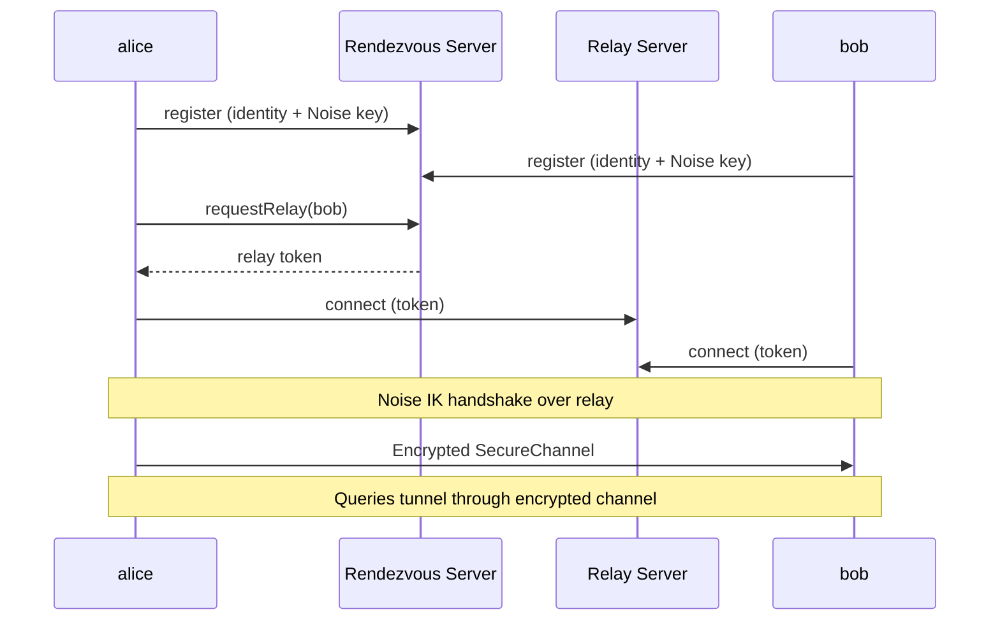
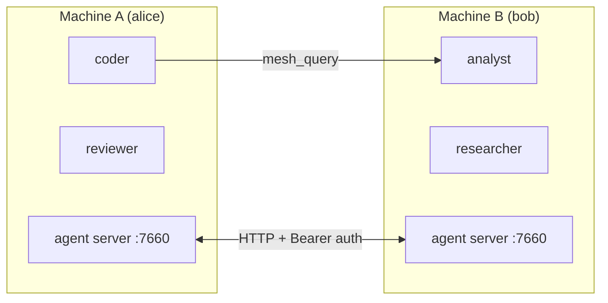
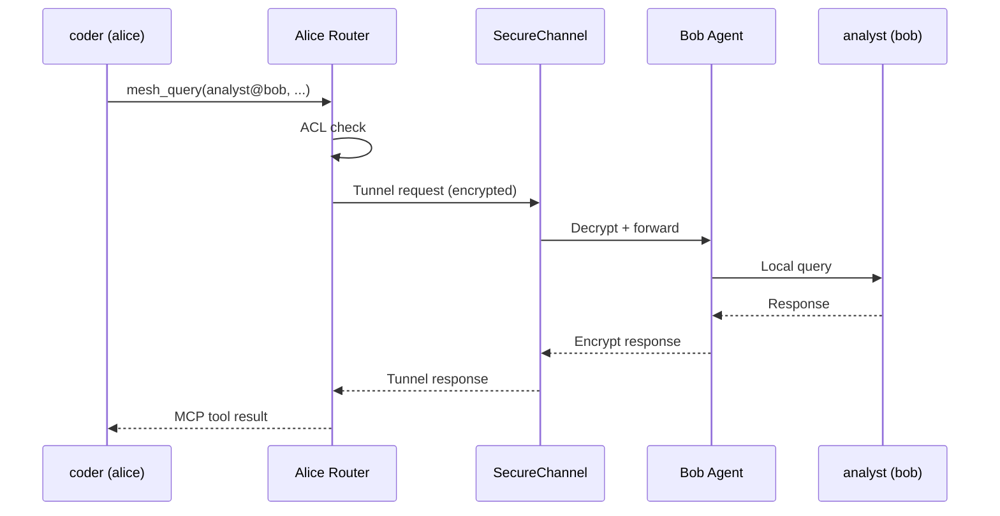
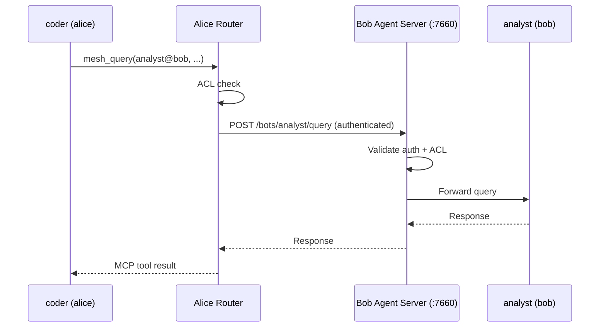

# Mesh Networking

Mecha agents can communicate across machines through the mesh. Nodes connect via two modes: **P2P** (invite-based, encrypted channels) and **HTTP** (direct agent server connections).

## Connection Modes

Mecha supports two types of node connections:

| Mode | Setup | Transport | Use Case |
|------|-------|-----------|----------|
| **P2P (managed)** | `node invite` + `node join` | Encrypted channel via relay | Zero-config, NAT-friendly, no port forwarding |
| **HTTP (direct)** | `node add` | HTTP with Bearer auth | LAN/VPN, full control over networking |

## Architecture

### P2P Mode (Managed Nodes)



P2P nodes use a rendezvous server for discovery and a relay server for transport. All communication is end-to-end encrypted using the [Noise IK](http://noiseprotocol.org/) handshake pattern (X25519 + ChaCha20-Poly1305).

### HTTP Mode (Direct Nodes)



HTTP nodes communicate directly through agent servers. This requires network connectivity (same LAN, VPN, or open ports).

## Auto-Discovery

Nodes can automatically find each other on the same Tailscale network (or LAN via mDNS in a future release). This eliminates manual `node add` for machines that share a cluster key.

### Enable Auto-Discovery

Set the same `MECHA_CLUSTER_KEY` in `.env` on all machines:

```bash
MECHA_CLUSTER_KEY=my-secret-cluster-key
```

When the agent starts with this key set, it:

1. Scans Tailscale peers every 60 seconds via `tailscale status --json`
2. Probes each peer's port 7660 with `GET /healthz` to check if it's running Mecha
3. Exchanges cluster keys via `POST /discover/handshake` (timing-safe comparison)
4. Stores discovered nodes in `nodes-discovered.json` (separate from manual `nodes.json`)

### Discovered vs Manual Nodes

| Property | Manual (`nodes.json`) | Discovered (`nodes-discovered.json`) |
|----------|----------------------|--------------------------------------|
| Created by | `node add` or `node join` | Auto-discovery loop |
| Persistence | Permanent | TTL-based (removed after 1 hour offline) |
| Priority | Wins on name conflicts | Lower priority |
| Promote | — | `mecha node promote <name>` |

### View Discovered Nodes

```bash
mecha node ls
```

The `Source` column shows `manual` or `discovered` for each node.

### Promote a Discovered Node

To make a discovered node permanent (survives even if auto-discovery is disabled):

```bash
mecha node promote bob
```

### Security

- Discovery is **opt-in** — only active when `MECHA_CLUSTER_KEY` is set
- Cluster key is compared using timing-safe equality
- Failed handshakes (wrong key) return `403` with no details
- The handshake endpoint (`/discover/handshake`) bypasses session auth but requires the cluster key in the request body

## Setting Up P2P Nodes (Recommended)

### 1. Initialize Both Nodes

On each machine, generate an identity:

```bash
mecha node init
```

This creates an Ed25519 keypair and X25519 Noise key for your node.

### 2. Create and Share an Invite

On the first machine:

```bash
mecha node invite
```

This outputs an invite code like `mecha://invite/eyJ...`. Share it with your peer.

| Option | Description |
|--------|-------------|
| `--expires <duration>` | Invite expiry (default: `24h`). Accepts: `1h`, `6h`, `24h`, `7d` |
| `--server <url>` | Rendezvous server URL |

### 3. Accept the Invite

On the second machine:

```bash
mecha node join mecha://invite/eyJ...
```

The peer is added as a **managed** node. Both nodes are now connected through the rendezvous infrastructure.

### 4. Test the Connection

```bash
mecha node ping bob
```

For managed nodes, this checks online status via the rendezvous server and reports latency.

### 5. List Nodes

```bash
mecha node ls
```

Displays all nodes with their type (`managed` or `http`), host, port, and when they were added.

## Setting Up HTTP Nodes

For LAN/VPN environments where you prefer direct connections:

### Add a Remote Node

```bash
mecha node add bob 192.168.1.50 --port 7660 --api-key <key>
```

### Start the Agent Server

```bash
mecha agent start --host 0.0.0.0 --port 7660
```

By default, the agent server binds to `127.0.0.1` (localhost only). Use `--host 0.0.0.0` to accept connections from other machines.

## Cross-Node Queries

Once nodes are connected (either mode), queries route automatically:

```bash
mecha bot chat coder "Ask analyst@bob about the sales data"
```

### Routing: Managed Nodes



For managed nodes, the router tunnels requests through the encrypted SecureChannel. No HTTP ports or API keys are needed on either side.

### Routing: HTTP Nodes



## Security

### P2P Encryption

Managed nodes use end-to-end encryption:

- **Noise IK handshake** — X25519 Diffie-Hellman key exchange with ChaCha20-Poly1305 AEAD
- **Mutual authentication** — both sides verify the peer's Ed25519 fingerprint during the handshake
- **Forward secrecy** — ephemeral keys are generated per session

### Ed25519 Signatures (HTTP Mode)

HTTP routing requests include signed envelopes for tamper detection:

- **X-Mecha-Signature** — Ed25519 signature over the canonical request envelope
- **X-Mecha-Timestamp** — Unix timestamp (rejects requests outside a 5-minute window)
- **X-Mecha-Nonce** — Unique nonce per request (prevents replay attacks within the timestamp window)

The canonical envelope format: `method\npath\nsource\ntimestamp\nnonce\nbody`

### Authentication

Every cross-node request includes:

- **X-Mecha-Source** — the fully qualified source address (e.g., `coder@alice`)

### SSRF Protection

The agent fetch layer validates remote hosts before connecting:

- Private/loopback IPs are rejected by default (`127.0.0.1`, `10.x`, `192.168.x`, etc.)
- IPv4-mapped IPv6 addresses are detected and blocked (`::ffff:127.0.0.1`)
- Bracketed IPv6 literals are canonicalized before validation

### Relay Token Validation

Relay tokens use HMAC-SHA256 for stateless verification. Each token includes the peer name, a random nonce, an expiration timestamp, and the issuing server ID. Tokens are validated cryptographically — no server-side state is needed.

## Decentralized Mode

By default, all nodes use the central rendezvous server for discovery. Mecha supports a decentralized mode where each node can run its own embedded rendezvous server, eliminating the central server as a single point of failure.

### Embedded Server

Start an embedded rendezvous server alongside the agent:

```bash
mecha agent start --server
mecha agent start --server --server-port 7681
mecha agent start --server --public-addr wss://my-server.example.com
```

When `--server` is enabled, the agent starts an in-process rendezvous server. Invite codes automatically include both the local server URL and the central fallback, enabling multi-URL failover.

### Multi-URL Invites

When an embedded server is running, `mecha node invite` produces invite codes with multiple rendezvous URLs:

```bash
# With embedded server running at ws://my-server:7681
mecha node invite
# → Invite code contains [ws://my-server:7681, wss://rendezvous.mecha.im]
```

The joining node tries each URL in order. If the first (embedded) server is unreachable, it falls back to the central server automatically.

### Gossip Protocol

When multiple nodes run embedded servers, they propagate peer information via a gossip protocol:

- Servers authenticate each other using Ed25519 challenge-response (against their `nodes.json` registry)
- Peer records (name, public key, server URL, last-seen timestamp) propagate across servers
- A hop count (max 3) limits gossip propagation depth
- Vector clocks prevent redundant synchronization
- Records expire after 5 minutes (TTL) — they are routing hints, not a trust store

This enables peer discovery across a decentralized mesh without relying on any single server.

## Multi-Turn Mesh Conversations

The `mesh_query` MCP tool supports an optional `sessionId` parameter for multi-turn conversations across the mesh:

```
mesh_query({ target: "analyst@bob", message: "Analyze the data", sessionId: "abc123" })
```

When a mesh query creates a new session on the target, the response includes `_meta.sessionId`. Passing this ID in subsequent queries continues the same conversation on the remote bot — the target retains full context from prior turns.

## Addressing

| Format | Meaning |
|--------|---------|
| `analyst` | Local bot on this node |
| `analyst@bob` | bot on remote node "bob" |
| `+research` | All bots tagged "research" (local + remote) |

## Infrastructure Services

| Service | Default URL | Port | Purpose |
|---------|-------------|------|---------|
| Rendezvous server | `wss://rendezvous.mecha.im` | 7680 | Peer discovery, signaling, invite exchange |
| Relay server | `wss://relay.mecha.im` | 7680 | Encrypted channel transport for managed nodes |
| Embedded server | `localhost:7681` | 7681 | Local rendezvous server (decentralized mode via `--server`) |
| Agent server | `localhost:7660` | 7660 | HTTP mesh routing for direct nodes |

---

## API Reference

This section documents the public API of the `@mecha/connect` package and mesh-related exports from `@mecha/core`.

### Type Reference

#### `ConnectionType`

```ts
type ConnectionType = "lan" | "direct" | "hole-punched" | "relayed";
```

Describes how two peers are connected. The connect manager selects the best available transport automatically.

#### `NoiseKeyPair`

```ts
interface NoiseKeyPair {
  publicKey: string;   // base64url-encoded X25519 public key
  privateKey: string;  // base64url-encoded X25519 private key
}
```

X25519 key pair used for Noise IK handshake key exchange.

#### `SecureChannel`

The primary abstraction for an encrypted peer-to-peer link. Created after a successful Noise handshake over a relay or hole-punched UDP connection.

```ts
interface SecureChannel {
  readonly peer: NodeName;
  readonly type: ConnectionType;
  readonly latencyMs: number;
  readonly peerFingerprint: string;
  readonly isOpen: boolean;
  send(data: Uint8Array): void;
  onMessage(handler: (data: Uint8Array) => void): void;
  offMessage(handler: (data: Uint8Array) => void): void;
  onClose(handler: (reason: string) => void): void;
  onError(handler: (err: Error) => void): void;
  offError(handler: (err: Error) => void): void;
  close(): void;
}
```

| Property / Method | Description |
|-------------------|-------------|
| `peer` | Name of the remote node. |
| `type` | How the channel is connected (`"lan"`, `"direct"`, `"hole-punched"`, `"relayed"`). |
| `latencyMs` | Measured round-trip latency in milliseconds. |
| `peerFingerprint` | SHA-256 fingerprint (first 16 hex chars) of the peer's public key. |
| `isOpen` | Whether the channel is still open and usable. |
| `send(data)` | Send encrypted data to the peer. Throws if the channel is closed. |
| `onMessage(handler)` | Register a handler for incoming decrypted messages. |
| `offMessage(handler)` | Remove a previously registered message handler. |
| `onClose(handler)` | Register a handler invoked when the channel closes (with a reason string). |
| `onError(handler)` | Register a handler for decryption or transport errors. |
| `offError(handler)` | Remove a previously registered error handler. |
| `close()` | Close the channel and underlying transport. |

#### `InviteOpts`

```ts
interface InviteOpts {
  expiresIn?: number;  // seconds, default: 86400 (24h)
}
```

Options passed to `createInvite()` to control invite expiry.

#### `InviteCode`

```ts
interface InviteCode {
  code: string;       // "mecha://invite/<base64url-payload>"
  token: string;      // raw token for server registration
  expiresAt: string;  // ISO timestamp
}
```

Returned by `createInvite()`. The `code` string is what gets shared with the peer.

#### `InvitePayload`

```ts
interface InvitePayload {
  inviterName: string;
  inviterPublicKey: string;
  inviterFingerprint: string;
  inviterNoisePublicKey: string;
  rendezvousUrl: string;
  rendezvousUrls?: string[];  // multi-URL failover (embedded + central)
  token: string;
  expiresAt: string;
  signature: string;          // Ed25519 signature over all other fields
}
```

The decoded contents of an invite code. Verified with Ed25519 signature on parse.

| Field | Description |
|-------|-------------|
| `inviterName` | Node name of the inviter. |
| `inviterPublicKey` | Ed25519 public key (PEM) of the inviter. |
| `inviterFingerprint` | 16-char hex SHA-256 fingerprint of the inviter's public key. |
| `inviterNoisePublicKey` | X25519 public key (base64url) for Noise handshake. |
| `rendezvousUrl` | Primary rendezvous server URL (ws:// or wss://). |
| `rendezvousUrls` | Ordered list of rendezvous URLs for failover. Present in invites from nodes running embedded servers. |
| `token` | Random 24-byte token (base64url) for invite registration. |
| `expiresAt` | ISO 8601 expiry timestamp. |
| `signature` | Ed25519 signature over all fields except `signature` itself. |

#### `AcceptResult`

```ts
interface AcceptResult {
  peer: NodeName;
  channel?: SecureChannel;  // undefined when P2P infra is not yet deployed
}
```

Returned by `acceptInvite()`. Contains the peer name and optionally a pre-established channel.

#### `PingResult`

```ts
interface PingResult {
  peer: NodeName;
  latencyMs: number;
  connectionType: ConnectionType;
}
```

Returned by `ping()`. Reports the round-trip latency and connection type.

#### `PeerInfo`

```ts
interface PeerInfo {
  name: string;
  publicKey: string;
  noisePublicKey: string;
  fingerprint: string;
  online: boolean;
  sameLan: boolean;
  privateCandidates?: string[];
}
```

Peer information returned by the rendezvous server's `lookup()` method.

| Field | Description |
|-------|-------------|
| `name` | Node name. |
| `publicKey` | Ed25519 public key (PEM). |
| `noisePublicKey` | X25519 public key (base64url). |
| `fingerprint` | 16-char hex SHA-256 fingerprint. |
| `online` | Whether the peer is currently registered on the rendezvous server. |
| `sameLan` | Whether the peer shares the same public IP (potential LAN shortcut). |
| `privateCandidates` | Private IP:port candidates reported by the peer (for LAN connections). |

#### `Candidate`

```ts
interface Candidate {
  ip: string;
  port: number;
  source: "stun" | "local" | "vpn";
}
```

A network address candidate for hole-punching. The `source` field indicates how the address was discovered.

#### `SignalData`

```ts
type SignalData =
  | { type: "offer"; candidates: Candidate[] }
  | { type: "answer"; candidates: Candidate[] }
  | { type: "relay-ready"; token: string };
```

Signaling messages exchanged between peers via the rendezvous server during connection setup.

#### `StunResult`

```ts
interface StunResult {
  ip: string;
  port: number;
}
```

Public IP and port discovered via a STUN Binding Request (RFC 5389).

#### `HolePunchResult`

```ts
interface HolePunchResult {
  success: boolean;
  remoteAddress?: string;
  remotePort?: number;
  candidateIndex?: number;
}
```

Result of a UDP hole-punch attempt. On success, includes the remote address, port, and which candidate from the list succeeded.

#### `NoiseCipher`

```ts
interface NoiseCipher {
  encrypt(plaintext: Uint8Array): Uint8Array;
  decrypt(ciphertext: Uint8Array): Uint8Array;
  rekey(): void;
}
```

Symmetric cipher derived from a Noise handshake. Uses ChaCha20-Poly1305 with monotonic nonces. Frame format: `[12-byte IV][16-byte auth tag][ciphertext]`.

| Method | Description |
|--------|-------------|
| `encrypt(plaintext)` | Encrypt and frame a message. Increments the send nonce. |
| `decrypt(ciphertext)` | Decrypt a framed message. Enforces nonce monotonicity (rejects replays). |
| `rekey()` | Generate fresh random keys and reset nonces. Securely zeroes old key material. |

#### `NoiseTransport`

```ts
interface NoiseTransport {
  send(data: Uint8Array): void;
  receive(): Promise<Uint8Array>;
}
```

A pull-based transport interface used during the Noise handshake phase. `receive()` returns a promise that resolves when the next message arrives.

#### `NoiseHandshakeResult`

```ts
interface NoiseHandshakeResult {
  cipher: NoiseCipher;
  remoteStaticKey: Uint8Array;
}
```

Result of a completed Noise IK handshake. Contains the negotiated cipher and the peer's static X25519 public key.

#### `RelayChannel`

```ts
interface RelayChannel {
  send(data: Uint8Array): void;
  onMessage(handler: (data: Uint8Array) => void): void;
  onClose(handler: (reason: string) => void): void;
  close(): void;
}
```

A raw (unencrypted) channel to a peer through the relay server. Used as the transport layer beneath `SecureChannel`.

#### `ChannelRequest`

```ts
interface ChannelRequest {
  id: string;
  method: string;
  path: string;
  headers: Record<string, string>;
  body?: string;
}
```

An HTTP-like request message sent over a `SecureChannel` via `channelFetch()`.

#### `ChannelResponse`

```ts
interface ChannelResponse {
  id: string;
  status: number;
  headers: Record<string, string>;
  body?: string;
}
```

An HTTP-like response message received over a `SecureChannel` via `channelFetch()`.

#### `ConnectOpts`

```ts
interface ConnectOpts {
  identity: NodeIdentity;
  nodeName: string;
  privateKey: string;
  noiseKeyPair: NoiseKeyPair;
  mechaDir: string;
  rendezvousUrl?: string;
  rendezvousUrls?: string[];
  stunServers?: string[];
  relayUrl?: string;
  holePunchTimeoutMs?: number;
  answerTimeoutMs?: number;
  enableUdpTransport?: boolean;
}
```

Configuration for `createConnectManager()`.

| Field | Default | Description |
|-------|---------|-------------|
| `identity` | (required) | Node's Ed25519 identity (id, publicKey, fingerprint). |
| `nodeName` | (required) | Human-readable node name. |
| `privateKey` | (required) | Ed25519 private key (PEM) for signing. |
| `noiseKeyPair` | (required) | X25519 key pair for Noise handshakes. |
| `mechaDir` | (required) | Path to the `.mecha` directory (for `nodes.json`). |
| `rendezvousUrl` | `wss://rendezvous.mecha.im` | Primary rendezvous server URL. |
| `rendezvousUrls` | `undefined` | Ordered list of rendezvous URLs. Uses multi-server failover when >1 URL. |
| `stunServers` | (platform default) | STUN server addresses for public IP discovery. |
| `relayUrl` | `wss://relay.mecha.im` | Relay server URL. |
| `holePunchTimeoutMs` | `5000` | UDP hole-punch timeout. |
| `answerTimeoutMs` | `10000` | How long to wait for a signaling answer from the peer. |
| `enableUdpTransport` | `false` | Enable STUN/hole-punch path. When `false`, goes straight to relay. |

#### `ConnectManager`

```ts
interface ConnectManager {
  start(): Promise<void>;
  connect(peer: NodeName): Promise<SecureChannel>;
  getChannel(peer: NodeName): SecureChannel | undefined;
  onConnection(handler: (channel: SecureChannel) => void): void;
  createInvite(opts?: InviteOpts): Promise<InviteCode>;
  acceptInvite(code: string): Promise<AcceptResult>;
  ping(peer: NodeName): Promise<PingResult>;
  close(): Promise<void>;
}
```

The main orchestrator for P2P connectivity. Manages rendezvous registration, channel lifecycle, invite flow, and connection deduplication.

| Method | Description |
|--------|-------------|
| `start()` | Connect to the rendezvous server and register this node's identity. Must be called before any other method. Idempotent. |
| `connect(peer)` | Establish an encrypted channel to a peer. Attempts STUN/hole-punch (if enabled), then falls back to relay. Deduplicates concurrent calls to the same peer. Returns a cached channel if one is already open. |
| `getChannel(peer)` | Return the cached channel for a peer, or `undefined` if no open channel exists. |
| `onConnection(handler)` | Register a handler called when an inbound connection is established (from a peer who initiated the connection). |
| `createInvite(opts?)` | Create a signed invite code for sharing with a peer. Requires `start()` to have been called. |
| `acceptInvite(code)` | Parse and accept an invite code. Adds the inviter as a managed node in `nodes.json`. |
| `ping(peer)` | Measure round-trip latency to a connected peer. Throws `PeerOfflineError` if the channel is not open. |
| `close()` | Close all channels, reject pending operations, unregister from rendezvous, and release resources. |

#### `ConnectManagerEvents`

```ts
interface ConnectManagerEvents {
  connection: (channel: SecureChannel) => void;
  "channel-closed": (peer: NodeName, reason: string) => void;
  offline: () => void;
  online: () => void;
  "auth-failed": (peer: NodeName, reason: string) => void;
}
```

Event signatures emitted by the connect manager.

| Event | Description |
|-------|-------------|
| `connection` | A new inbound `SecureChannel` was established. |
| `channel-closed` | A channel to a peer was closed (with a reason). |
| `offline` | Lost connection to the rendezvous server. |
| `online` | Reconnected to the rendezvous server. |
| `auth-failed` | Noise handshake failed for a peer (identity mismatch). |

#### `RendezvousClient`

```ts
interface RendezvousClient {
  connect(): Promise<void>;
  register(identity: {
    name: string;
    publicKey: string;
    noisePublicKey: string;
    fingerprint: string;
  }): Promise<void>;
  unregister(): Promise<void>;
  lookup(peer: NodeName): Promise<PeerInfo | undefined>;
  signal(peer: NodeName, data: SignalData): Promise<void>;
  requestRelay(peer: NodeName): Promise<string>;
  onSignal(handler: (from: NodeName, data: SignalData) => void): void;
  onInviteAccepted(handler: (
    peer: string,
    publicKey: string,
    noisePublicKey: string,
    fingerprint: string,
  ) => void): void;
  close(): void;
}
```

WebSocket-based client for the rendezvous server. Handles peer discovery, signaling, and invite acceptance notifications.

| Method | Description |
|--------|-------------|
| `connect()` | Open a WebSocket connection to the rendezvous server. Supports automatic reconnection with exponential backoff. |
| `register(identity)` | Register this node's identity on the server. Signs the registration payload with the node's Ed25519 key. |
| `unregister()` | Remove this node's registration from the server. |
| `lookup(peer)` | Look up a peer by name. Returns `PeerInfo` if found, `undefined` otherwise. |
| `signal(peer, data)` | Send a signaling message (offer, answer, or relay-ready) to a peer. |
| `requestRelay(peer)` | Request a relay token for establishing a relayed channel to a peer. |
| `onSignal(handler)` | Register a handler for incoming signaling messages from other peers. |
| `onInviteAccepted(handler)` | Register a handler called when a peer accepts your invite code. |
| `close()` | Close the WebSocket connection and reject all pending requests. |

### Function Reference

#### `createConnectManager(opts)`

```ts
function createConnectManager(opts: ConnectOpts): ConnectManager
```

Create a `ConnectManager` that orchestrates P2P connectivity. The connection pipeline is: STUN discovery, hole-punch attempt, Noise IK handshake, then `SecureChannel`. Falls back to relay transport when hole-punching fails or UDP transport is disabled (the default).

**Source:** `packages/connect/src/connect-manager.ts`

**Example:**

```ts
import { createConnectManager } from "@mecha/connect";

const manager = createConnectManager({
  identity,
  nodeName: "alice",
  privateKey,
  noiseKeyPair,
  mechaDir: "/home/alice/.mecha",
});

await manager.start();
const channel = await manager.connect("bob");
channel.send(new TextEncoder().encode("hello"));
```

#### `createRendezvousClient(opts)`

```ts
function createRendezvousClient(opts: CreateRendezvousClientOpts): RendezvousClient
```

Create a WebSocket-based rendezvous client with automatic reconnection.

**Source:** `packages/connect/src/rendezvous.ts`

**Parameters:**

| Field | Type | Default | Description |
|-------|------|---------|-------------|
| `url` | `string` | `wss://rendezvous.mecha.im` | Rendezvous server URL. |
| `signFn` | `(data: Uint8Array) => string` | (required) | Function that signs data and returns a base64 signature string. |
| `reconnectBaseMs` | `number` | `1000` | Base delay for exponential backoff reconnection. |
| `reconnectMaxAttempts` | `number` | `10` | Maximum reconnection attempts before giving up. |
| `createWebSocket` | `(url: string) => WebSocketLike` | native `WebSocket` | Injected WebSocket factory (for testing). |

**Example:**

```ts
import { createRendezvousClient } from "@mecha/connect";

const client = createRendezvousClient({
  url: "wss://rendezvous.mecha.im",
  signFn: (data) => signMessage(privateKey, data),
});

await client.connect();
await client.register({ name: "alice", publicKey, noisePublicKey, fingerprint });
const peer = await client.lookup("bob");
```

#### `createMultiRendezvousClient(opts)`

```ts
function createMultiRendezvousClient(opts: MultiRendezvousOpts): RendezvousClient
```

Create a `RendezvousClient` that tries multiple server URLs in order. The first successful connection becomes the active client. All `RendezvousClient` methods delegate to the active connection.

**Source:** `packages/connect/src/multi-rendezvous.ts`

**Parameters:**

| Field | Type | Description |
|-------|------|-------------|
| `urls` | `string[]` | Ordered list of rendezvous server URLs. Must have at least one entry. |
| `signFn` | `(data: Uint8Array) => string` | Signing function (same as `createRendezvousClient`). |
| `createWebSocket` | `(url: string) => WebSocketLike` | Optional WebSocket factory. |

**Throws:** `ConnectError` if all URLs are unreachable or if `urls` is empty.

**Example:**

```ts
import { createMultiRendezvousClient } from "@mecha/connect";

const client = createMultiRendezvousClient({
  urls: ["ws://local-server:7681", "wss://rendezvous.mecha.im"],
  signFn: (data) => signMessage(privateKey, data),
});

await client.connect(); // tries local first, falls back to central
```

#### `createSecureChannel(opts)`

```ts
function createSecureChannel(opts: CreateChannelOpts): SecureChannel
```

Create a `SecureChannel` that encrypts outbound messages and decrypts inbound messages using a `NoiseCipher` over a raw `ChannelTransport`.

**Source:** `packages/connect/src/channel.ts`

**Parameters (`CreateChannelOpts`):**

| Field | Type | Description |
|-------|------|-------------|
| `peer` | `NodeName` | Remote peer name. |
| `type` | `ConnectionType` | How the transport is connected. |
| `peerFingerprint` | `string` | Expected peer fingerprint (identity binding). |
| `cipher` | `NoiseCipher` | The negotiated Noise cipher for encrypt/decrypt. |
| `transport` | `ChannelTransport` | Raw transport (relay or UDP). |

#### `channelFetch(opts)`

```ts
function channelFetch(opts: ChannelFetchOpts): Promise<ChannelResponse>
```

Send an HTTP-like request over a `SecureChannel` and wait for the matching response. Used internally to tunnel mesh queries through encrypted channels.

**Source:** `packages/connect/src/channel-fetch.ts`

**Parameters (`ChannelFetchOpts`):**

| Field | Type | Default | Description |
|-------|------|---------|-------------|
| `channel` | `SecureChannel` | (required) | The channel to send the request over. |
| `path` | `string` | (required) | Request path (e.g., `/bots/analyst/query`). |
| `method` | `string` | `"GET"` | HTTP method. |
| `headers` | `Record<string, string>` | `{}` | Request headers. |
| `body` | `string` | `undefined` | Request body. |
| `timeoutMs` | `number` | `30000` | Timeout for waiting for the response. |

**Example:**

```ts
import { channelFetch } from "@mecha/connect";

const response = await channelFetch({
  channel,
  method: "POST",
  path: "/bots/analyst/query",
  headers: { "content-type": "application/json" },
  body: JSON.stringify({ message: "summarize the data" }),
});

console.log(response.status, response.body);
```

#### `relayConnect(opts)`

```ts
function relayConnect(opts: RelayConnectOpts): Promise<RelayChannel>
```

Connect to a relay server via WebSocket and establish a `RelayChannel` to a peer using a relay token.

**Source:** `packages/connect/src/relay.ts`

**Parameters (`RelayConnectOpts`):**

| Field | Type | Default | Description |
|-------|------|---------|-------------|
| `relayUrl` | `string` | (required) | Relay server base URL. |
| `token` | `string` | (required) | Relay token obtained from `requestRelay()`. |
| `timeoutMs` | `number` | `10000` | Connection timeout. |
| `createWebSocket` | `(url: string) => WebSocketLike` | native `WebSocket` | Injected WebSocket factory. |

#### `createNoiseCipher(sendKey, recvKey?)`

```ts
function createNoiseCipher(sendKeyInput: Uint8Array, recvKeyInput?: Uint8Array): NoiseCipher
```

Create a `NoiseCipher` with separate send/receive keys to prevent nonce reuse. Uses ChaCha20-Poly1305 with monotonic nonce counters.

**Source:** `packages/connect/src/noise.ts`

**Parameters:**

| Parameter | Type | Description |
|-----------|------|-------------|
| `sendKeyInput` | `Uint8Array` | 32-byte key for encrypting outbound messages. |
| `recvKeyInput` | `Uint8Array` | 32-byte key for decrypting inbound messages. Defaults to `sendKeyInput` if omitted (symmetric mode). |

#### `noiseInitiate(opts)`

```ts
function noiseInitiate(opts: NoiseInitiateOpts): Promise<NoiseHandshakeResult>
```

Initiate a Noise IK handshake. Exchanges X25519 public keys, computes a shared secret via Diffie-Hellman, and derives directional encryption keys via HKDF.

**Source:** `packages/connect/src/noise.ts`

**Parameters (`NoiseInitiateOpts`):**

| Field | Type | Default | Description |
|-------|------|---------|-------------|
| `transport` | `NoiseTransport` | (required) | The transport to perform the handshake over. |
| `localKeyPair` | `NoiseKeyPair` | (required) | Local X25519 key pair. |
| `remotePublicKey` | `string` | (required) | Expected remote X25519 public key (base64url). |
| `expectedFingerprint` | `string` | (required) | Expected SHA-256 fingerprint of the remote peer. |
| `timeoutMs` | `number` | `5000` | Handshake timeout. |

**Throws:** `HandshakeError` if the remote key does not match the expected key or fingerprint.

#### `noiseRespond(opts)`

```ts
function noiseRespond(opts: NoiseRespondOpts): Promise<NoiseHandshakeResult>
```

Respond to a Noise IK handshake initiated by a peer. Waits for the initiator's public key, optionally verifies identity, then sends the local public key and derives shared keys.

**Source:** `packages/connect/src/noise.ts`

**Parameters (`NoiseRespondOpts`):**

| Field | Type | Default | Description |
|-------|------|---------|-------------|
| `transport` | `NoiseTransport` | (required) | The transport to perform the handshake over. |
| `localKeyPair` | `NoiseKeyPair` | (required) | Local X25519 key pair. |
| `expectedFingerprint` | `string` | `undefined` | Optional expected fingerprint of the initiator. |
| `expectedPublicKey` | `string` | `undefined` | Optional expected public key of the initiator. |
| `timeoutMs` | `number` | `5000` | Handshake timeout. |

#### `holePunch(opts)`

```ts
function holePunch(opts: HolePunchOpts): Promise<HolePunchResult>
```

Attempt UDP hole-punching using simultaneous open. Sends `MECHA-PUNCH` magic packets to all remote candidates at 100ms intervals. The first bidirectional exchange (magic + ACK) constitutes success.

**Source:** `packages/connect/src/hole-punch.ts`

**Parameters (`HolePunchOpts`):**

| Field | Type | Default | Description |
|-------|------|---------|-------------|
| `localPort` | `number` | (required) | Local UDP port to bind. |
| `remoteCandidates` | `Candidate[]` | (required) | Candidate addresses to punch toward. Maximum 8 candidates are used. |
| `timeoutMs` | `number` | `5000` | Timeout for the hole-punch attempt. |
| `createUdpSocket` | `typeof createSocket` | `dgram.createSocket` | Injected socket factory. |

**Returns:** `HolePunchResult` with `success: false` if no candidates respond within the timeout, or if the candidate list is empty.

#### `stunDiscover(opts)`

```ts
function stunDiscover(opts: StunDiscoverOpts): Promise<StunResult>
```

Discover the public IP and port by sending a STUN Binding Request (RFC 5389) to a STUN server.

**Source:** `packages/connect/src/stun.ts`

**Parameters (`StunDiscoverOpts`):**

| Field | Type | Default | Description |
|-------|------|---------|-------------|
| `localPort` | `number` | (required) | Local UDP port to bind. |
| `stunServer` | `string` | First default STUN server | STUN server address (`stun:host:port` or `host:port`). |
| `timeoutMs` | `number` | `3000` | STUN response timeout. |
| `createUdpSocket` | `typeof createSocket` | `dgram.createSocket` | Injected socket factory. |

#### `buildBindingRequest()`

```ts
function buildBindingRequest(): { buffer: Buffer; transactionId: Buffer }
```

Build a 20-byte STUN Binding Request packet (RFC 5389).

**Source:** `packages/connect/src/stun.ts`

#### `parseBindingResponse(data, transactionId)`

```ts
function parseBindingResponse(data: Buffer, transactionId: Buffer): StunResult | undefined
```

Parse a STUN Binding Response to extract the XOR-MAPPED-ADDRESS or MAPPED-ADDRESS attribute. Returns `undefined` if the response is invalid or does not match the transaction ID.

**Source:** `packages/connect/src/stun.ts`

#### `parseStunServer(server)`

```ts
function parseStunServer(server: string): { host: string; port: number }
```

Parse a STUN server address string. Accepts formats: `stun:host:port`, `host:port`, or just `host` (defaults to port 3478). Supports IPv6 bracket notation.

**Source:** `packages/connect/src/stun.ts`

#### `createInviteCode(opts)`

```ts
function createInviteCode(opts: CreateInviteOpts): Promise<InviteCode>
```

Create a signed invite code containing the inviter's identity, Noise public key, rendezvous URLs, and an Ed25519 signature.

**Source:** `packages/connect/src/invite.ts`

**Parameters (`CreateInviteOpts`):**

| Field | Type | Default | Description |
|-------|------|---------|-------------|
| `client` | `RendezvousClient` | `undefined` | Optional rendezvous client (reserved for future server-side registration). |
| `identity` | `NodeIdentity` | (required) | Node's Ed25519 identity. |
| `nodeName` | `string` | (required) | Human-readable node name. |
| `noisePublicKey` | `string` | (required) | X25519 public key (base64url). |
| `privateKey` | `string` | (required) | Ed25519 private key for signing the invite. |
| `rendezvousUrl` | `string` | `wss://rendezvous.mecha.im` | Primary rendezvous server URL. |
| `rendezvousUrls` | `string[]` | `undefined` | Ordered list of rendezvous URLs for failover. |
| `opts` | `InviteOpts` | `undefined` | Expiry options. |

#### `parseInviteCode(code)`

```ts
function parseInviteCode(code: string): InvitePayload
```

Parse and validate a `mecha://invite/...` code string. Verifies the Ed25519 signature, checks expiry, validates URL schemes, and fingerprint format.

**Source:** `packages/connect/src/invite.ts`

**Throws:** `InvalidInviteError` if the code is malformed, expired, or has an invalid signature.

### Transport Adapters

These functions convert between the push-based (`onMessage`) and pull-based (`receive()`) transport interfaces used at different stages of the connection pipeline.

**Source:** `packages/connect/src/transport-adapters.ts`

#### `relayToNoiseTransport(channel)`

```ts
function relayToNoiseTransport(channel: RelayChannel): NoiseTransport
```

Wrap a push-based `RelayChannel` as a pull-based `NoiseTransport` for use during the Noise handshake.

#### `relayToChannelTransport(channel)`

```ts
function relayToChannelTransport(channel: RelayChannel): ChannelTransport
```

Wrap a `RelayChannel` as a `ChannelTransport` (adds `onError` and `isOpen` required by `createSecureChannel`).

#### `udpToNoiseTransport(socket, remoteAddress, remotePort)`

```ts
function udpToNoiseTransport(socket: UdpSocket, remoteAddress: string, remotePort: number): NoiseTransport
```

Wrap a dgram UDP socket as a `NoiseTransport`. Only accepts packets from the expected remote address and port.

#### `udpToChannelTransport(socket, remoteAddress, remotePort)`

```ts
function udpToChannelTransport(socket: UdpSocket, remoteAddress: string, remotePort: number): ChannelTransport
```

Wrap a dgram UDP socket as a `ChannelTransport` for use with `createSecureChannel`.

### Discovery Types (`@mecha/core`)

See [Multi-Machine Setup > Discovery Filter API](/advanced/multi-machine#discovery-filter) for the full reference on `DiscoverableEntry`, `DiscoveryFilter`, `DiscoveryIndex`, `DiscoveryIndexEntry`, and `matchesDiscoveryFilter`.

**Source:** `packages/core/src/discovery.ts`
