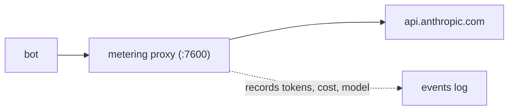

# Metering & Budgets

[[toc]]

Mecha includes a built-in metering proxy that tracks API costs per agent in real time. Set daily budgets, get warnings, and auto-pause agents that overspend.

## How It Works

The metering proxy sits between your agents and the Anthropic API:



Every API call is intercepted, forwarded to Anthropic, and the response is parsed for usage data (input tokens, output tokens, cache tokens). Costs are calculated using built-in model pricing.

## Starting the Meter

```bash
mecha meter start
```

The proxy listens on port 7600 by default. All bots spawned after the meter starts will automatically route API calls through it.

```bash
# Check status
mecha meter status

# Stop the meter
mecha meter stop
```

## Viewing Costs

```bash
# Show current day's costs
mecha cost

# JSON output for scripting
mecha cost --json
```

The cost report shows per-bot and total spending:

```
Daily Cost Summary (2026-02-26)
───────────────────────────────
researcher    $1.23  (42 requests)
coder         $3.45  (118 requests)
reviewer      $0.67  (23 requests)
───────────────────────────────
Total         $5.35
```

## Budgets

Set spending limits to prevent runaway costs:

```bash
# Set a global daily budget ($10/day)
mecha budget set --global --daily 10.00

# Set a global monthly budget
mecha budget set --global --monthly 100.00

# Set a per-bot budget
mecha budget set researcher --daily 2.00

# Set a per-auth-profile budget
mecha budget set --auth mykey --daily 5.00

# Set a per-tag budget (applies to all bots with that tag)
mecha budget set --tag dev --daily 8.00

# List all budgets
mecha budget ls

# Remove a budget
mecha budget rm --global --daily
mecha budget rm researcher --daily
```

### Budget Enforcement

When a bot approaches its budget:

1. **80% threshold** — warning logged
2. **100% threshold** — API requests blocked with 429 response

The bot receives an error message explaining the budget limit. Daily budgets reset at midnight UTC. Monthly budgets reset on the first of each month.

In-flight requests are pre-accounted at an estimated cost of $0.03 each to prevent concurrent requests from bypassing budget limits.

## Event Tracking

Every API call is recorded as a meter event:

- Timestamp
- bot name
- Model used
- Input/output/cache tokens
- Estimated cost
- Cache creation and cache read tokens
- Latency (time to first token)
- Stream vs non-stream
- Actual model returned by API (may differ from requested)

Events are stored in `~/.mecha/meter/events/` as daily JSONL files, enabling historical cost analysis.

## Pricing

Model pricing is stored in `~/.mecha/meter/pricing.json` and can be updated:

```bash
# Pricing is auto-initialized with current Anthropic rates
# Edit ~/.mecha/meter/pricing.json to customize
```

The proxy uses the `model` field from each API request to look up per-token costs. Unknown models fall back to the most expensive model in the pricing table (overestimate rather than underestimate).

## Rollups

Cost data is aggregated into rollup files for efficient querying:

- **Hourly rollups** — per-date files in `rollups/hourly/YYYY-MM-DD.json`, broken down by hour, bot, and model
- **Daily rollups** — per-month files in `rollups/daily/YYYY-MM.json`, broken down by date, bot, model, auth profile, tag, and workspace
- **Bot rollups** — per-bot files in `rollups/bot/{name}.json`, with all-time totals and daily breakdown

Rollups are computed inline on each event and flushed on shutdown — there is no periodic rollup timer.

## Internals

The metering proxy uses several background processes to maintain accuracy and performance:

| Parameter | Default | Description |
|-----------|---------|-------------|
| Snapshot interval | 5s | Hot counters flushed to `snapshot.json` |
| Registry rescan | 30s | Re-scan bots for new/removed agents |
| Retention | 90 days | Event files older than this are pruned |
| Upstream timeout | 60s | HTTPS request to `api.anthropic.com` |
| Max request body | 32 MB | Rejects oversized request bodies with 413 |
| Max response body | 128 MB | Rejects oversized non-stream responses with 502 |

Events are written synchronously via `appendFileSync` per event (no in-memory buffer).

Special HTTP status codes in event records:
- `status: -1` — Client disconnected mid-stream (partial usage still recorded)
- `status: 0` — Upstream API unreachable

### Hot Counters

The proxy keeps in-memory counters (`HotCounters`) for the current day and month, broken down by bot, auth profile, and tag. These counters are used for budget enforcement and the `snapshot.json` file that powers the dashboard.

On UTC midnight, daily counters reset. On UTC month boundary, all counters reset. On startup, counters are restored from the last snapshot if the date matches.

### Configuration Reload

Send `SIGHUP` to the meter process to reload budgets, pricing, and the bot registry without restarting.

## API Reference

See [@mecha/meter API Reference](/reference/api/meter) for the complete function and type documentation.
