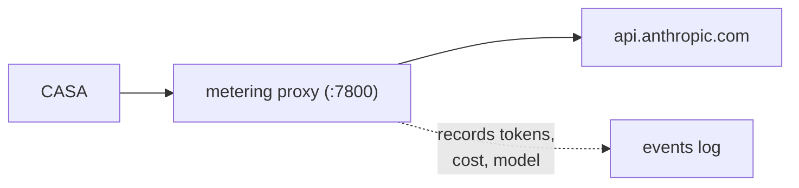

# Metering & Budgets

Mecha includes a built-in metering proxy that tracks API costs per agent in real time. Set daily budgets, get warnings, and auto-pause agents that overspend.

## How It Works

The metering proxy sits between your agents and the Anthropic API:



Every API call is intercepted, forwarded to Anthropic, and the response is parsed for usage data (input tokens, output tokens, cache tokens). Costs are calculated using built-in model pricing.

## Starting the Meter

```bash
mecha meter start
```

The proxy listens on port 7800 by default. All CASAs spawned after the meter starts will automatically route API calls through it.

```bash
# Check status
mecha meter status

# Stop the meter
mecha meter stop
```

## Viewing Costs

```bash
# Show current day's costs
mecha cost show

# JSON output for scripting
mecha cost show --json
```

The cost report shows per-CASA and total spending:

```
Daily Cost Summary (2026-02-26)
───────────────────────────────
researcher    $1.23  (42 requests)
coder         $3.45  (118 requests)
reviewer      $0.67  (23 requests)
───────────────────────────────
Total         $5.35
```

## Budgets

Set spending limits to prevent runaway costs:

```bash
# Set a global daily budget ($10/day)
mecha budget set --daily 10.00

# Set a per-CASA budget
mecha budget set --casa researcher --daily 2.00

# List all budgets
mecha budget ls

# Remove a budget
mecha budget rm --daily
mecha budget rm --casa researcher --daily
```

### Budget Enforcement

When a CASA approaches its budget:

1. **80% threshold** — warning logged
2. **100% threshold** — API requests blocked with 429 response

The CASA receives an error message explaining the budget limit. Budgets reset daily at midnight.

## Event Tracking

Every API call is recorded as a meter event:

- Timestamp
- CASA name
- Model used
- Input/output/cache tokens
- Estimated cost
- Latency (time to first token)
- Stream vs non-stream

Events are stored in `~/.mecha/meter/events/` as daily JSONL files, enabling historical cost analysis.

## Pricing

Model pricing is stored in `~/.mecha/meter/pricing.json` and can be updated:

```bash
# Pricing is auto-initialized with current Anthropic rates
# Edit ~/.mecha/meter/pricing.json to customize
```

The proxy uses the `model` field from each API request to look up per-token costs.
