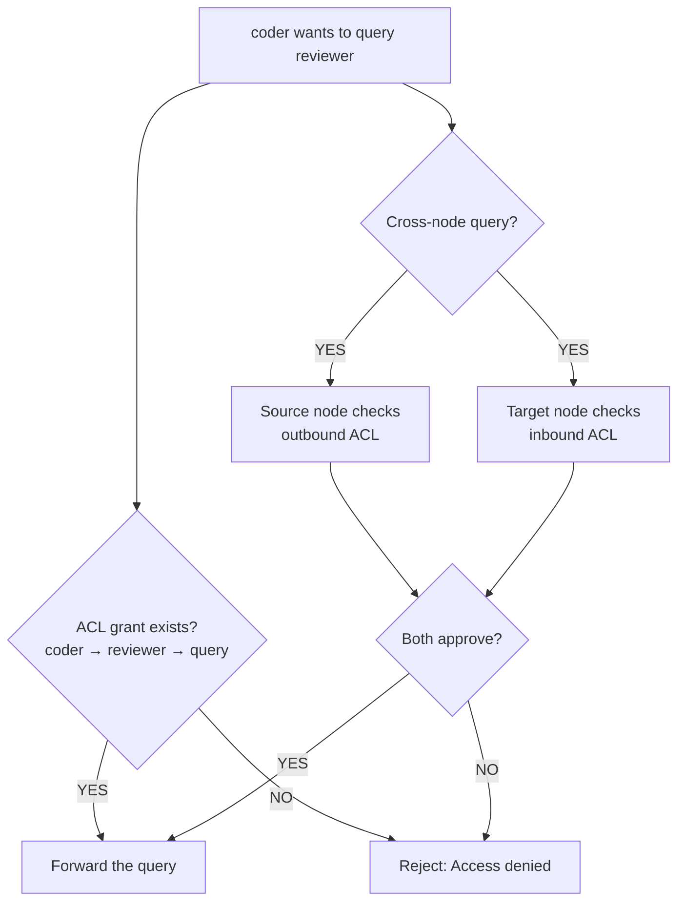

# Permissions (ACL)

Mecha uses **capability-based access control** to mediate all inter-agent communication. No grant means no access — agents are isolated by default.

## Capabilities

| Capability | Description |
|------------|-------------|
| `query` | Send a message and receive a response |
| `read_workspace` | Read files from the target's workspace |
| `write_workspace` | Write files to the target's workspace |
| `execute` | Request command execution on the target |
| `read_sessions` | View the target's chat history |
| `manage_sessions` | Create or delete sessions on the target |
| `lifecycle` | Start, stop, or restart the target |
| `delegate` | Pass capabilities to a third party |

## Granting Permissions

```bash
# Allow coder to query reviewer
mecha acl grant coder reviewer query

# Allow researcher to read coder's workspace
mecha acl grant researcher coder read_workspace

# Grant multiple capabilities
mecha acl grant coder reviewer query read_workspace
```

## Revoking Permissions

```bash
# Revoke a specific capability
mecha acl revoke coder reviewer query

# Revoke all capabilities
mecha acl revoke coder reviewer query read_workspace
```

## Viewing Permissions

```bash
# Show all ACL rules
mecha acl show

# Show rules for a specific CASA
mecha acl show coder
```

## How ACL Enforcement Works

Every inter-agent interaction goes through the ACL engine:



Both sides must approve. This prevents a compromised node from unilaterally accessing agents on another node.

## ACL Storage

Rules are stored in `~/.mecha/acl.json`:

```json
{
  "rules": [
    {
      "source": "coder",
      "target": "reviewer",
      "capabilities": ["query", "read_workspace"]
    }
  ]
}
```

The file is written atomically (tmp + rename) to prevent corruption.

## Expose

CASAs can declare which capabilities they expose to the mesh for discovery:

```json
{
  "expose": ["query"]
}
```

When another agent discovers CASAs via the mesh, only those with matching exposed capabilities appear in results — and only if the ACL allows the requesting agent to use that capability.
