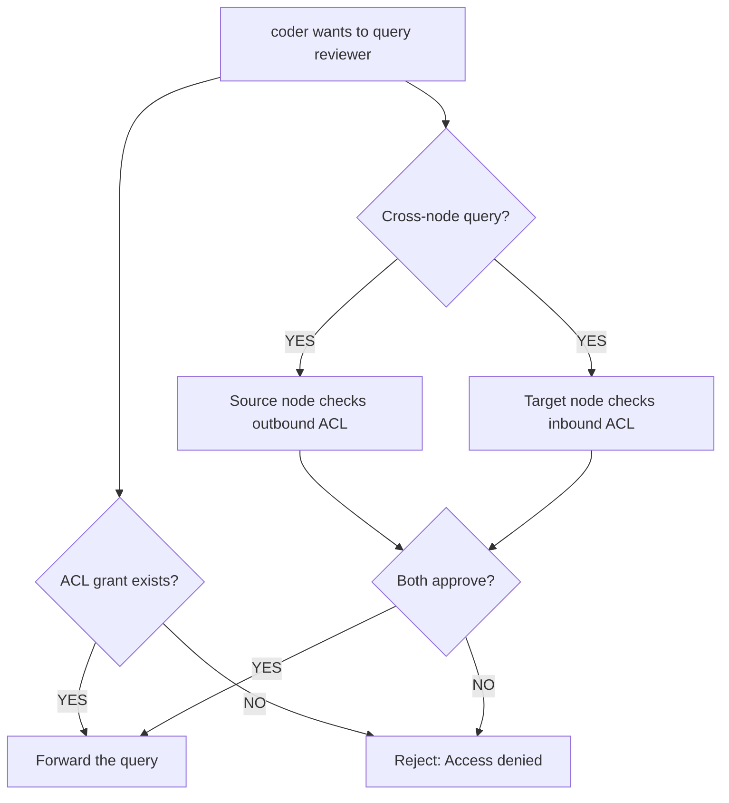

# Permissions (ACL)

Mecha uses **capability-based access control** to mediate all inter-agent communication. No grant means no access — agents are isolated by default.

## Capabilities

| Capability | Description |
|------------|-------------|
| `query` | Send a message and receive a response |
| `read_workspace` | Read files from the target's workspace |
| `write_workspace` | Write files to the target's workspace |
| `execute` | Request command execution on the target |
| `read_sessions` | View the target's chat history |
| `lifecycle` | Start, stop, or restart the target |

## Granting Permissions

```bash
# Allow coder to query reviewer
mecha acl grant coder query reviewer

# Allow researcher to read coder's workspace
mecha acl grant researcher read_workspace coder
```

## Revoking Permissions

```bash
# Revoke a specific capability
mecha acl revoke coder query reviewer
```

## Viewing Permissions

```bash
# Show all ACL rules
mecha acl show

# Show rules for a specific bot
mecha acl show coder
```

## How ACL Enforcement Works

Every inter-agent interaction goes through the ACL engine:



Both sides must approve. This prevents a compromised node from unilaterally accessing agents on another node.

## ACL Storage

Rules are stored in `~/.mecha/acl.json`:

```json
{
  "rules": [
    {
      "source": "coder",
      "target": "reviewer",
      "capabilities": ["query", "read_workspace"]
    }
  ]
}
```

The file is written atomically (tmp + rename) to prevent corruption.

## Expose

bots can declare which capabilities they expose to the mesh for discovery:

```json
{
  "expose": ["query"]
}
```

When another agent discovers bots via the mesh, only those with matching exposed capabilities appear in results — and only if the ACL allows the requesting agent to use that capability.

## Core API Reference (`@mecha/core`)

The ACL system is implemented in `@mecha/core` and re-exported from the `@mecha/core` barrel.

### Types

#### `Capability`

```ts
type Capability =
  | "query"
  | "read_workspace"
  | "write_workspace"
  | "execute"
  | "read_sessions"
  | "lifecycle";
```

The union of all valid capability strings. See the [Capabilities table](#capabilities) above.

#### `ALL_CAPABILITIES`

```ts
const ALL_CAPABILITIES: readonly Capability[];
```

An immutable array containing all six capability values. Useful for validation and iteration.

#### `isCapability(s): boolean`

```ts
function isCapability(s: string): s is Capability;
```

Type guard that returns `true` if the string is a valid `Capability`.

```ts
import { isCapability } from "@mecha/core";

isCapability("query");          // true
isCapability("read_workspace"); // true
isCapability("fly");            // false
```

#### `AclRule`

```ts
interface AclRule {
  source: string;      // Bot name or address (e.g., "coder" or "coder@alice")
  target: string;      // Bot name or address
  capabilities: Capability[];
}
```

A single ACL rule granting `source` a set of capabilities on `target`.

#### `AclResult`

```ts
type AclResult =
  | { allowed: true }
  | { allowed: false; reason: "no_connect" | "not_exposed" };
```

Result of an ACL check. When denied, `reason` indicates whether the rule is missing (`no_connect`) or the target does not expose the capability (`not_exposed`).

#### `AclData`

```ts
interface AclData {
  version: number;
  rules: AclRule[];
}
```

The on-disk schema for `acl.json`. Contains a schema version and the full list of rules.

### `AclEngine` Interface

The `AclEngine` is the runtime object that manages ACL rules. All mutations are in-memory until `save()` is called.

```ts
interface AclEngine {
  grant(source: string, target: string, caps: Capability[]): void;
  revoke(source: string, target: string, caps: Capability[]): void;
  check(source: string, target: string, cap: Capability): AclResult;
  listRules(): AclRule[];
  listConnections(source: string): { target: string; caps: Capability[] }[];
  save(): void;
}
```

| Method | Description |
|--------|-------------|
| `grant(source, target, caps)` | Add capabilities to a source-target rule. Merges with existing grants. |
| `revoke(source, target, caps)` | Remove specific capabilities. If no capabilities remain, the rule is deleted. |
| `check(source, target, cap)` | Check if `source` can use `cap` on `target`. Validates both the ACL rule and the target's expose config. |
| `listRules()` | Return a defensive copy of all rules. |
| `listConnections(source)` | List all targets that `source` has grants for, with their capabilities. |
| `save()` | Persist the current state to `acl.json` (atomic write). |

### `createAclEngine(opts): AclEngine`

Factory function that creates an ACL engine backed by `mechaDir/acl.json`.

```ts
import { createAclEngine } from "@mecha/core";

const acl = createAclEngine({ mechaDir: "/Users/you/.mecha" });

acl.grant("coder", "reviewer", ["query"]);
acl.check("coder", "reviewer", "query"); // { allowed: true }
acl.save(); // writes to ~/.mecha/acl.json
```

**`CreateAclEngineOpts`**

| Field | Type | Required | Description |
|-------|------|----------|-------------|
| `mechaDir` | `string` | Yes | Path to `~/.mecha` directory (reads/writes `acl.json`) |
| `getExpose` | `(name: string) => Capability[]` | No | Override for reading a bot's expose config. Defaults to reading from `config.json`. Useful for testing. |

### `loadAcl(mechaDir): AclData`

Load ACL rules from `mechaDir/acl.json`. Returns `{ version: 1, rules: [] }` if the file is missing or invalid.

```ts
import { loadAcl } from "@mecha/core";

const data = loadAcl("/Users/you/.mecha");
console.log(data.rules.length); // number of ACL rules
```

### `saveAcl(mechaDir, data): void`

Write ACL rules to `mechaDir/acl.json` using atomic tmp+rename to prevent corruption.

```ts
import { saveAcl } from "@mecha/core";

saveAcl("/Users/you/.mecha", { version: 1, rules: [
  { source: "coder", target: "reviewer", capabilities: ["query"] }
] });
```

### Error Classes

| Error | Code | HTTP | Description |
|-------|------|------|-------------|
| `AclDeniedError` | `ACL_DENIED` | 403 | Source lacks the capability on the target |
| `InvalidCapabilityError` | `INVALID_CAPABILITY` | 400 | The capability string is not recognized |
| `InvalidAddressError` | `INVALID_ADDRESS` | 400 | The bot address format is invalid |

See [Error Reference](/reference/errors) for the complete error catalog.
