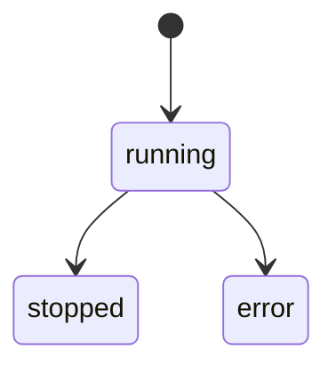

# Core Concepts

## CASA

A **CASA** (Claude Agent SDK App) is the fundamental unit in Mecha. Each CASA is an isolated process running a Fastify HTTP server that wraps the Claude Agent SDK.

When you run `mecha casa spawn researcher ~/papers`, Mecha:

1. Creates a directory at `~/.mecha/researcher/`
2. Generates a config file with a random port and auth token
3. Sets up OS-level sandbox restrictions
4. Spawns the runtime process
5. Waits for the health check to pass

Each CASA has:

| Component | Description |
|-----------|-------------|
| **Name** | Human-readable identifier (`researcher`, `coder`) |
| **Workspace** | The directory the agent can read and write |
| **Port** | HTTP port for the runtime API (auto-assigned from 7700-7799) |
| **Token** | Random Bearer token for API authentication |
| **Tags** | Labels for organization and discovery |
| **Sessions** | Persistent chat conversations stored as JSONL |

## Names and Addresses

### Local Names

Every CASA has a unique name on its node:

```
researcher
coder
reviewer
```

Names must be lowercase alphanumeric with hyphens, max 32 characters.

### Fully Qualified Addresses

When communicating across machines, addresses include the node name:

```
researcher@alice       ← "researcher" on node "alice"
coder@bob              ← "coder" on node "bob"
```

### Group Addresses

The `+` prefix addresses all CASAs with a matching tag:

```
+research              ← all CASAs tagged "research"
+dev                   ← all CASAs tagged "dev"
```

### Local Shorthand

An unqualified name like `researcher` resolves to `researcher@local` — the CASA on the current node.

## Sessions

Each chat conversation is a **session** — stored as two files:

```
~/.mecha/researcher/home/.claude/projects/<path>/
├── abc123.meta.json     ← metadata (title, timestamps)
└── abc123.jsonl         ← transcript (messages, tool calls)
```

Sessions persist across CASA restarts. You can list and review them:

```bash
mecha casa sessions list researcher
mecha casa sessions show researcher <session-id>
```

The JSONL format matches the Claude Agent SDK's native transcript format — user messages, assistant responses, tool calls, and progress events.

## Workspaces

A workspace is the directory a CASA is allowed to access. When you spawn an agent:

```bash
mecha casa spawn coder ~/my-project
```

The agent can read and write files inside `~/my-project/` but nowhere else. The OS sandbox enforces this boundary.

The workspace path is encoded into the session storage path (matching Claude Code's convention):

```
/Users/you/my-project → -Users-you-my-project
```

## Tags

Tags organize CASAs into logical groups:

```bash
# Spawn with tags
mecha casa spawn researcher ~/papers --tags research,ml

# Find by tag
mecha casa find --tag research

# Configure tags later
mecha casa configure researcher --tags research,nlp
```

Tags power:
- **Discovery** — `mecha casa find --tag dev` lists all dev agents
- **Group addressing** — `+research` targets all research agents
- **ACL rules** — grant permissions to groups by tag

## State Machine

Each CASA has a lifecycle state:



| State | Meaning |
|-------|---------|
| `running` | Healthy and accepting requests |
| `stopped` | Gracefully stopped via `mecha casa stop` |
| `error` | Crashed or failed health check |

Check state with:

```bash
mecha casa ls              # all CASAs
mecha casa status coder    # single CASA detail
```

## Directory Structure

All Mecha state lives under `~/.mecha/`:

```
~/.mecha/
├── researcher/                  ← CASA directory
│   ├── config.json              ← port, token, workspace, tags
│   ├── state.json               ← running/stopped/error
│   ├── identity.json            ← CASA Ed25519 public key + node signature
│   ├── casa.key                 ← CASA private key (mode 0600)
│   ├── logs/
│   │   ├── stdout.log
│   │   └── stderr.log
│   ├── home/                    ← redirected HOME for this CASA
│   │   └── .claude/
│   │       ├── settings.json    ← auto-generated sandbox hooks
│   │       ├── hooks/
│   │       │   ├── sandbox-guard.sh
│   │       │   └── bash-guard.sh
│   │       └── projects/
│   │           └── -home-alice-papers/
│   │               ├── abc123.meta.json
│   │               └── abc123.jsonl
│   └── tmp/                     ← isolated TMPDIR
├── coder/                       ← another CASA
├── auth/
│   ├── profiles.json            ← API key / OAuth token metadata
│   └── credentials.json         ← API key / OAuth token values
├── acl.json                     ← permission rules
├── nodes.json                   ← known remote nodes
├── identity/                    ← Ed25519 keypair for this node
└── meter/                       ← cost tracking data
```

No SQLite, no databases. Everything is plain JSON files that you can inspect, back up, and version control.

Each CASA's `home/` directory is an isolated Claude Code environment — the `HOME` env var is redirected there so Claude Code reads its own settings, not the host's. See [Sandbox & Security](/features/sandbox#casa-home-directory-isolation) for details.

## Parent-Child Workspaces

When one CASA's workspace is a subdirectory of another's, Mecha automatically detects the relationship. For example, if `coder` owns `~/project` and `reviewer` owns `~/project/reviews`, then `mecha casa status reviewer` will show `coder` as the parent. This is purely informational — no permissions are implied.
