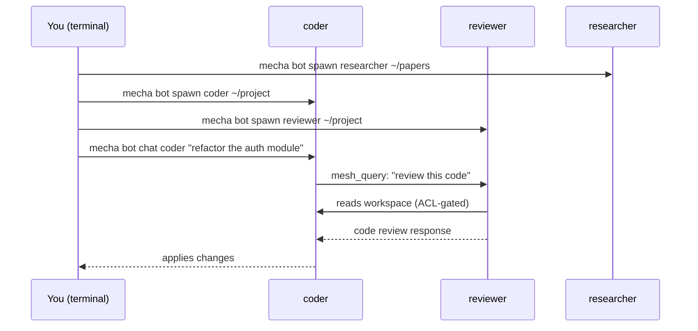

# What is Mecha?

[[toc]]

Mecha is a **local-first multi-agent runtime** that lets you run multiple Claude agents as isolated processes on your own machine. Each agent — called a **bot** (Claude Agent SDK App) — gets its own workspace, permissions, and identity.

## Why Mecha?

Running AI agents locally gives you:

- **Privacy** — your code and conversations never leave your machine
- **Speed** — agents start in under a second, no container boot time
- **Control** — fine-grained permissions decide what each agent can access
- **Cost visibility** — built-in metering tracks every API call per agent

## How It Works



Each agent runs as a separate process with:

- Its own **workspace directory** (read/write only its own files)
- Its own **chat sessions** (persistent conversation history)
- Its own **MCP tools** (workspace_list, workspace_read, mesh_query)
- Its own **budget** (daily API cost limit)

Agents communicate through **mesh queries** — one agent asks another a question, mediated by the ACL engine that checks permissions on both sides.

## Key Concepts

### bot (Claude Agent SDK App)

A bot is the unit of deployment in Mecha. Each bot is a Fastify server process that wraps the Claude Agent SDK, providing:

- HTTP API for chat (with SSE streaming)
- MCP tool server (workspace access + mesh tools)
- Session management (conversation persistence as JSONL files)

### Names and Addresses

Every bot has a human-readable name:

```text
researcher              ← local name
researcher@alice        ← fully qualified (name@node)
+research               ← group address (all bots tagged "research")
```

### Permissions (ACL)

Mecha uses capability-based access control:

```bash
# Allow coder to query reviewer
mecha acl grant coder query reviewer

# Allow researcher to read coder's workspace
mecha acl grant researcher read_workspace coder
```

No grant = no access. Every inter-agent interaction is checked against the ACL.

### Sandbox

Each bot runs inside an OS-level sandbox:

- **macOS**: `sandbox-exec` profiles restrict filesystem and network
- **Linux**: `bwrap` (bubblewrap) provides namespace isolation
- **Fallback**: Process-level restrictions when no sandbox runtime is available

## What's Next?

- [Install Mecha](/guide/installation) — download the binary
- [Quick Start](/guide/quickstart) — create your first agent in 5 minutes
- [Core Concepts](/guide/concepts) — deep dive into the architecture
