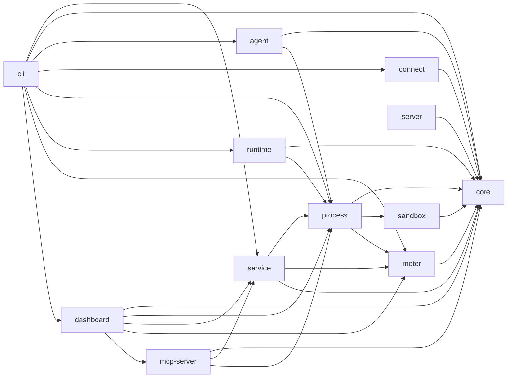
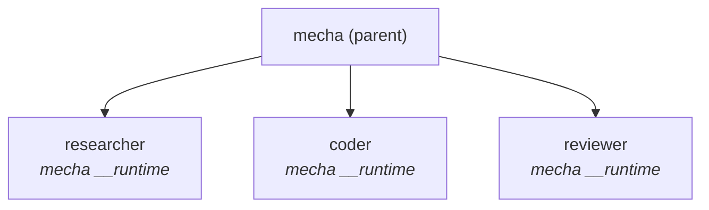
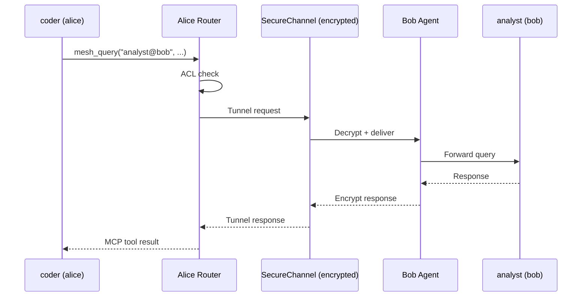
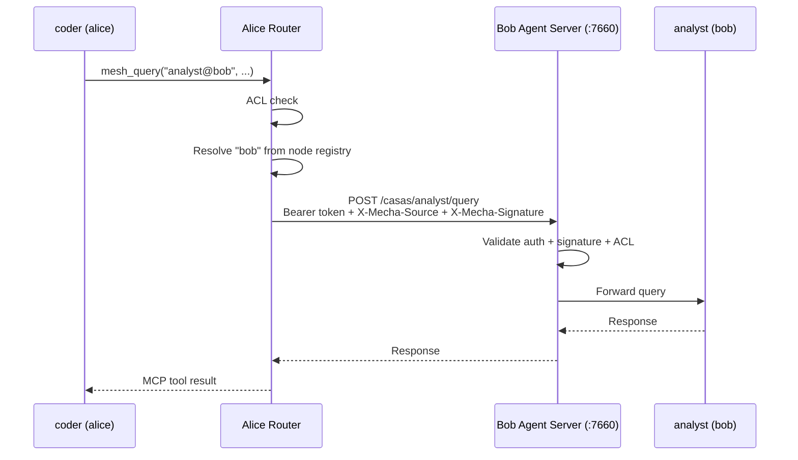

# Architecture

Technical overview of Mecha's internal architecture.

## Package Structure

Mecha is a TypeScript monorepo with 11 packages (+ dashboard planned for Phase 7b):

```
@mecha/core        ← Types, schemas, validation, ACL engine, identity (Ed25519)
@mecha/process     ← ProcessManager: spawn/kill/stop, port allocation, sandbox hooks
@mecha/runtime     ← Fastify server per CASA: sessions, chat SSE, MCP tools
@mecha/service     ← High-level API: casaSpawn, casaChat, casaFind, routing
@mecha/agent       ← Inter-node HTTP server for mesh routing
@mecha/connect     ← P2P connectivity: Noise IK handshake, SecureChannel, invite codes
@mecha/server      ← Rendezvous + relay server + gossip protocol for P2P peer discovery
@mecha/sandbox     ← OS-level isolation: macOS sandbox-exec, Linux bwrap
@mecha/meter       ← Metering proxy: cost tracking, budgets, events
@mecha/mcp-server  ← MCP server: stdio + HTTP transport, audit logging, rate limiting
@mecha/cli         ← Commander-based CLI: 40+ commands
@mecha/dashboard   ← Next.js web UI: CASA management, terminal, mesh, ACL, audit, metering
```

### Dependency Graph



## Process Model

Each CASA is a child process of the `mecha` CLI:



The single `mecha` binary serves dual duty:
- **CLI mode** — when invoked with commands (`mecha spawn`, `mecha chat`)
- **Runtime mode** — when invoked as `mecha __runtime` (spawned internally as a child process)

This is how the bun single-binary distribution works — no separate runtime binary needed.

## Request Flow

### Chat Request

```mermaid
sequenceDiagram
  participant User as User (terminal)
  participant CLI as mecha CLI
  participant CASA as coder CASA (:7700)

  User->>CLI: mecha chat coder "refactor auth"
  CLI->>CLI: Parse args, read config.json
  CLI->>CASA: POST /api/chat<br/>Authorization: Bearer &lt;token&gt;
  CASA-->>CLI: SSE stream
  Note right of CASA: progress: "Reading files..."<br/>assistant: "I'll refactor..."
  CLI-->>User: Print streamed response
```

### Mesh Query (P2P / Managed Node)



### Mesh Query (HTTP / Direct Node)



## Agent Server API

The agent server (`@mecha/agent`, port 7660) exposes these HTTP endpoints for inter-node communication. All routes except `/healthz` require `Authorization: Bearer <apiKey>`.

| Method | Path | Description |
|--------|------|-------------|
| `GET` | `/healthz` | Health check (no auth required) |
| `GET` | `/casas` | List all CASAs on this node |
| `GET` | `/casas/:name/status` | Get CASA status |
| `POST` | `/casas/:name/stop` | Graceful stop |
| `POST` | `/casas/:name/kill` | Force kill |
| `POST` | `/casas` | Spawn a new CASA |
| `GET` | `/casas/:name/sessions` | List CASA sessions |
| `GET` | `/casas/:name/sessions/:id` | Get specific session |
| `POST` | `/casas/:name/query` | Forward a mesh query (requires `X-Mecha-Source` header) |
| `GET` | `/discover` | Discover CASAs (filterable by `?tag=` and `?capability=`) |
| `WS` | `/ws/terminal/:name` | Terminal WebSocket (PTY attach, requires `ptySpawnFn`) |

## Runtime API

Each CASA exposes these HTTP endpoints (localhost only):

| Method | Path | Description |
|--------|------|-------------|
| `GET` | `/healthz` | Health check |
| `GET` | `/info` | Runtime info (name, port, uptime, memory) |
| `POST` | `/api/chat` | Send a message (SSE response) |
| `GET` | `/api/sessions` | List all sessions |
| `GET` | `/api/sessions/:id` | Get session transcript |
| `GET` | `/api/schedules` | List schedules |
| `POST` | `/api/schedules` | Create a schedule |
| `DELETE` | `/api/schedules/:id` | Remove a schedule |
| `POST` | `/api/schedules/:id/pause` | Pause a schedule |
| `POST` | `/api/schedules/:id/resume` | Resume a schedule |
| `POST` | `/api/schedules/:id/run` | Trigger a schedule immediately |
| `POST` | `/api/schedules/pause-all` | Pause all schedules |
| `POST` | `/api/schedules/resume-all` | Resume all schedules |
| `GET` | `/api/schedules/:id/history` | Schedule run history |
| `POST` | `/mcp` | JSON-RPC MCP endpoint |

All routes require `Authorization: Bearer <token>` (the token from `config.json`).

## Data Storage

All state is plain files — no databases:

| Data | Format | Location |
|------|--------|----------|
| CASA config | JSON | `~/.mecha/<name>/config.json` |
| CASA state | JSON | `~/.mecha/<name>/state.json` |
| Sessions | JSONL + JSON | `~/.mecha/<name>/home/.claude/projects/` |
| Logs | Text | `~/.mecha/<name>/logs/` |
| ACL rules | JSON | `~/.mecha/acl.json` |
| Node registry | JSON | `~/.mecha/nodes.json` |
| Embedded server state | JSON | `~/.mecha/server.json` |
| Auth profiles | JSON | `~/.mecha/auth/profiles.json` |
| Identity (Ed25519) | PEM | `~/.mecha/identity/` |
| Noise keys (X25519) | PEM | `~/.mecha/identity/` |
| Meter events | JSONL | `~/.mecha/meter/events/` |
| Meter snapshot | JSON | `~/.mecha/meter/snapshot.json` |
| Budgets | JSON | `~/.mecha/meter/budgets.json` |
| Plugin registry | JSON | `~/.mecha/plugins.json` |
| Audit log | JSONL | `~/.mecha/audit.jsonl` |

All file writes use atomic tmp+rename to prevent corruption on crash.

## Process Events

The ProcessManager emits lifecycle events that CLI commands and integrations can subscribe to:

| Event | Fields | Description |
|-------|--------|-------------|
| `spawned` | `name`, `pid`, `port` | CASA process started successfully |
| `stopped` | `name`, `exitCode?` | CASA process exited |
| `error` | `name`, `error` | CASA encountered an error |
| `warning` | `name`, `message` | Non-fatal warning (e.g., sandbox degradation) |

Subscribe via `processManager.onEvent(handler)`, which returns an unsubscribe function. Handlers are isolated — one failing handler does not affect others.

## Quality Gates

Every change must pass before merge:

```bash
pnpm test           # 2000+ tests
pnpm test:coverage  # 100% statements, branches, functions, lines
pnpm typecheck      # tsc -b (strict TypeScript)
pnpm build          # clean compilation
```
