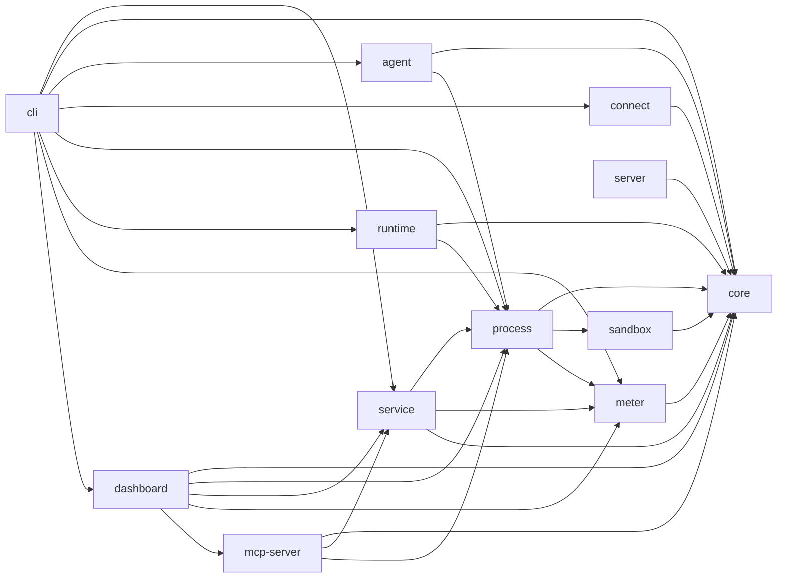
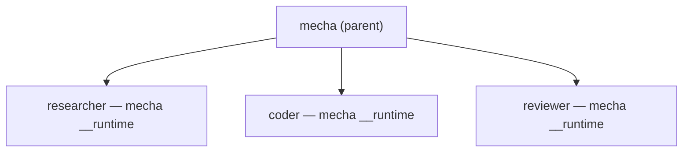
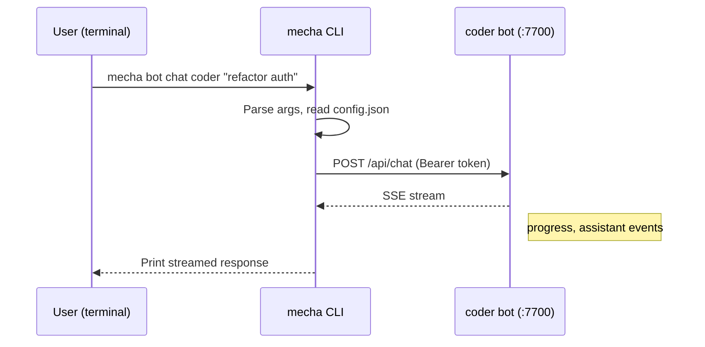
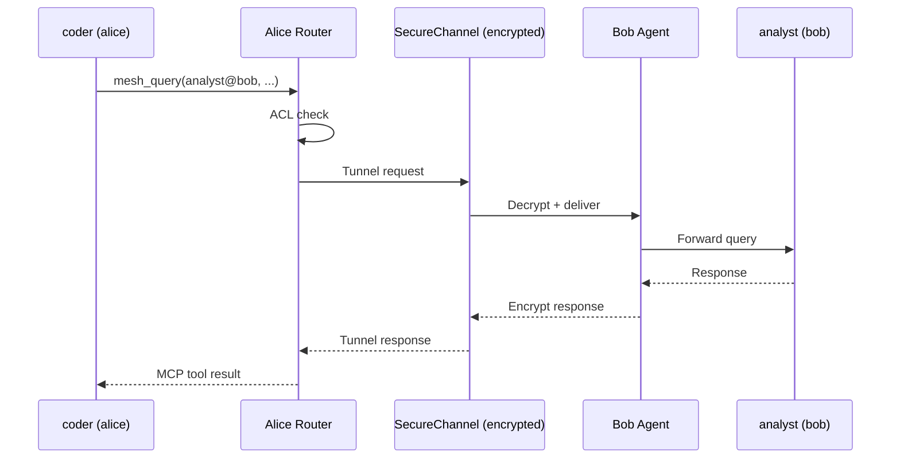
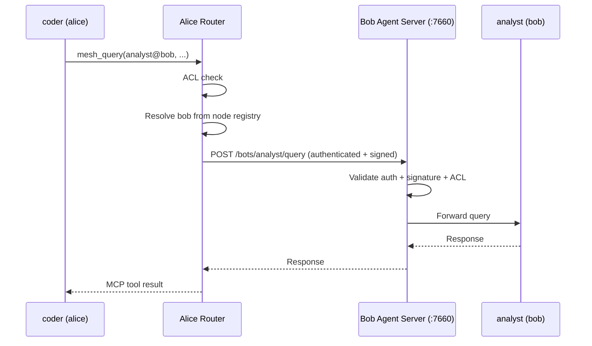

# Architecture

Technical overview of Mecha's internal architecture.

## Package Structure

Mecha is a TypeScript monorepo with 13 packages:

```
@mecha/core        ← Types, schemas, validation, ACL engine, identity (Ed25519)
@mecha/process     ← ProcessManager: spawn/kill/stop, port allocation, sandbox hooks
@mecha/runtime     ← Fastify server per bot: sessions, chat SSE, MCP tools
@mecha/service     ← High-level API: botSpawn, botChat, botFind, routing
@mecha/agent       ← Inter-node HTTP server for mesh routing
@mecha/connect     ← P2P connectivity: Noise IK handshake, SecureChannel, invite codes
@mecha/server      ← Rendezvous + relay server + gossip protocol for P2P peer discovery
@mecha/sandbox     ← OS-level isolation: macOS sandbox-exec, Linux bwrap
@mecha/meter       ← Metering proxy: cost tracking, budgets, events
@mecha/mcp-server  ← MCP server: stdio + HTTP transport, audit logging, rate limiting
@mecha/cli         ← Commander-based CLI: 40+ commands
@mecha/dashboard   ← Next.js web UI: bot management, terminal, mesh, ACL, audit, metering
```

### Dependency Graph



## Process Model

Each bot is a child process of the `mecha` CLI:



The single `mecha` binary serves dual duty:
- **CLI mode** — when invoked with commands (`mecha spawn`, `mecha chat`)
- **Runtime mode** — when invoked as `mecha __runtime` (spawned internally as a child process)

This is how the bun single-binary distribution works — no separate runtime binary needed.

## Request Flow

### Chat Request



### Mesh Query (P2P / Managed Node)



### Mesh Query (HTTP / Direct Node)



## Agent Server API

The agent server (`@mecha/agent`, port 7660) is the unified HTTP + WebSocket server for dashboard UI, inter-node mesh routing, and terminal access. It is created via `createAgentServer()` from `@mecha/agent`.

All routes except those listed as **Public** require authentication (session cookie or Bearer token).

### Route Summary

| Method | Path | Auth | Description |
|--------|------|------|-------------|
| `GET` | `/healthz` | Public | Health check |
| `GET` | `/node/info` | Required | Full system telemetry |
| `GET` | `/auth/status` | Public | Available auth methods |
| `POST` | `/auth/login` | Public | TOTP login (rate-limited) |
| `POST` | `/auth/logout` | Public | Clear session cookie |
| `GET` | `/auth/profiles` | Required | List auth profiles |
| `GET` | `/bots` | Required | List all bots |
| `GET` | `/bots/:name/status` | Required | Get bot status (enriched) |
| `POST` | `/bots/:name/start` | Required | Start a stopped bot from config |
| `POST` | `/bots/:name/stop` | Required | Graceful stop (supports `force` body param) |
| `POST` | `/bots/:name/restart` | Required | Restart bot (supports `force` body param) |
| `POST` | `/bots/:name/kill` | Required | Force kill |
| `PATCH` | `/bots/:name/config` | Required | Update bot config fields, optionally restart |
| `POST` | `/bots` | Required | Spawn a new bot |
| `GET` | `/bots/:name/sessions` | Required | List bot sessions |
| `GET` | `/bots/:name/sessions/:id` | Required | Get specific session |
| `DELETE` | `/bots/:name/sessions/:id` | Required | Delete a session |
| `POST` | `/bots/:name/query` | Required | Forward a mesh query (requires `X-Mecha-Source`) |
| `GET` | `/discover` | Required | Discover bots (filterable by `?tag=` and `?capability=`) |
| `GET` | `/acl` | Required | List ACL rules |
| `GET` | `/audit` | Required | Read audit log (supports `?limit=`) |
| `GET` | `/mesh/nodes` | Required | List mesh nodes with health status |
| `GET` | `/meter/cost` | Required | Query metering data (supports `?bot=`) |
| `GET` | `/settings/runtime` | Required | Runtime port configuration |
| `GET` | `/events` | Required | SSE stream for real-time process events |
| `POST` | `/ws/ticket` | Required | Issue a single-use WebSocket ticket |
| `WS` | `/ws/terminal/:name` | Ticket | Terminal WebSocket (PTY attach) |

### `createAgentServer(opts)`

Factory function that creates a fully configured Fastify server with all routes, auth hooks, and optional SPA serving.

```ts
import { createAgentServer, fetchPublicIp } from "@mecha/agent";

const publicIp = await fetchPublicIp();
const app = createAgentServer({
  port: 7660,
  auth: { totpSecret: "BASE32SECRET", sessionTtlHours: 24 },
  processManager,
  acl,
  mechaDir: "/Users/you/.mecha",
  nodeName: "alice",
  startedAt: new Date().toISOString(),
  publicIp,
  ptySpawnFn: spawnPty,   // omit to disable terminal
  spaDir: "/path/to/spa", // omit to disable SPA serving
});

await app.listen({ port: 7660, host: "0.0.0.0" });
```

**`AgentServerOpts`**

| Field | Type | Required | Description |
|-------|------|----------|-------------|
| `port` | `number` | Yes | Port the server binds to |
| `auth` | `AgentServerAuth` | Yes | Authentication configuration |
| `processManager` | `ProcessManager` | Yes | Process manager for bot lifecycle |
| `acl` | `AclEngine` | Yes | ACL engine for access control checks |
| `mechaDir` | `string` | Yes | Path to `~/.mecha` data directory |
| `nodeName` | `string` | Yes | Name of this node in the mesh |
| `startedAt` | `string` | Yes | ISO timestamp of server start |
| `publicIp` | `string` | No | Cached public IP (fetched at startup via `fetchPublicIp()`) |
| `ptySpawnFn` | `PtySpawnFn` | No | PTY spawn function for terminal WebSocket. Omit to disable terminal |
| `spaDir` | `string` | No | Path to SPA dist directory. When set, serves static SPA files and handles client-side routing fallback |

**`AgentServerAuth`**

| Field | Type | Default | Description |
|-------|------|---------|-------------|
| `totpSecret` | `string` | — | Base32 TOTP secret. When set, enables session-based TOTP auth |
| `sessionTtlHours` | `number` | `24` | Session cookie TTL in hours |
| `apiKey` | `string` | — | Internal API key for mesh node-to-node routing (Bearer token) |

### Authentication System

The agent server uses a multi-layer authentication system implemented across several modules.

#### Auth Hooks (`auth.ts`)

Two Fastify hooks enforce authentication:

1. **`createAuthHook(opts)`** — `onRequest` hook that validates auth via session cookie, Bearer token, or WebSocket ticket.
2. **`createSignatureHook(opts)`** — `preHandler` hook that verifies Ed25519 signatures on routing endpoints (runs after body parsing).

**Auth flow priority:**

1. **Public paths** — `/healthz`, `/auth/status`, `/auth/login`, `/auth/logout` skip auth entirely
2. **SPA static assets** — When `spaDir` is set, non-API paths skip auth. Browser navigations (`Accept: text/html`) to API-prefixed paths serve the SPA index.html
3. **WebSocket paths** — `/ws/*` (except `/ws/ticket`) accept single-use ticket auth via `?ticket=` query parameter
4. **Session cookie** — `mecha-session` cookie containing a signed JWT (HS256)
5. **Bearer token** — `Authorization: Bearer <apiKey>`, restricted to mesh routing requests only (POST `/bots/:name/query` with `X-Mecha-Source` header)

**Signature verification** (mesh routing only):

Routing requests (`POST /bots/:name/query`) from remote nodes must include:

| Header | Description |
|--------|-------------|
| `X-Mecha-Source` | Source identifier (`bot@node`) |
| `X-Mecha-Signature` | Ed25519 signature over the request envelope |
| `X-Mecha-Timestamp` | Unix timestamp (must be within 5-minute window) |
| `X-Mecha-Nonce` | Unique nonce (prevents replay attacks) |

The signature envelope format is: `METHOD\nPATH\nSOURCE\nTIMESTAMP\nNONCE\nBODY_JSON`.

#### Session Management (`session.ts`)

Sessions use custom JWT tokens (HS256) with no external dependencies.

| Function | Description |
|----------|-------------|
| `deriveSessionKey(totpSecret)` | Derives a hex signing key from the TOTP secret via HKDF-SHA256 |
| `createSessionToken(key, ttlHours?)` | Creates a signed JWT with `iat` and `exp` claims. Default TTL: 24 hours |
| `verifySessionToken(key, token)` | Verifies JWT signature and expiry. Returns `{ valid, iat, exp }` or `{ valid: false }` |
| `parseSessionCookie(cookieHeader)` | Extracts the `mecha-session` value from a `Cookie` header string |

The session cookie name is `mecha-session`. Cookies are set with `HttpOnly`, `SameSite=Strict`, and `Secure` (when not on localhost).

#### TOTP Verification (`totp.ts`)

`verifyTotpCode(secret, code)` verifies a 6-digit TOTP code against a base32 secret using SHA1 with a 30-second period. A window of 1 allows plus/minus 30 seconds of clock skew.

#### Login Rate Limiter (`login-limiter.ts`)

`createLoginLimiter(opts?)` returns a rate limiter for login attempts.

| Option | Type | Default | Description |
|--------|------|---------|-------------|
| `maxAttempts` | `number` | `5` | Maximum failed attempts within the window |
| `windowMs` | `number` | `30000` | Sliding window duration in ms |
| `lockoutMs` | `number` | `60000` | Lockout duration after max attempts exceeded |

**Methods:**

| Method | Description |
|--------|-------------|
| `check()` | Returns `{ allowed, retryAfterMs? }`. Call before each login attempt |
| `recordFailure()` | Record a failed attempt. Triggers lockout when `maxAttempts` is reached |
| `reset()` | Clear failure history and lockout (called on successful login) |

#### WebSocket Tickets (`ws-tickets.ts`)

Browser WebSocket connections cannot set custom headers, so terminal connections use single-use tickets instead of session cookies.

| Function | Description |
|----------|-------------|
| `issueTicket()` | Returns a cryptographically random 24-byte base64url ticket. Stored in memory with a 30-second TTL |
| `consumeTicket(ticket)` | Validates and deletes the ticket. Returns `true` once, then the ticket is gone |
| `purgeTickets()` | Removes expired tickets. Called automatically before issuing new tickets |

Flow: Client calls `POST /ws/ticket` (authenticated) to get a ticket, then connects to `ws://host/ws/terminal/:name?ticket=<ticket>`.

### PTY Manager (`pty-manager.ts`)

The PTY manager handles terminal sessions for the WebSocket terminal feature. Created via `createPtyManager(opts)`.

| Option | Type | Default | Description |
|--------|------|---------|-------------|
| `processManager` | `ProcessManager` | (required) | For looking up bot state and config |
| `mechaDir` | `string` | (required) | Path to `~/.mecha` |
| `spawnFn` | `PtySpawnFn` | (required) | Function to spawn PTY processes |
| `maxSessions` | `number` | `10` | Maximum concurrent PTY sessions |
| `idleTimeoutMs` | `number` | `300000` | Kill idle PTYs after 5 minutes with no attached clients |

**`PtyManager` methods:**

| Method | Description |
|--------|-------------|
| `spawn(botName, sessionId, cols, rows)` | Spawn a new PTY running `claude` (or `claude --resume <id>`). Returns `PtySession` |
| `attach(sessionKey, ws)` | Attach a WebSocket client to an existing PTY session |
| `detach(sessionKey, ws)` | Detach a client. Starts idle timer if no clients remain |
| `resize(sessionKey, cols, rows)` | Resize the PTY |
| `getSession(sessionKey)` | Look up a session by key (`botName:sessionId`) |
| `findByBot(botName)` | Find all PTY sessions for a bot, sorted by most recently active first |
| `shutdown()` | Kill all PTY processes and clear idle timers |

PTY sessions maintain a scrollback ring buffer (200 chunks) that is replayed when a client reattaches, so reconnecting users see recent output.

### Route Details

#### Health Routes

**`GET /healthz`** (Public)

Minimal health check.

```json
{ "status": "ok", "node": "alice" }
```

**`GET /node/info`** (Authenticated)

Full system telemetry: hostname, platform, arch, memory, CPU count, uptime, bot count, and network IPs.

#### Auth Routes

**`GET /auth/status`** (Public)

Returns available authentication methods.

```json
{ "methods": { "totp": true } }
```

**`POST /auth/login`** (Public, rate-limited)

Submit a TOTP code to get a session cookie.

| Field | Type | Description |
|-------|------|-------------|
| `code` | `string` | 6-digit TOTP code |

| Status | Condition |
|--------|-----------|
| 200 | Login successful, `Set-Cookie` header sent |
| 400 | Missing TOTP code |
| 401 | Invalid TOTP code |
| 404 | TOTP auth not enabled |
| 429 | Too many attempts (`retryAfterMs` in body) |

**`POST /auth/logout`** (Public)

Clears the session cookie by setting `Max-Age=0`.

**`GET /auth/profiles`** (Authenticated)

Lists available auth profiles for the UI bot config dropdown.

#### bot Routes

**`GET /bots`** — List all bots with enriched info (metering snapshot, tags, expose, model). Response uses a list projection that omits `pid`, `exitCode`, and shortens `workspacePath` to its basename.

**`GET /bots/:name/status`** — Full enriched status for a single bot.

**`POST /bots`** — Spawn a new bot.

| Field | Type | Required | Description |
|-------|------|----------|-------------|
| `name` | `string` | Yes | bot name (validated via `isValidName`) |
| `workspacePath` | `string` | Yes | Absolute path to workspace directory |

**`POST /bots/:name/start`** — Start a stopped bot from its persisted `config.json`.

| Status | Condition |
|--------|-----------|
| 200 | Started successfully |
| 404 | bot not found |
| 409 | bot already running |

**`POST /bots/:name/stop`** — Graceful stop with task safety check.

| Body Field | Type | Default | Description |
|------------|------|---------|-------------|
| `force` | `boolean` | `false` | Skip busy check and stop immediately |

Returns `409 BOT_BUSY` with `activeSessions` and `lastActivity` if the bot has active sessions and `force` is not set.

**`POST /bots/:name/restart`** — Stop and re-spawn. Same `force` semantics as stop.

**`POST /bots/:name/kill`** — Force kill (SIGKILL).

**`POST /bots/batch`** — Batch stop or restart all bots.

| Body Field | Type | Default | Description |
|------------|------|---------|-------------|
| `action` | `"stop" \| "restart"` | — | Required. The batch action to perform |
| `force` | `boolean` | `false` | Bypass busy check entirely |
| `idleOnly` | `boolean` | `false` | Skip busy bots instead of failing |
| `dryRun` | `boolean` | `false` | Check status without executing |
| `names` | `string[]` | — | Optional filter to target specific bots |

Always returns HTTP 200 with per-bot results (partial completion model):

```json
{
  "results": [
    { "name": "alice", "status": "succeeded" },
    { "name": "bob", "status": "skipped_busy", "activeSessions": 2 },
    { "name": "charlie", "status": "failed", "error": "Config not found" }
  ],
  "summary": { "succeeded": 1, "skipped": 1, "failed": 1 }
}
```

Status values: `succeeded`, `skipped_busy`, `skipped_stopped`, `failed`.

**`PATCH /bots/:name/config`** — Update bot configuration fields.

| Body Field | Type | Description |
|------------|------|-------------|
| `auth` | `string \| null` | Auth profile name, `$env:api-key`, `$env:oauth`, or `null` to clear |
| `model` | `string` | Model override |
| `tags` | `string[]` | Tags for discovery |
| `expose` | `string[]` | Exposed capabilities |
| `sandboxMode` | `string` | Sandbox mode |
| `permissionMode` | `string` | Permission mode |
| `restart` | `boolean` | Restart the bot after config update |
| `force` | `boolean` | Force restart (skip busy check) |

Only allowlisted fields are persisted. Auth profiles are validated before saving (checks `$env:` sentinel env vars or profile store).

#### Session Routes

**`GET /bots/:name/sessions`** — List all sessions for a bot. Proxies to the bot's runtime API.

**`GET /bots/:name/sessions/:id`** — Get a specific session transcript.

**`DELETE /bots/:name/sessions/:id`** — Delete a session.

All session routes return `502` if the upstream bot is unreachable.

#### Routing Routes

**`POST /bots/:name/query`** — Forward a mesh query to a local bot.

| Header | Required | Description |
|--------|----------|-------------|
| `X-Mecha-Source` | Yes | Source identifier (`bot` or `bot@node`) |

| Body Field | Type | Required | Description |
|------------|------|----------|-------------|
| `message` | `string` | Yes | Message to send |
| `sessionId` | `string` | No | Session ID for multi-turn conversations |

ACL is always enforced. Returns `403` if the source lacks `query` capability on the target. Returns `502`/`504` on upstream errors.

#### Discovery Routes

**`GET /discover`** — Discover bots by tag or capability.

| Query Param | Description |
|-------------|-------------|
| `tag` | Filter by tag (exact match) |
| `capability` | Filter by exposed capability (exact match) |

```json
[
  { "name": "researcher", "state": "running", "tags": ["research"], "expose": ["query"] }
]
```

#### ACL Routes

**`GET /acl`** — Returns all ACL rules from the ACL engine.

#### Audit Routes

**`GET /audit`** — Read the audit log.

| Query Param | Default | Range | Description |
|-------------|---------|-------|-------------|
| `limit` | `50` | 1--1000 | Number of entries to return |

#### Mesh Routes

**`GET /mesh/nodes`** — List all mesh nodes with live health status. The local node always appears first with `isLocal: true` and full system info. Remote nodes are health-checked in parallel (max 10 concurrent, 5-second timeout) via their `/node/info` endpoint, falling back to `/healthz` if auth fails.

#### Meter Routes

**`GET /meter/cost`** — Query today's metering data.

| Query Param | Description |
|-------------|-------------|
| `bot` | Optional bot name for per-bot breakdown |

#### Settings Routes

**`GET /settings/runtime`** — Runtime port configuration sourced from `@mecha/core` defaults.

```json
{ "botPortRange": "7700-7799", "agentPort": 7660, "mcpPort": 7680 }
```

#### Events Routes

**`GET /events`** — Server-Sent Events stream for real-time process lifecycle events.

| Parameter | Value |
|-----------|-------|
| Max connections | 10 concurrent |
| Heartbeat | Every 10 seconds |
| Overflow | 429 Too Many Requests |

Events are emitted by the ProcessManager (spawn, stop, exit, error) and streamed as `data:` frames.

#### Terminal WebSocket

**`WS /ws/terminal/:name`** — Attach to a bot terminal via WebSocket-to-PTY bridge.

| Query Param | Required | Description |
|-------------|----------|-------------|
| `session` | No | Session ID to resume (omit for new session or auto-reattach) |
| `cols` | No | Initial terminal columns (default: 80) |
| `rows` | No | Initial terminal rows (default: 24) |
| `ticket` | Yes | Single-use auth ticket from `POST /ws/ticket` |

When no `session` is specified, the server attempts to reattach to the most recently active PTY for that bot before spawning a new one.

#### WebSocket Ticket

**`POST /ws/ticket`** — Issue a single-use, 30-second ticket for WebSocket auth.

```json
{ "ticket": "base64url-encoded-24-bytes" }
```

### SPA Serving

When `spaDir` is provided, the server serves the SPA:

- Static files are served from `spaDir` via `@fastify/static`
- Browser navigations (GET with `Accept: text/html`) to any path serve `index.html` for client-side routing
- API paths (`/bots`, `/acl`, `/audit`, `/mesh`, `/meter`, `/settings/`, `/events`, `/discover`, `/ws`) are not intercepted by the SPA fallback for non-browser requests
- The auth hook skips authentication for static asset requests when SPA is enabled

## Runtime API

Each bot exposes these HTTP endpoints (localhost only):

| Method | Path | Description |
|--------|------|-------------|
| `GET` | `/healthz` | Health check (no auth required) |
| `GET` | `/info` | Runtime info (name, port, uptime, memory) |
| `POST` | `/api/chat` | Send a message (stub — returns 501, chat handled by Agent SDK) |
| `GET` | `/api/sessions` | List all sessions |
| `GET` | `/api/sessions/:id` | Get session transcript |
| `DELETE` | `/api/sessions/:id` | Delete a session |
| `GET` | `/api/schedules` | List schedules |
| `POST` | `/api/schedules` | Create a schedule |
| `DELETE` | `/api/schedules/:id` | Remove a schedule |
| `POST` | `/api/schedules/:id/pause` | Pause a schedule |
| `POST` | `/api/schedules/:id/resume` | Resume a schedule |
| `POST` | `/api/schedules/:id/run` | Trigger a schedule immediately |
| `POST` | `/api/schedules/pause-all` | Pause all schedules |
| `POST` | `/api/schedules/resume-all` | Resume all schedules |
| `GET` | `/api/schedules/:id/history` | Schedule run history (supports `?limit=N`) |
| `POST` | `/mcp` | JSON-RPC MCP endpoint |

All routes except `/healthz` require `Authorization: Bearer <token>` (the token from `config.json`). Authentication uses timing-safe comparison via `safeCompare`.

### Runtime Package API Reference (`@mecha/runtime`)

The `@mecha/runtime` package provides the Fastify-based HTTP server that runs inside each bot process. It is the per-bot runtime — one instance per spawned agent.

#### `createServer(opts): ServerResult`

Creates a fully configured Fastify server for a bot, wiring up authentication, session management, scheduling, MCP tools, and all HTTP routes.

```ts
import { createServer } from "@mecha/runtime";

const { app, scheduler } = createServer({
  botName: "researcher",
  port: 7700,
  authToken: "secret-token",
  projectsDir: "/home/.claude/projects/-Users-you-workspace",
  workspacePath: "/Users/you/workspace",
  mechaDir: "/Users/you/.mecha",
  botDir: "/Users/you/.mecha/researcher",
  chatFn: async (prompt) => {
    // Send prompt to Claude Agent SDK, return result
    return { durationMs: 1200 };
  },
});

await app.listen({ port: 7700, host: "127.0.0.1" });
```

**`CreateServerOpts`**

| Field | Type | Required | Description |
|-------|------|----------|-------------|
| `botName` | `string` | Yes | Name of the bot (e.g., `"researcher"`) |
| `port` | `number` | Yes | Port the server binds to |
| `authToken` | `string` | Yes | Bearer token for request authentication |
| `projectsDir` | `string` | Yes | Path to the workspace-specific Claude projects directory |
| `workspacePath` | `string` | Yes | Absolute path to the bot's workspace on disk |
| `mechaDir` | `string` | No | Path to `~/.mecha` (enables mesh tools) |
| `botDir` | `string` | No | Path to the bot root directory (enables scheduler) |
| `chatFn` | `ChatFn` | No | Function to execute chat prompts (used by scheduler) |

**`ServerResult`**

| Field | Type | Description |
|-------|------|-------------|
| `app` | `FastifyInstance` | The configured Fastify server (not yet listening) |
| `scheduler` | `ScheduleEngine \| undefined` | Schedule engine instance, present only when `botDir` is provided |

The scheduler is automatically started when the Fastify server emits `onReady` and stopped on `onClose`.

#### `parseRuntimeEnv(env): RuntimeEnvData`

Parses and validates the environment variables required by the bot runtime process. Throws a descriptive error if any required variables are missing or invalid.

```ts
import { parseRuntimeEnv } from "@mecha/runtime";

const env = parseRuntimeEnv(process.env);
// env.MECHA_BOT_NAME, env.MECHA_PORT (number), etc.
```

**`RuntimeEnvData`**

| Variable | Type | Required | Description |
|----------|------|----------|-------------|
| `MECHA_BOT_NAME` | `string` | Yes | Name of the bot |
| `MECHA_PORT` | `number` | Yes | Port number (1--65535, parsed from string) |
| `MECHA_AUTH_TOKEN` | `string` | Yes | Bearer token for authentication |
| `MECHA_PROJECTS_DIR` | `string` | Yes | Path to the workspace-encoded projects directory |
| `MECHA_WORKSPACE` | `string` | Yes | Absolute path to the bot workspace |
| `MECHA_DIR` | `string` | No | Path to `~/.mecha` |
| `MECHA_SANDBOX_ROOT` | `string` | No | bot root directory (used by sandbox guard scripts; also enables scheduler) |

#### `createAuthHook(token): FastifyHook`

Returns a Fastify `onRequest` hook that enforces Bearer token authentication on all routes except `/healthz`. Uses timing-safe string comparison to prevent timing attacks.

```ts
import { createAuthHook } from "@mecha/runtime";

app.addHook("onRequest", createAuthHook("my-secret-token"));
```

#### Route Registration Functions

Each route group is registered independently, allowing selective composition:

| Function | Routes | Dependencies |
|----------|--------|--------------|
| `registerHealthRoutes(app, opts)` | `GET /healthz`, `GET /info` | `HealthRouteOpts` |
| `registerSessionRoutes(app, sm)` | `GET /api/sessions`, `GET /api/sessions/:id`, `DELETE /api/sessions/:id` | `SessionManager` |
| `registerChatRoutes(app)` | `POST /api/chat` | None (stub, returns 501) |
| `registerScheduleRoutes(app, engine)` | All `/api/schedules/*` routes | `ScheduleEngine` |
| `registerMcpRoutes(app, opts)` | `POST /mcp` | `McpRouteOpts` |

**`HealthRouteOpts`**

| Field | Type | Description |
|-------|------|-------------|
| `botName` | `string` | bot name returned in `/info` |
| `port` | `number` | Port returned in `/info` |
| `startedAt` | `string` | ISO timestamp of server start |

The `/info` endpoint returns: `name`, `port`, `startedAt`, `uptime` (seconds), and `memoryMB` (RSS in megabytes).

**`McpRouteOpts`**

| Field | Type | Description |
|-------|------|-------------|
| `workspacePath` | `string` | Root path for workspace file tools |
| `mechaDir` | `string?` | Enables mesh tools when provided with `botName` |
| `botName` | `string?` | bot identity for mesh operations |
| `router` | `MeshRouter?` | Router for cross-bot mesh queries |

#### `MeshRouter` Interface

The router interface for inter-bot communication via MCP mesh tools.

```ts
interface MeshRouter {
  routeQuery(
    source: string,    // Source bot name
    target: string,    // Target bot (name or name@node)
    message: string,   // Message to send
    sessionId?: string // Optional session for multi-turn
  ): Promise<ForwardResult>;
}
```

**`MeshOpts`**

| Field | Type | Description |
|-------|------|-------------|
| `mechaDir` | `string` | Path to `~/.mecha` (reads `discovery.json`) |
| `botName` | `string` | Identity of the calling bot |
| `router` | `MeshRouter?` | Routing implementation (undefined disables `mesh_query`) |

## Data Storage

All state is plain files — no databases:

| Data | Format | Location |
|------|--------|----------|
| bot config | JSON | `~/.mecha/<name>/config.json` |
| bot state | JSON | `~/.mecha/<name>/state.json` |
| Sessions | JSONL + JSON | `~/.mecha/<name>/home/.claude/projects/` |
| Logs | Text | `~/.mecha/<name>/logs/` |
| ACL rules | JSON | `~/.mecha/acl.json` |
| Node registry | JSON | `~/.mecha/nodes.json` |
| Embedded server state | JSON | `~/.mecha/server.json` |
| Auth profiles | JSON | `~/.mecha/auth/profiles.json` |
| Identity (Ed25519) | PEM | `~/.mecha/identity/` |
| Noise keys (X25519) | PEM | `~/.mecha/identity/` |
| Meter events | JSONL | `~/.mecha/meter/events/` |
| Meter snapshot | JSON | `~/.mecha/meter/snapshot.json` |
| Budgets | JSON | `~/.mecha/meter/budgets.json` |
| Plugin registry | JSON | `~/.mecha/plugins.json` |
| Audit log | JSONL | `~/.mecha/audit.jsonl` |

All file writes use atomic tmp+rename to prevent corruption on crash.

## Process Events

The ProcessManager emits lifecycle events that CLI commands and integrations can subscribe to:

| Event | Fields | Description |
|-------|--------|-------------|
| `spawned` | `name`, `pid`, `port` | bot process started successfully |
| `stopped` | `name`, `exitCode?` | bot process exited |
| `error` | `name`, `error` | bot encountered an error |
| `warning` | `name`, `message` | Non-fatal warning (e.g., sandbox degradation) |

Subscribe via `processManager.onEvent(handler)`, which returns an unsubscribe function. Handlers are isolated — one failing handler does not affect others.

## Quality Gates

Every change must pass before merge:

```bash
pnpm test           # 2000+ tests
pnpm test:coverage  # 100% statements, branches, functions, lines
pnpm typecheck      # tsc -b (strict TypeScript)
pnpm build          # clean compilation
```
