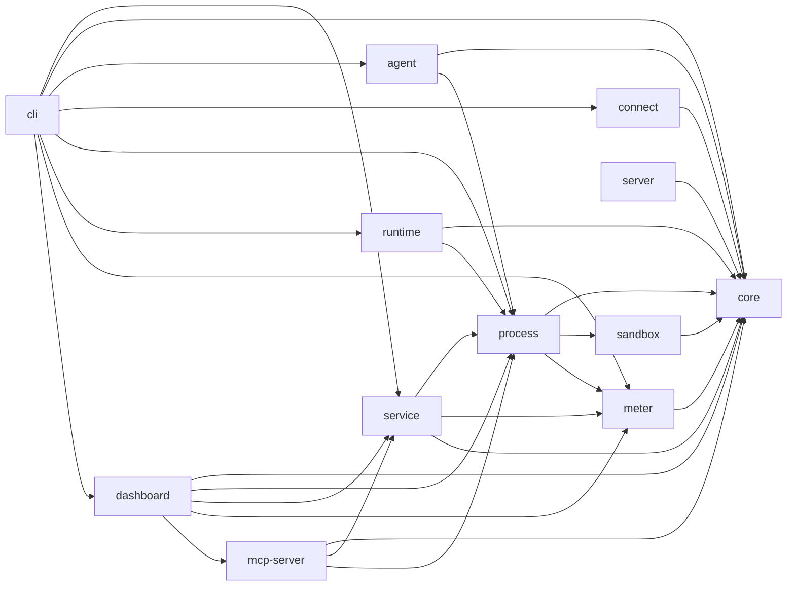
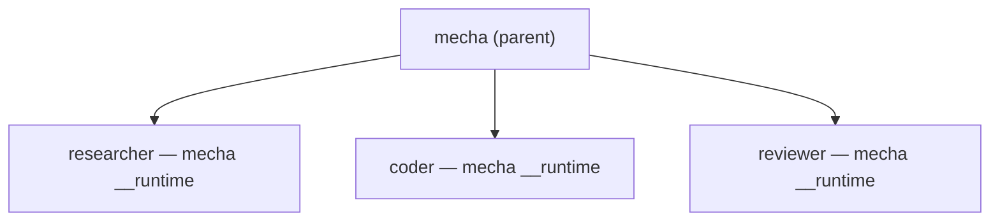
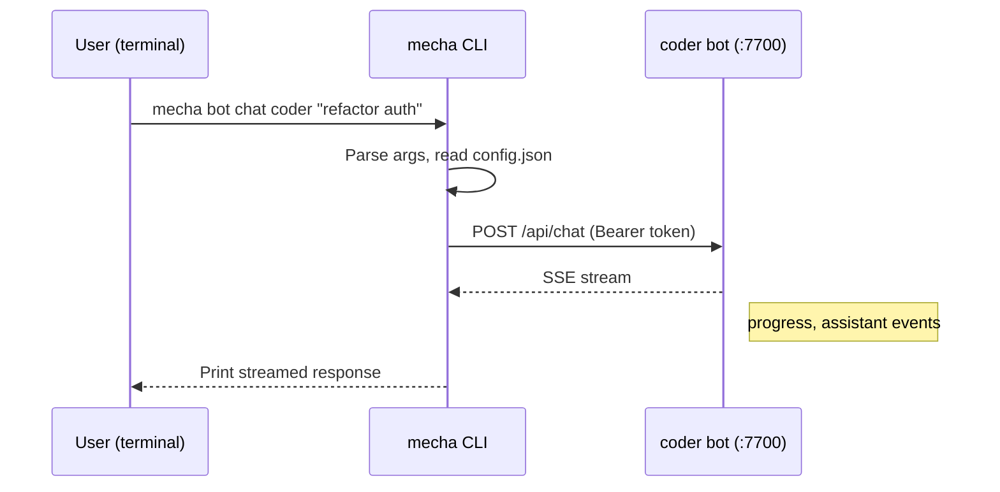
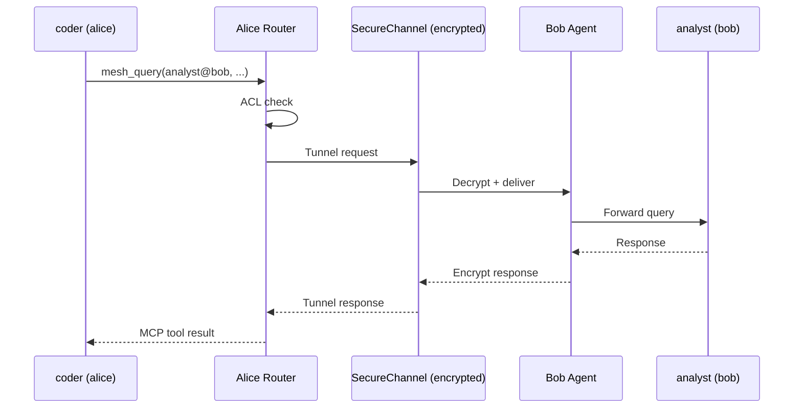
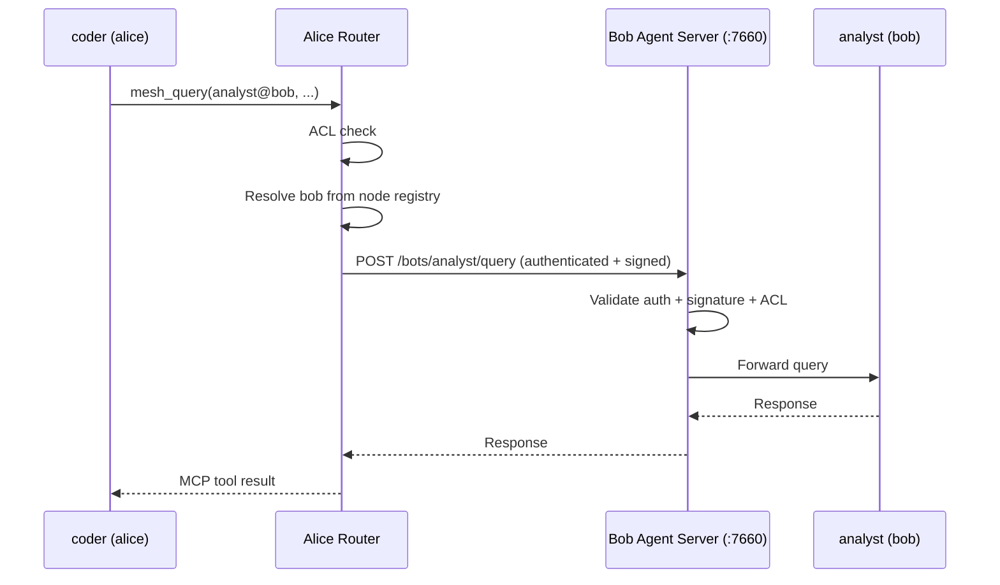

# Architecture

Technical overview of Mecha's internal architecture.

## Package Structure

Mecha is a TypeScript monorepo with 12 packages:

```
@mecha/core        ← Types, schemas, validation, ACL engine, identity (Ed25519)
@mecha/process     ← ProcessManager: spawn/kill/stop, port allocation, sandbox hooks
@mecha/runtime     ← Fastify server per bot: sessions, chat SSE, MCP tools
@mecha/service     ← High-level API: botSpawn, botChat, botFind, routing
@mecha/agent       ← Inter-node HTTP server for mesh routing
@mecha/connect     ← P2P connectivity: Noise IK handshake, SecureChannel, invite codes
@mecha/server      ← Rendezvous + relay server + gossip protocol for P2P peer discovery
@mecha/sandbox     ← OS-level isolation: macOS sandbox-exec, Linux bwrap
@mecha/meter       ← Metering proxy: cost tracking, budgets, events
@mecha/mcp-server  ← MCP server: stdio + HTTP transport, audit logging, rate limiting
@mecha/cli         ← Commander-based CLI: 40+ commands
@mecha/dashboard   ← Next.js web UI: bot management, terminal, mesh, ACL, audit, metering
```

### Dependency Graph



## Process Model

Each bot is a child process of the `mecha` CLI:



The single `mecha` binary serves dual duty:
- **CLI mode** — when invoked with commands (`mecha spawn`, `mecha chat`)
- **Runtime mode** — when invoked as `mecha __runtime` (spawned internally as a child process)

This is how the bun single-binary distribution works — no separate runtime binary needed.

## Request Flow

### Chat Request



### Mesh Query (P2P / Managed Node)



### Mesh Query (HTTP / Direct Node)



## Agent Server API

The agent server (`@mecha/agent`, port 7660) is the unified HTTP + WebSocket server for dashboard UI, inter-node mesh routing, and terminal access. It is created via `createAgentServer()` from `@mecha/agent`.

All routes except those listed as **Public** require authentication (session cookie or Bearer token).

### Route Summary

| Method | Path | Auth | Description |
|--------|------|------|-------------|
| **Health & Info** |
| `GET` | `/healthz` | Public | Health check |
| `GET` | `/node/info` | Required | Full system telemetry |
| `GET` | `/doctor` | Required | System health diagnostics |
| **Auth** |
| `GET` | `/auth/status` | Public | Available auth methods |
| `POST` | `/auth/login` | Public | TOTP login (per-IP rate-limited) |
| `POST` | `/auth/logout` | Public | Clear session cookie |
| `GET` | `/auth/profiles` | Required | List auth profiles |
| **Bots** |
| `GET` | `/bots` | Required | List all bots |
| `POST` | `/bots` | Required | Spawn a new bot |
| `POST` | `/bots/batch` | Required | Batch stop or restart all bots |
| `GET` | `/bots/:name/status` | Required | Get bot status (enriched) |
| `POST` | `/bots/:name/start` | Required | Start a stopped bot from config |
| `POST` | `/bots/:name/stop` | Required | Graceful stop (supports `force` body param) |
| `POST` | `/bots/:name/restart` | Required | Restart bot (supports `force` body param) |
| `POST` | `/bots/:name/kill` | Required | Force kill |
| `DELETE` | `/bots/:name` | Required | Remove a bot (must be stopped) |
| `PATCH` | `/bots/:name/config` | Required | Update bot config fields, optionally restart |
| `GET` | `/bots/:name/logs` | Required | Read bot stdout/stderr logs |
| `GET` | `/bots/:name/sandbox` | Required | Get bot sandbox profile |
| **Sessions** |
| `GET` | `/bots/:name/sessions` | Required | List bot sessions |
| `GET` | `/bots/:name/sessions/:id` | Required | Get specific session |
| `DELETE` | `/bots/:name/sessions/:id` | Required | Delete a session |
| **Routing** |
| `POST` | `/bots/:name/query` | Required | Forward a mesh query (requires `X-Mecha-Source`) |
| **Schedules** |
| `GET` | `/bots/schedules/overview` | Required | All schedules across all bots |
| `GET` | `/bots/:name/schedules` | Required | List bot schedules |
| `POST` | `/bots/:name/schedules` | Required | Add a schedule |
| `DELETE` | `/bots/:name/schedules/:id` | Required | Remove a schedule |
| `POST` | `/bots/:name/schedules/:id/pause` | Required | Pause a schedule |
| `POST` | `/bots/:name/schedules/:id/resume` | Required | Resume a paused schedule |
| `POST` | `/bots/:name/schedules/:id/run` | Required | Trigger immediate schedule run |
| `GET` | `/bots/:name/schedules/:id/history` | Required | Schedule run history (supports `?limit=`) |
| **Discovery** |
| `GET` | `/discover` | Required | Discover bots (filterable by `?tag=` and `?capability=`) |
| `POST` | `/discover/handshake` | Cluster Key | Auto-discovery handshake (conditional on `MECHA_CLUSTER_KEY`) |
| **ACL** |
| `GET` | `/acl` | Required | List ACL rules |
| `POST` | `/acl/grant` | Required | Grant a capability |
| `POST` | `/acl/revoke` | Required | Revoke a capability |
| **Audit** |
| `GET` | `/audit` | Required | Read audit log (supports `?limit=`) |
| `POST` | `/audit/clear` | Required | Clear the audit log |
| **Budgets** |
| `GET` | `/budgets` | Required | List budget limits |
| `POST` | `/budgets` | Required | Set a budget limit |
| `DELETE` | `/budgets/:scope/:name?` | Required | Remove a budget limit |
| **Metering** |
| `GET` | `/meter/cost` | Required | Query metering data (supports `?bot=`) |
| `GET` | `/meter/status` | Required | Meter proxy status |
| `POST` | `/meter/start` | Required | Start the meter proxy |
| `POST` | `/meter/stop` | Required | Stop the meter proxy |
| **Events** |
| `GET` | `/events` | Required | SSE stream for real-time process events |
| `GET` | `/events/log` | Required | Persisted event log (supports `?limit=`) |
| **Mesh Nodes** |
| `GET` | `/mesh/nodes` | Required | List mesh nodes with health status |
| `GET` | `/nodes` | Required | List mesh nodes from registry |
| `POST` | `/nodes` | Required | Add a mesh node |
| `DELETE` | `/nodes/:name` | Required | Remove a mesh node |
| `POST` | `/nodes/:name/ping` | Required | Ping a mesh node |
| `POST` | `/nodes/:name/promote` | Required | Promote a discovered node to managed |
| **Tools** |
| `GET` | `/tools` | Required | List installed tools |
| `POST` | `/tools` | Required | Install a tool |
| `DELETE` | `/tools/:name` | Required | Remove a tool |
| **Plugins** |
| `GET` | `/plugins` | Required | List registered plugins |
| `POST` | `/plugins` | Required | Add a plugin |
| `DELETE` | `/plugins/:name` | Required | Remove a plugin |
| `GET` | `/plugins/:name/status` | Required | Get plugin config (secrets redacted) |
| `POST` | `/plugins/:name/test` | Required | Connectivity test for a plugin |
| **Settings** |
| `GET` | `/settings/runtime` | Required | Runtime port configuration |
| `GET` | `/settings/totp` | Required | TOTP auth status |
| `GET` | `/settings/node` | Required | Node identity and network info |
| `GET` | `/settings/auth-profiles` | Required | Auth profile configuration |
| `GET` | `/settings/network` | Required | Network/proxy settings |
| **WebSocket** |
| `POST` | `/ws/ticket` | Required | Issue a single-use WebSocket ticket |
| `WS` | `/ws/terminal/:name` | Ticket | Terminal WebSocket (PTY attach) |

### `createAgentServer(opts)`

Factory function that creates a fully configured Fastify server with all routes, auth hooks, and optional SPA serving.

```ts
import { createAgentServer } from "@mecha/agent";
import { fetchPublicIp } from "@mecha/core";

const publicIp = await fetchPublicIp();
const app = createAgentServer({
  port: 7660,
  auth: { totpSecret: "BASE32SECRET", sessionTtlHours: 24 },
  processManager,
  acl,
  mechaDir: "/Users/you/.mecha",
  nodeName: "alice",
  startedAt: new Date().toISOString(),
  publicIp,
  ptySpawnFn: spawnPty,   // omit to disable terminal
  spaDir: "/path/to/spa", // omit to disable SPA serving
});

await app.listen({ port: 7660, host: "0.0.0.0" });
```

**`AgentServerOpts`**

| Field | Type | Required | Description |
|-------|------|----------|-------------|
| `port` | `number` | Yes | Port the server binds to |
| `auth` | `AgentServerAuth` | Yes | Authentication configuration |
| `processManager` | `ProcessManager` | Yes | Process manager for bot lifecycle |
| `acl` | `AclEngine` | Yes | ACL engine for access control checks |
| `mechaDir` | `string` | Yes | Path to `~/.mecha` data directory |
| `nodeName` | `string` | Yes | Name of this node in the mesh |
| `startedAt` | `string` | Yes | ISO timestamp of server start |
| `publicIp` | `string` | No | Cached public IP (fetched at startup via `fetchPublicIp()`) |
| `ptySpawnFn` | `PtySpawnFn` | No | PTY spawn function for terminal WebSocket. Omit to disable terminal |
| `spaDir` | `string` | No | Path to SPA dist directory. When set, serves static SPA files and handles client-side routing fallback |

**`AgentServerAuth`**

| Field | Type | Default | Description |
|-------|------|---------|-------------|
| `totpSecret` | `string` | — | Base32 TOTP secret. When set, enables session-based TOTP auth |
| `sessionTtlHours` | `number` | `24` | Session cookie TTL in hours |
| `apiKey` | `string` | — | Internal API key for mesh node-to-node routing (Bearer token) |

### Barrel Exports (`@mecha/agent`)

The `@mecha/agent` package re-exports the following public API from its barrel:

| Export | Type | Description |
|--------|------|-------------|
| `createAgentServer` | Function | Factory to create the agent Fastify server |
| `AgentServerOpts` | Type | Options for `createAgentServer` |
| `AgentServerAuth` | Type | Auth configuration subset |
| `createAuthHook` | Function | Fastify `onRequest` hook for session/token/ticket auth |
| `getSource` | Function | Extract `X-Mecha-Source` header from a request |
| `AuthOpts` | Type | Options for the auth hook |
| `startMeterDaemon` | Function | Start the background meter proxy daemon |
| `stopMeterDaemon` | Function | Stop the running meter proxy daemon |

### Node Routes (`registerNodeRoutes`)

Registers CRUD + ping + promote routes for mesh node management.

```ts
function registerNodeRoutes(app: FastifyInstance, opts: NodeRouteOpts): void
```

**`NodeRouteOpts`**

| Field | Type | Description |
|-------|------|-------------|
| `mechaDir` | `string` | Path to `~/.mecha` data directory |

**Routes registered:**

| Method | Path | Description |
|--------|------|-------------|
| `GET` | `/nodes` | List all nodes (redacts `apiKey`, exposes `hasApiKey` boolean) |
| `POST` | `/nodes` | Add a node. Body: `{ name, host, port, apiKey }`. Returns `409` on duplicate |
| `DELETE` | `/nodes/:name` | Remove a node. Returns `404` if not found |
| `POST` | `/nodes/:name/ping` | Ping a node via `nodePing()`. Returns `404` if not found |
| `POST` | `/nodes/:name/promote` | Promote a discovered node to managed. Returns `404` if not found |

### Tool Routes (`registerToolRoutes`)

Registers CRUD routes for tool management (install, list, remove).

```ts
function registerToolRoutes(app: FastifyInstance, opts: ToolRouteOpts): void
```

**`ToolRouteOpts`**

| Field | Type | Description |
|-------|------|-------------|
| `mechaDir` | `string` | Path to `~/.mecha` data directory |

**Routes registered:**

| Method | Path | Description |
|--------|------|-------------|
| `GET` | `/tools` | List all installed tools |
| `POST` | `/tools` | Install a tool. Body: `{ name, version?, description? }` |
| `DELETE` | `/tools/:name` | Remove a tool. Returns `404` if not found |

### Plugin Routes and `isPrivateUrl`

Plugin routes are registered via `registerPluginRoutes(app, opts)` with the same `{ mechaDir }` options pattern.

**`isPrivateUrl(urlStr: string): boolean`**

SSRF guard helper used by the plugin test endpoint. Returns `true` if the given URL targets a private or internal network address. Blocks:

- Non-HTTP(S) protocols
- Localhost variants (`localhost`, `0.0.0.0`, `[::]`, `::1`, `::`)
- IPv4 private ranges (10.x, 172.16-31.x, 192.168.x, 127.x, 169.254.x)
- IPv6 link-local (`fe80:`), unique local (`fc`, `fd`), and IPv4-mapped (`::ffff:`)
- Malformed URLs (returns `true` as fail-closed default)

### Authentication System

The agent server uses a multi-layer authentication system implemented across several modules.

#### Auth Hooks (`auth.ts`)

Two Fastify hooks enforce authentication:

1. **`createAuthHook(opts)`** — `onRequest` hook that validates auth via session cookie, Bearer token, or WebSocket ticket.
2. **`createSignatureHook(opts)`** — `preHandler` hook that verifies Ed25519 signatures on routing endpoints (runs after body parsing).

**Auth flow priority:**

1. **Public paths** — `/healthz`, `/auth/status`, `/auth/login`, `/auth/logout` skip auth entirely
2. **SPA static assets** — When `spaDir` is set, non-API paths skip auth. Browser navigations (`Accept: text/html`) to API-prefixed paths serve the SPA index.html
3. **WebSocket paths** — `/ws/*` (except `/ws/ticket`) accept single-use ticket auth via `?ticket=` query parameter
4. **Session cookie** — `mecha-session` cookie containing a signed JWT (HS256)
5. **Bearer token** — `Authorization: Bearer <apiKey>`, restricted to mesh routing requests only (POST `/bots/:name/query` with `X-Mecha-Source` header)

**Signature verification** (mesh routing only):

Routing requests (`POST /bots/:name/query`) from remote nodes must include:

| Header | Description |
|--------|-------------|
| `X-Mecha-Source` | Source identifier (`bot@node`) |
| `X-Mecha-Signature` | Ed25519 signature over the request envelope |
| `X-Mecha-Timestamp` | Unix timestamp (must be within 5-minute window) |
| `X-Mecha-Nonce` | Unique nonce (prevents replay attacks) |

The signature envelope format is: `METHOD\nPATH\nSOURCE\nTIMESTAMP\nNONCE\nBODY_JSON`.

#### Session Management (`session.ts`)

Sessions use custom JWT tokens (HS256) with no external dependencies.

| Function | Description |
|----------|-------------|
| `deriveSessionKey(totpSecret)` | Derives a hex signing key from the TOTP secret via HKDF-SHA256 |
| `createSessionToken(key, ttlHours?)` | Creates a signed JWT with `iat` and `exp` claims. Default TTL: 24 hours |
| `verifySessionToken(key, token)` | Verifies JWT signature and expiry. Returns `{ valid, iat, exp }` or `{ valid: false }` |
| `parseSessionCookie(cookieHeader)` | Extracts the `mecha-session` value from a `Cookie` header string |

The session cookie name is `mecha-session`. Cookies are set with `HttpOnly`, `SameSite=Strict`, and `Secure` (when not on localhost).

#### TOTP Verification (`totp.ts`)

`verifyTotpCode(secret, code)` verifies a 6-digit TOTP code against a base32 secret using SHA1 with a 30-second period. A window of 1 allows plus/minus 30 seconds of clock skew.

#### Login Rate Limiter (`login-limiter.ts`)

`createLoginLimiter(opts?)` returns a rate limiter for login attempts.

| Option | Type | Default | Description |
|--------|------|---------|-------------|
| `maxAttempts` | `number` | `5` | Maximum failed attempts within the window |
| `windowMs` | `number` | `30000` | Sliding window duration in ms |
| `lockoutMs` | `number` | `60000` | Lockout duration after max attempts exceeded |

**Methods:**

| Method | Description |
|--------|-------------|
| `check()` | Returns `{ allowed, retryAfterMs? }`. Call before each login attempt |
| `recordFailure()` | Record a failed attempt. Triggers lockout when `maxAttempts` is reached |
| `reset()` | Clear failure history and lockout (called on successful login) |

#### WebSocket Tickets (`ws-tickets.ts`)

Browser WebSocket connections cannot set custom headers, so terminal connections use single-use tickets instead of session cookies.

| Function | Description |
|----------|-------------|
| `issueTicket()` | Returns a cryptographically random 24-byte base64url ticket. Stored in memory with a 30-second TTL |
| `consumeTicket(ticket)` | Validates and deletes the ticket. Returns `true` once, then the ticket is gone |
| `purgeTickets()` | Removes expired tickets. Called automatically before issuing new tickets |

Flow: Client calls `POST /ws/ticket` (authenticated) to get a ticket, then connects to `ws://host/ws/terminal/:name?ticket=<ticket>`.

### PTY Manager (`pty-manager.ts`)

The PTY manager handles terminal sessions for the WebSocket terminal feature. Created via `createPtyManager(opts)`.

| Option | Type | Default | Description |
|--------|------|---------|-------------|
| `processManager` | `ProcessManager` | (required) | For looking up bot state and config |
| `mechaDir` | `string` | (required) | Path to `~/.mecha` |
| `spawnFn` | `PtySpawnFn` | (required) | Function to spawn PTY processes |
| `maxSessions` | `number` | `10` | Maximum concurrent PTY sessions |
| `idleTimeoutMs` | `number` | `300000` | Kill idle PTYs after 5 minutes with no attached clients |

**`PtyManager` methods:**

| Method | Description |
|--------|-------------|
| `spawn(botName, sessionId, cols, rows)` | Spawn a new PTY running `claude` (or `claude --resume <id>`). Returns `PtySession` |
| `attach(sessionKey, ws)` | Attach a WebSocket client to an existing PTY session |
| `detach(sessionKey, ws)` | Detach a client. Starts idle timer if no clients remain |
| `resize(sessionKey, cols, rows)` | Resize the PTY |
| `getSession(sessionKey)` | Look up a session by key (`botName:sessionId`) |
| `findByBot(botName)` | Find all PTY sessions for a bot, sorted by most recently active first |
| `shutdown()` | Kill all PTY processes and clear idle timers |

PTY sessions maintain a scrollback ring buffer (200 chunks) that is replayed when a client reattaches, so reconnecting users see recent output.

### Route Details

#### Health Routes

**`GET /healthz`** (Public)

Minimal health check.

```json
{ "status": "ok", "node": "alice" }
```

**`GET /node/info`** (Authenticated)

Full system telemetry: hostname, platform, arch, memory, CPU count, uptime, bot count, and network IPs.

#### Auth Routes

**`GET /auth/status`** (Public)

Returns available authentication methods.

```json
{ "methods": { "totp": true } }
```

**`POST /auth/login`** (Public, rate-limited)

Submit a TOTP code to get a session cookie.

| Field | Type | Description |
|-------|------|-------------|
| `code` | `string` | 6-digit TOTP code |

| Status | Condition |
|--------|-----------|
| 200 | Login successful, `Set-Cookie` header sent |
| 400 | Missing TOTP code |
| 401 | Invalid TOTP code |
| 404 | TOTP auth not enabled |
| 429 | Too many attempts (`retryAfterMs` in body) |

**`POST /auth/logout`** (Public)

Clears the session cookie by setting `Max-Age=0`.

**`GET /auth/profiles`** (Authenticated)

Lists available auth profiles for the UI bot config dropdown.

#### bot Routes

**`GET /bots`** — List all bots with enriched info (metering snapshot, tags, expose, model). Response uses a list projection that omits `pid`, `exitCode`, and shortens `workspacePath` to its basename.

**`GET /bots/:name/status`** — Full enriched status for a single bot.

**`POST /bots`** — Spawn a new bot.

| Field | Type | Required | Description |
|-------|------|----------|-------------|
| `name` | `string` | Yes | bot name (validated via `isValidName`) |
| `workspacePath` | `string` | Yes | Absolute path to workspace directory |

**`POST /bots/:name/start`** — Start a stopped bot from its persisted `config.json`.

| Status | Condition |
|--------|-----------|
| 200 | Started successfully |
| 404 | bot not found |
| 409 | bot already running |

**`POST /bots/:name/stop`** — Graceful stop with task safety check.

| Body Field | Type | Default | Description |
|------------|------|---------|-------------|
| `force` | `boolean` | `false` | Skip busy check and stop immediately |

Returns `409 BOT_BUSY` with `activeSessions` and `lastActivity` if the bot has active sessions and `force` is not set.

**`POST /bots/:name/restart`** — Stop and re-spawn. Same `force` semantics as stop.

**`POST /bots/:name/kill`** — Force kill (SIGKILL).

**`POST /bots/batch`** — Batch stop or restart all bots.

| Body Field | Type | Default | Description |
|------------|------|---------|-------------|
| `action` | `"stop" \| "restart"` | — | Required. The batch action to perform |
| `force` | `boolean` | `false` | Bypass busy check entirely |
| `idleOnly` | `boolean` | `false` | Skip busy bots instead of failing |
| `dryRun` | `boolean` | `false` | Check status without executing |
| `names` | `string[]` | — | Optional filter to target specific bots |

Always returns HTTP 200 with per-bot results (partial completion model):

```json
{
  "results": [
    { "name": "alice", "status": "succeeded" },
    { "name": "bob", "status": "skipped_busy", "activeSessions": 2 },
    { "name": "charlie", "status": "failed", "error": "Config not found" }
  ],
  "summary": { "succeeded": 1, "skipped": 1, "failed": 1 }
}
```

Status values: `succeeded`, `skipped_busy`, `skipped_stopped`, `failed`.

**`PATCH /bots/:name/config`** — Update bot configuration fields.

| Body Field | Type | Description |
|------------|------|-------------|
| `auth` | `string \| null` | Auth profile name, `$env:api-key`, `$env:oauth`, or `null` to clear |
| `model` | `string` | Model override |
| `tags` | `string[]` | Tags for discovery |
| `expose` | `string[]` | Exposed capabilities |
| `sandboxMode` | `string` | Sandbox mode |
| `permissionMode` | `string` | Permission mode |
| `restart` | `boolean` | Restart the bot after config update |
| `force` | `boolean` | Force restart (skip busy check) |

Only allowlisted fields are persisted. Auth profiles are validated before saving (checks `$env:` sentinel env vars or profile store).

#### Session Routes

**`GET /bots/:name/sessions`** — List all sessions for a bot. Proxies to the bot's runtime API.

**`GET /bots/:name/sessions/:id`** — Get a specific session transcript.

**`DELETE /bots/:name/sessions/:id`** — Delete a session.

All session routes return `502` if the upstream bot is unreachable.

#### Routing Routes

**`POST /bots/:name/query`** — Forward a mesh query to a local bot.

| Header | Required | Description |
|--------|----------|-------------|
| `X-Mecha-Source` | Yes | Source identifier (`bot` or `bot@node`) |

| Body Field | Type | Required | Description |
|------------|------|----------|-------------|
| `message` | `string` | Yes | Message to send |
| `sessionId` | `string` | No | Session ID for multi-turn conversations |

ACL is always enforced. Returns `403` if the source lacks `query` capability on the target. Returns `502`/`504` on upstream errors.

#### Discovery Routes

**`GET /discover`** — Discover bots by tag or capability.

| Query Param | Description |
|-------------|-------------|
| `tag` | Filter by tag (exact match) |
| `capability` | Filter by exposed capability (exact match) |

```json
[
  { "name": "researcher", "state": "running", "tags": ["research"], "expose": ["query"] }
]
```

#### ACL Routes

**`GET /acl`** — Returns all ACL rules from the ACL engine.

#### Audit Routes

**`GET /audit`** — Read the audit log.

| Query Param | Default | Range | Description |
|-------------|---------|-------|-------------|
| `limit` | `50` | 1--1000 | Number of entries to return |

#### Mesh Routes

**`GET /mesh/nodes`** — List all mesh nodes with live health status. The local node always appears first with `isLocal: true` and full system info. Remote nodes are health-checked in parallel (max 10 concurrent, 5-second timeout) via their `/node/info` endpoint, falling back to `/healthz` if auth fails.

#### Meter Routes

**`GET /meter/cost`** — Query today's metering data.

| Query Param | Description |
|-------------|-------------|
| `bot` | Optional bot name for per-bot breakdown |

#### Settings Routes

**`GET /settings/runtime`** — Runtime port configuration sourced from `@mecha/core` defaults.

```json
{ "botPortRange": "7700-7799", "agentPort": 7660, "mcpPort": 7680 }
```

#### Events Routes

**`GET /events`** — Server-Sent Events stream for real-time process lifecycle events.

| Parameter | Value |
|-----------|-------|
| Max connections | 10 concurrent |
| Heartbeat | Every 10 seconds |
| Overflow | 429 Too Many Requests |

Events are emitted by the ProcessManager (spawn, stop, exit, error) and streamed as `data:` frames.

#### Terminal WebSocket

**`WS /ws/terminal/:name`** — Attach to a bot terminal via WebSocket-to-PTY bridge.

| Query Param | Required | Description |
|-------------|----------|-------------|
| `session` | No | Session ID to resume (omit for new session or auto-reattach) |
| `cols` | No | Initial terminal columns (default: 80) |
| `rows` | No | Initial terminal rows (default: 24) |
| `ticket` | Yes | Single-use auth ticket from `POST /ws/ticket` |

When no `session` is specified, the server attempts to reattach to the most recently active PTY for that bot before spawning a new one.

#### WebSocket Ticket

**`POST /ws/ticket`** — Issue a single-use, 30-second ticket for WebSocket auth.

```json
{ "ticket": "base64url-encoded-24-bytes" }
```

### SPA Serving

When `spaDir` is provided, the server serves the SPA:

- Static files are served from `spaDir` via `@fastify/static`
- Browser navigations (GET with `Accept: text/html`) to any path serve `index.html` for client-side routing
- API paths (`/bots`, `/acl`, `/audit`, `/mesh`, `/meter`, `/settings/`, `/events`, `/discover`, `/ws`) are not intercepted by the SPA fallback for non-browser requests
- The auth hook skips authentication for static asset requests when SPA is enabled

## Process Package API Reference (`@mecha/process`)

The `@mecha/process` package manages bot process lifecycles: spawning, stopping, killing, port allocation, sandbox filesystem setup, schedule persistence, and event emission.

### Barrel Exports

The package re-exports the following public API:

| Export | Kind | Source |
|--------|------|--------|
| `checkPort` | Function | `port.ts` |
| `allocatePort` | Function | `port.ts` |
| `waitForHealthy` | Function | `health.ts` |
| `readState` | Function | `state-store.ts` |
| `writeState` | Function | `state-store.ts` |
| `listBotDirs` | Function | `state-store.ts` |
| `BotState` | Type | `state-store.ts` |
| `ProcessEventEmitter` | Class | `events.ts` |
| `ProcessEvent` | Type | `events.ts` |
| `ProcessEventHandler` | Type | `events.ts` |
| `createProcessManager` | Function | `process-manager.ts` |
| `ProcessManager` | Interface | `types.ts` |
| `ProcessInfo` | Interface | `types.ts` |
| `SpawnOpts` | Interface | `types.ts` |
| `LogOpts` | Interface | `types.ts` |
| `CreateProcessManagerOpts` | Interface | `types.ts` |
| `isPidAlive` | Function | `process-lifecycle.ts` (re-export from `@mecha/core`) |
| `waitForChildExit` | Function | `process-lifecycle.ts` |
| `waitForPidExit` | Function | `process-lifecycle.ts` |
| `prepareBotFilesystem` | Function | `sandbox-setup.ts` |
| `encodeProjectPath` | Function | `sandbox-setup.ts` |
| `buildBotEnv` | Function | `sandbox-setup.ts` |
| `BotFilesystemOpts` | Interface | `sandbox-setup.ts` |
| `BotFilesystemResult` | Interface | `sandbox-setup.ts` |
| `BuildBotEnvOpts` | Interface | `sandbox-setup.ts` |
| `readLogs` | Function | `log-reader.ts` |
| `MechaPty` | Interface | `pty-types.ts` |
| `PtySpawnOpts` | Interface | `pty-types.ts` |
| `PtySpawnFn` | Type | `pty-types.ts` |
| `PtyDisposable` | Interface | `pty-types.ts` |
| `createBunPtySpawn` | Function | `bun-pty.ts` |
| `readScheduleConfig` | Function | `schedule-store.ts` |
| `writeScheduleConfig` | Function | `schedule-store.ts` |
| `readScheduleState` | Function | `schedule-store.ts` |
| `writeScheduleState` | Function | `schedule-store.ts` |
| `appendRunHistory` | Function | `schedule-store.ts` |
| `readRunHistory` | Function | `schedule-store.ts` |
| `removeScheduleData` | Function | `schedule-store.ts` |

### `createProcessManager(opts)`

Factory function that creates a `ProcessManager` instance managing bot process lifecycles with per-bot mutex serialization.

```ts
import { createProcessManager } from "@mecha/process";

const pm = createProcessManager({
  mechaDir: "/Users/you/.mecha",
  runtimeEntrypoint: "/path/to/runtime.js",
  healthTimeoutMs: 30000,
});

const info = await pm.spawn({ name: "researcher", workspacePath: "/path/to/workspace" });
```

**`CreateProcessManagerOpts`**

| Field | Type | Required | Default | Description |
|-------|------|----------|---------|-------------|
| `mechaDir` | `string` | Yes | — | Path to `~/.mecha` data directory |
| `healthTimeoutMs` | `number` | No | `30000` | Timeout for bot health check after spawn |
| `spawnFn` | `typeof spawn` | No | `child_process.spawn` | Override for testing |
| `runtimeEntrypoint` | `string` | No | — | Path to the `@mecha/runtime` JS entrypoint (used with `node`) |
| `runtimeBin` | `string` | No | — | Path to a standalone runtime binary (takes precedence over `runtimeEntrypoint`) |
| `runtimeArgs` | `string[]` | No | — | Extra args when using `runtimeBin` (e.g., `["__runtime"]`) |
| `sandbox` | `Sandbox` | No | — | Sandbox instance for kernel-level isolation |

**`ProcessManager` Interface**

| Method | Signature | Description |
|--------|-----------|-------------|
| `spawn` | `(opts: SpawnOpts) => Promise<ProcessInfo>` | Spawn a new bot process |
| `get` | `(name: BotName) => ProcessInfo \| undefined` | Get bot info by name |
| `list` | `() => ProcessInfo[]` | List all bots (checks PID liveness) |
| `stop` | `(name: BotName) => Promise<void>` | Graceful stop (SIGTERM, then SIGKILL after grace period) |
| `kill` | `(name: BotName) => Promise<void>` | Force kill (SIGKILL) |
| `logs` | `(name: BotName, opts?: LogOpts) => Readable` | Stream bot logs |
| `getPortAndToken` | `(name: BotName) => { port: number; token: string } \| undefined` | Get connection details for a running bot |
| `onEvent` | `(handler: (event: ProcessEvent) => void) => () => void` | Subscribe to lifecycle events (returns unsubscribe fn) |

### Types

**`SpawnOpts`**

| Field | Type | Required | Description |
|-------|------|----------|-------------|
| `name` | `BotName` | Yes | Bot name |
| `workspacePath` | `string` | Yes | Absolute path to workspace directory |
| `port` | `number` | No | Specific port (auto-allocated from 7700-7799 if omitted) |
| `env` | `Record<string, string>` | No | Additional environment variables |
| `model` | `string` | No | Model override |
| `permissionMode` | `string` | No | Permission mode |
| `auth` | `string \| null` | No | Auth profile name or `null` to clear |
| `tags` | `string[]` | No | Tags for discovery |
| `expose` | `string[]` | No | Exposed capabilities |
| `runtimeBin` | `string` | No | Per-spawn runtime binary override |
| `sandboxMode` | `SandboxMode` | No | Sandbox mode (`"auto"`, `"require"`, `"off"`) |
| `meterOff` | `boolean` | No | Disable metering for this bot |
| `home` | `string` | No | Override HOME directory |

**`ProcessInfo`**

| Field | Type | Description |
|-------|------|-------------|
| `name` | `BotName` | Bot name |
| `state` | `"running" \| "stopped" \| "error"` | Current state |
| `pid` | `number?` | OS process ID |
| `port` | `number?` | Listening port |
| `workspacePath` | `string` | Workspace path |
| `token` | `string?` | Auth token (only available for live processes) |
| `startedAt` | `string?` | ISO timestamp of last start |
| `stoppedAt` | `string?` | ISO timestamp of last stop |
| `exitCode` | `number?` | Exit code if stopped |

**`LogOpts`**

| Field | Type | Default | Description |
|-------|------|---------|-------------|
| `follow` | `boolean` | `false` | Tail the log file (like `tail -f`) |
| `tail` | `number` | — | Number of lines from the end |

**`LiveProcess`** (internal)

| Field | Type | Description |
|-------|------|-------------|
| `child` | `ChildProcess` | Node.js child process handle |
| `port` | `number` | Allocated port |
| `token` | `string` | Auth token |
| `name` | `BotName` | Bot name |

### `spawnBot(ctx, spawnOpts)`

Low-level spawn pipeline called internally by `ProcessManager.spawn()`. Handles port allocation, filesystem preparation, sandbox wrapping, child process spawning, health check, and state persistence.

```ts
function spawnBot(ctx: SpawnContext, spawnOpts: SpawnOpts): Promise<ProcessInfo>
```

Throws `BotAlreadyExistsError` if the bot is already running, `ProcessSpawnError` on spawn failures.

### `prepareBotFilesystem(opts)`

Creates the sandboxed directory structure for a bot process, writes `config.json`, sandbox hook scripts, Claude Code credentials, and builds the child process environment.

```ts
function prepareBotFilesystem(opts: BotFilesystemOpts): BotFilesystemResult
```

**`BotFilesystemOpts`**

| Field | Type | Required | Description |
|-------|------|----------|-------------|
| `botDir` | `string` | Yes | Bot root directory |
| `workspacePath` | `string` | Yes | Workspace path |
| `port` | `number` | Yes | Allocated port |
| `token` | `string` | Yes | Auth token |
| `name` | `string` | Yes | Bot name |
| `mechaDir` | `string` | Yes | Path to `~/.mecha` |
| `model` | `string` | No | Model override |
| `permissionMode` | `string` | No | Permission mode |
| `auth` | `string \| null` | No | Auth profile |
| `tags` | `string[]` | No | Tags |
| `expose` | `string[]` | No | Exposed capabilities |
| `userEnv` | `Record<string, string>` | No | User environment variables (reserved keys are filtered) |
| `meterOff` | `boolean` | No | Disable meter proxy integration |
| `home` | `string` | No | Override HOME directory |

**`BotFilesystemResult`**

| Field | Type | Description |
|-------|------|-------------|
| `homeDir` | `string` | Effective HOME directory |
| `tmpDir` | `string` | TMPDIR for the bot |
| `logsDir` | `string` | Log directory |
| `projectsDir` | `string` | Claude projects directory |
| `childEnv` | `Record<string, string>` | Complete environment for the child process |

The directory structure mirrors real Claude Code:

```
botDir/
  .claude/
    settings.json         <- hooks config
    hooks/
      sandbox-guard.sh    <- file access guard
      bash-guard.sh       <- bash command guard
    projects/<encoded>/   <- session data
  tmp/                    <- TMPDIR
  logs/                   <- stdout.log, stderr.log
  config.json             <- port, token, workspace
```

### `waitForChildExit(child, timeoutMs)`

Waits for a `ChildProcess` to emit an `exit` event within the given timeout.

```ts
function waitForChildExit(child: ChildProcess, timeoutMs: number): Promise<boolean>
```

Returns `true` if the child exited, `false` if the timeout elapsed.

### `waitForPidExit(pid, timeoutMs)`

Polls a process by PID (using `process.kill(pid, 0)`) until it exits or the timeout elapses. Polls every 100ms.

```ts
function waitForPidExit(pid: number, timeoutMs: number): Promise<boolean>
```

Returns `true` if the process exited, `false` on timeout.

### Process Events

**`ProcessEvent`** -- Discriminated union of lifecycle events:

| Event | Fields | Description |
|-------|--------|-------------|
| `spawned` | `name`, `pid`, `port` | Bot process started successfully |
| `stopped` | `name`, `exitCode?` | Bot process exited |
| `error` | `name`, `error` | Bot encountered an error |
| `warning` | `name`, `message` | Non-fatal warning (e.g., sandbox degradation) |

**`ProcessEventEmitter`** -- Simple typed event emitter class:

| Member | Description |
|--------|-------------|
| `subscribe(handler)` | Register a handler. Returns an unsubscribe function |
| `emit(event)` | Emit an event to all handlers. Failures are isolated per handler |
| `listenerCount` | Read-only property returning the number of active handlers |

### Schedule Store

Filesystem-backed persistence for bot schedules. All writes use atomic tmp+rename.

#### `readScheduleConfig(botDir)`

Reads `schedule.json` from the bot directory. Returns an empty config (`{ schedules: [] }`) if the file is missing or corrupt.

```ts
function readScheduleConfig(botDir: string): ScheduleConfig
```

#### `writeScheduleConfig(botDir, config)`

Atomically writes `schedule.json` to the bot directory.

```ts
function writeScheduleConfig(botDir: string, config: ScheduleConfig): void
```

#### `readScheduleState(botDir, scheduleId)`

Reads per-schedule state from `schedules/<id>/state.json`. Returns `undefined` if missing.

```ts
function readScheduleState(botDir: string, scheduleId: string): ScheduleState | undefined
```

#### `writeScheduleState(botDir, scheduleId, state)`

Atomically writes per-schedule state.

```ts
function writeScheduleState(botDir: string, scheduleId: string, state: ScheduleState): void
```

#### `appendRunHistory(botDir, scheduleId, result)`

Appends a run result to `schedules/<id>/history.jsonl`. Automatically truncates when the file exceeds `MAX_HISTORY_ENTRIES` (amortized check based on file size heuristic).

```ts
function appendRunHistory(botDir: string, scheduleId: string, result: ScheduleRunResult): void
```

#### `readRunHistory(botDir, scheduleId, limit?)`

Reads run history from the JSONL file. Malformed lines are silently skipped. When `limit` is provided, returns only the most recent N entries.

```ts
function readRunHistory(botDir: string, scheduleId: string, limit?: number): ScheduleRunResult[]
```

#### `removeScheduleData(botDir, scheduleId)`

Removes all state and history for a schedule (deletes `schedules/<id>/` recursively).

```ts
function removeScheduleData(botDir: string, scheduleId: string): void
```

## Service Package API Reference (`@mecha/service`)

The `@mecha/service` package is the high-level business logic layer that CLI commands and dashboard routes call into. It orchestrates `@mecha/process`, `@mecha/core`, and `@mecha/meter`.

### Barrel Exports

| Export | Kind | Source |
|--------|------|--------|
| `resolveBotEndpoint` | Function | `helpers.ts` |
| `runtimeFetch` | Function | `helpers.ts` |
| `assertOk` | Function | `helpers.ts` |
| `RuntimeFetchOpts` | Type | `helpers.ts` |
| `RuntimeFetchResult` | Type | `helpers.ts` |
| `botStatus` | Function | `bot.ts` |
| `botFind` | Function | `bot.ts` |
| `botConfigure` | Function | `bot.ts` |
| `FindResult` | Type | `bot.ts` |
| `BotConfigUpdates` | Type | `bot.ts` |
| `botChat` | Function | `chat.ts` |
| `ChatOpts` | Type | `chat.ts` |
| `ChatEvent` | Type | `chat.ts` |
| `botSessionList` | Function | `sessions.ts` |
| `botSessionGet` | Function | `sessions.ts` |
| `botSessionDelete` | Function | `sessions.ts` |
| `mechaInit` | Function | `init.ts` |
| `InitResult` | Type | `init.ts` |
| `mechaDoctor` | Function | `doctor.ts` |
| `DoctorCheck` | Type | `doctor.ts` |
| `DoctorResult` | Type | `doctor.ts` |
| `mechaToolInstall` | Function | `tools.ts` |
| `mechaToolLs` | Function | `tools.ts` |
| `mechaToolRemove` | Function | `tools.ts` |
| `ToolInfo` | Type | `tools.ts` |
| `ToolInstallOpts` | Type | `tools.ts` |
| `mechaAuthAdd` | Function | `auth.ts` |
| `mechaAuthAddFull` | Function | `auth.ts` |
| `mechaAuthLs` | Function | `auth.ts` |
| `mechaAuthDefault` | Function | `auth.ts` |
| `mechaAuthRm` | Function | `auth.ts` |
| `mechaAuthTag` | Function | `auth.ts` |
| `mechaAuthSwitch` | Function | `auth.ts` |
| `mechaAuthTest` | Function | `auth.ts` |
| `mechaAuthRenew` | Function | `auth.ts` |
| `mechaAuthGet` | Function | `auth.ts` |
| `mechaAuthGetDefault` | Function | `auth.ts` |
| `mechaAuthSwitchBot` | Function | `auth.ts` |
| `mechaAuthProbe` | Function | `auth-probe.ts` |
| `AuthProfile` | Type | `auth.ts` |
| `AuthAddOpts` | Type | `auth.ts` |
| `buildHierarchy` | Function | `hierarchy.ts` |
| `flattenHierarchy` | Function | `hierarchy.ts` |
| `HierarchyNode` | Type | `hierarchy.ts` |
| `createBotRouter` | Function | `router.ts` |
| `BotRouter` | Type | `router.ts` |
| `CreateRouterOpts` | Type | `router.ts` |
| `nodeInit` | Function | `node-init.ts` |
| `readNodeName` | Function | `node-init.ts` |
| `NodeInitResult` | Type | `node-init.ts` |
| `agentFetch` | Function | `agent-fetch.ts` |
| `AgentFetchOpts` | Type | `agent-fetch.ts` |
| `SecureChannelLike` | Type | `agent-fetch.ts` |
| `createLocator` | Function | `locator.ts` |
| `MechaLocator` | Type | `locator.ts` |
| `LocateResult` | Type | `locator.ts` |
| `CreateLocatorOpts` | Type | `locator.ts` |
| `checkBotBusy` | Function | `task-check.ts` |
| `TaskCheckResult` | Type | `task-check.ts` |
| `batchBotAction` | Function | `bot-batch.ts` |
| `BatchActionOpts` | Type | `bot-batch.ts` |
| `BatchItemResult` | Type | `bot-batch.ts` |
| `BatchResult` | Type | `bot-batch.ts` |
| `enrichBotInfo` | Function | `bot-enrich.ts` |
| `buildEnrichContext` | Function | `bot-enrich.ts` |
| `EnrichedBotInfo` | Type | `bot-enrich.ts` |
| `EnrichContext` | Type | `bot-enrich.ts` |
| `getCachedSnapshot` | Function | `snapshot-cache.ts` |
| `invalidateSnapshotCache` | Function | `snapshot-cache.ts` |
| `botScheduleAdd` | Function | `schedule.ts` |
| `botScheduleRemove` | Function | `schedule.ts` |
| `botScheduleList` | Function | `schedule.ts` |
| `botSchedulePause` | Function | `schedule.ts` |
| `botScheduleResume` | Function | `schedule.ts` |
| `botScheduleRun` | Function | `schedule.ts` |
| `botScheduleHistory` | Function | `schedule.ts` |
| `nodePing` | Function | `node-ping.ts` |
| `PingResult` | Type | `node-ping.ts` |

### `nodePing(mechaDir, name, opts?)`

Pings a mesh node to check reachability. For managed (P2P) nodes, checks the rendezvous server's `/lookup/:name` endpoint. For direct (HTTP) nodes, performs a `/healthz` request.

```ts
import { nodePing } from "@mecha/service";

const result = await nodePing("/Users/you/.mecha", "bob");
// { reachable: true, latencyMs: 42, method: "http" }
```

**Parameters:**

| Parameter | Type | Required | Description |
|-----------|------|----------|-------------|
| `mechaDir` | `string` | Yes | Path to `~/.mecha` |
| `name` | `string` | Yes | Node name to ping |
| `opts.server` | `string` | No | Override rendezvous server URL |

**`PingResult`**

| Field | Type | Description |
|-------|------|-------------|
| `reachable` | `boolean` | Whether the node responded |
| `latencyMs` | `number?` | Round-trip time in milliseconds (only when reachable) |
| `method` | `"http" \| "rendezvous"` | Method used to reach the node |
| `error` | `string?` | Error description when not reachable |

Throws `NodeNotFoundError` if the node name is not in the registry.

## Runtime API

Each bot exposes these HTTP endpoints (localhost only):

| Method | Path | Description |
|--------|------|-------------|
| `GET` | `/healthz` | Health check (no auth required) |
| `GET` | `/info` | Runtime info (name, port, uptime, memory) |
| `POST` | `/api/chat` | Send a message (stub — returns 501, chat handled by Agent SDK) |
| `GET` | `/api/sessions` | List all sessions |
| `GET` | `/api/sessions/:id` | Get session transcript |
| `DELETE` | `/api/sessions/:id` | Delete a session |
| `GET` | `/api/schedules` | List schedules |
| `POST` | `/api/schedules` | Create a schedule |
| `DELETE` | `/api/schedules/:id` | Remove a schedule |
| `POST` | `/api/schedules/:id/pause` | Pause a schedule |
| `POST` | `/api/schedules/:id/resume` | Resume a schedule |
| `POST` | `/api/schedules/:id/run` | Trigger a schedule immediately |
| `POST` | `/api/schedules/_pause-all` | Pause all schedules |
| `POST` | `/api/schedules/_resume-all` | Resume all schedules |
| `GET` | `/api/schedules/:id/history` | Schedule run history (supports `?limit=N`) |
| `POST` | `/mcp` | JSON-RPC MCP endpoint |

All routes except `/healthz` require `Authorization: Bearer <token>` (the token from `config.json`). Authentication uses timing-safe comparison via `safeCompare`.

### Runtime Package API Reference (`@mecha/runtime`)

The `@mecha/runtime` package provides the Fastify-based HTTP server that runs inside each bot process. It is the per-bot runtime — one instance per spawned agent.

#### Barrel Exports

| Export | Kind | Source |
|--------|------|--------|
| `createSessionManager` | Function | `session-manager.ts` |
| `SessionManager` | Type | `session-manager.ts` |
| `SessionMeta` | Type | `session-manager.ts` |
| `TranscriptEvent` | Type | `session-manager.ts` |
| `Session` | Type | `session-manager.ts` |
| `createAuthHook` | Function | `auth.ts` |
| `registerHealthRoutes` | Function | `routes/health.ts` |
| `HealthRouteOpts` | Type | `routes/health.ts` |
| `registerSessionRoutes` | Function | `routes/sessions.ts` |
| `registerChatRoutes` | Function | `routes/chat.ts` |
| `registerMcpRoutes` | Function | `mcp/server.ts` |
| `McpRouteOpts` | Type | `mcp/server.ts` |
| `MeshRouter` | Type | `mcp/mesh-tools.ts` |
| `parseRuntimeEnv` | Function | `env.ts` |
| `RuntimeEnvData` | Type | `env.ts` |
| `createServer` | Function | `server.ts` |
| `CreateServerOpts` | Type | `server.ts` |
| `ServerResult` | Type | `server.ts` |
| `createScheduleEngine` | Function | `scheduler.ts` |
| `ScheduleEngine` | Type | `scheduler.ts` |
| `ChatFn` | Type | `scheduler.ts` |
| `CreateScheduleEngineOpts` | Type | `scheduler.ts` |
| `ScheduleLog` | Type | `scheduler.ts` |
| `executeRun` | Function | `schedule-runner.ts` |
| `RunDeps` | Type | `schedule-runner.ts` |
| `registerScheduleRoutes` | Function | `routes/schedule.ts` |

#### `createServer(opts): ServerResult`

Creates a fully configured Fastify server for a bot, wiring up authentication, session management, scheduling, MCP tools, and all HTTP routes.

```ts
import { createServer } from "@mecha/runtime";

const { app, scheduler } = createServer({
  botName: "researcher",
  port: 7700,
  authToken: "secret-token",
  projectsDir: "/Users/you/.mecha/researcher/.claude/projects/-Users-you-workspace",
  workspacePath: "/Users/you/workspace",
  mechaDir: "/Users/you/.mecha",
  botDir: "/Users/you/.mecha/researcher",
  chatFn: async (prompt) => {
    // Send prompt to Claude Agent SDK, return result
    return { durationMs: 1200 };
  },
});

await app.listen({ port: 7700, host: "127.0.0.1" });
```

**`CreateServerOpts`**

| Field | Type | Required | Description |
|-------|------|----------|-------------|
| `botName` | `string` | Yes | Name of the bot (e.g., `"researcher"`) |
| `port` | `number` | Yes | Port the server binds to |
| `authToken` | `string` | Yes | Bearer token for request authentication |
| `projectsDir` | `string` | Yes | Path to the workspace-specific Claude projects directory |
| `workspacePath` | `string` | Yes | Absolute path to the bot's workspace on disk |
| `mechaDir` | `string` | No | Path to `~/.mecha` (enables mesh tools) |
| `botDir` | `string` | No | Path to the bot root directory (enables scheduler) |
| `chatFn` | `ChatFn` | No | Function to execute chat prompts (used by scheduler) |

**`ServerResult`**

| Field | Type | Description |
|-------|------|-------------|
| `app` | `FastifyInstance` | The configured Fastify server (not yet listening) |
| `scheduler` | `ScheduleEngine \| undefined` | Schedule engine instance, present only when `botDir` is provided |

The scheduler is automatically started when the Fastify server emits `onReady` and stopped on `onClose`.

#### `parseRuntimeEnv(env): RuntimeEnvData`

Parses and validates the environment variables required by the bot runtime process. Throws a descriptive error if any required variables are missing or invalid.

```ts
import { parseRuntimeEnv } from "@mecha/runtime";

const env = parseRuntimeEnv(process.env);
// env.MECHA_BOT_NAME, env.MECHA_PORT (number), etc.
```

**`RuntimeEnvData`**

| Variable | Type | Required | Description |
|----------|------|----------|-------------|
| `MECHA_BOT_NAME` | `string` | Yes | Name of the bot |
| `MECHA_PORT` | `number` | Yes | Port number (1--65535, parsed from string) |
| `MECHA_AUTH_TOKEN` | `string` | Yes | Bearer token for authentication |
| `MECHA_PROJECTS_DIR` | `string` | Yes | Path to the workspace-encoded projects directory |
| `MECHA_WORKSPACE` | `string` | Yes | Absolute path to the bot workspace |
| `MECHA_DIR` | `string` | No | Path to `~/.mecha` |
| `MECHA_SANDBOX_ROOT` | `string` | No | bot root directory (used by sandbox guard scripts; also enables scheduler) |

#### `createAuthHook(token): FastifyHook`

Returns a Fastify `onRequest` hook that enforces Bearer token authentication on all routes except `/healthz`. Uses timing-safe string comparison to prevent timing attacks.

```ts
import { createAuthHook } from "@mecha/runtime";

app.addHook("onRequest", createAuthHook("my-secret-token"));
```

#### Route Registration Functions

Each route group is registered independently, allowing selective composition:

| Function | Routes | Dependencies |
|----------|--------|--------------|
| `registerHealthRoutes(app, opts)` | `GET /healthz`, `GET /info` | `HealthRouteOpts` |
| `registerSessionRoutes(app, sm)` | `GET /api/sessions`, `GET /api/sessions/:id`, `DELETE /api/sessions/:id` | `SessionManager` |
| `registerChatRoutes(app)` | `POST /api/chat` | None (stub, returns 501) |
| `registerScheduleRoutes(app, engine)` | All `/api/schedules/*` routes | `ScheduleEngine` |
| `registerMcpRoutes(app, opts)` | `POST /mcp` | `McpRouteOpts` |

**`HealthRouteOpts`**

| Field | Type | Description |
|-------|------|-------------|
| `botName` | `string` | bot name returned in `/info` |
| `port` | `number` | Port returned in `/info` |
| `startedAt` | `string` | ISO timestamp of server start |

The `/info` endpoint returns: `name`, `port`, `startedAt`, `uptime` (seconds), and `memoryMB` (RSS in megabytes).

**`McpRouteOpts`**

| Field | Type | Description |
|-------|------|-------------|
| `workspacePath` | `string` | Root path for workspace file tools |
| `mechaDir` | `string?` | Enables mesh tools when provided with `botName` |
| `botName` | `string?` | bot identity for mesh operations |
| `router` | `MeshRouter?` | Router for cross-bot mesh queries |

#### `MeshRouter` Interface

The router interface for inter-bot communication via MCP mesh tools.

```ts
interface MeshRouter {
  routeQuery(
    source: string,    // Source bot name
    target: string,    // Target bot (name or name@node)
    message: string,   // Message to send
    sessionId?: string // Optional session for multi-turn
  ): Promise<ForwardResult>;
}
```

**`MeshOpts`**

| Field | Type | Description |
|-------|------|-------------|
| `mechaDir` | `string` | Path to `~/.mecha` (reads `discovery.json`) |
| `botName` | `string` | Identity of the calling bot |
| `router` | `MeshRouter?` | Routing implementation (undefined disables `mesh_query`) |

## Rendezvous Server API Reference (`@mecha/server`)

The `@mecha/server` package provides the rendezvous server for P2P peer discovery, WebSocket signaling, relay tunneling, gossip protocol, and invite-based onboarding.

### Barrel Exports

| Export | Kind | Source |
|--------|------|--------|
| `createServer` | Function | `index.ts` |
| `nodes` | Map | `signaling.ts` -- in-memory online node registry |
| `invites` | Map | `invites.ts` -- in-memory pending invite store |
| `relayPairs` | Map | `relay.ts` -- active relay pair store |
| `DEFAULT_CONFIG` | Object | `types.ts` -- default server configuration |
| `ServerConfig` | Type | `types.ts` |
| `OnlineNode` | Type | `types.ts` |
| `PendingInvite` | Type | `types.ts` |
| `RelayPair` | Type | `types.ts` |
| `RelayTokenPayload` | Type | `relay-tokens.ts` |
| `createRelayToken` | Function | `relay-tokens.ts` |
| `validateRelayToken` | Function | `relay-tokens.ts` |
| `createGossipCache` | Function | `gossip-cache.ts` |
| `PeerRecord` | Type | `gossip-cache.ts` |
| `GossipCache` | Type | `gossip-cache.ts` |
| `VectorClock` | Type | `vector-clock.ts` |
| `increment` | Function | `vector-clock.ts` |
| `merge` | Function | `vector-clock.ts` |
| `isNewer` | Function | `vector-clock.ts` |
| `diff` | Function | `vector-clock.ts` |
| `GossipMessage` | Type | `gossip.ts` |

### `createServer(overrides?)`

Creates a fully configured Fastify server with WebSocket support, signaling, invites, relay, and optionally gossip.

```ts
import { createServer } from "@mecha/server";

const app = await createServer({
  port: 7680,
  host: "0.0.0.0",
  mechaDir: "/Users/you/.mecha", // enables gossip
});

await app.listen({ port: 7680, host: "0.0.0.0" });
```

**HTTP Routes:**

| Method | Path | Description |
|--------|------|-------------|
| `GET` | `/healthz` | Health check (`{ status: "ok" }`) |
| `GET` | `/lookup/:name` | REST lookup for a node by name (also checks gossip cache) |

### Types

**`ServerConfig`**

| Field | Type | Default | Description |
|-------|------|---------|-------------|
| `port` | `number` | `7680` | Server port |
| `host` | `string` | `"0.0.0.0"` | Bind address |
| `relayUrl` | `string` | `"wss://relay.mecha.im"` | Public relay WebSocket URL |
| `relayPairTimeoutMs` | `number` | `60000` | Timeout for relay pair matching |
| `relayMaxSessionMs` | `number` | `3600000` | Max relay session duration (1 hour) |
| `relayMaxMessageBytes` | `number` | `65536` | Max relay message size (64 KB) |
| `relayMaxPairs` | `number` | `1000` | Max concurrent relay pairs |
| `inviteMaxPending` | `number` | `10000` | Max pending invites |
| `trustProxy` | `boolean \| string` | `false` | Trust `X-Forwarded-For` headers |
| `secret` | `Buffer?` | (auto-generated) | HMAC secret for self-verifiable relay tokens |
| `mechaDir` | `string?` | — | Mecha config dir (enables gossip peer validation) |

**`OnlineNode`**

| Field | Type | Description |
|-------|------|-------------|
| `name` | `string` | Node name |
| `publicKey` | `string` | Ed25519 public key (base64 DER or PEM) |
| `noisePublicKey` | `string` | X25519 Noise public key |
| `fingerprint` | `string` | Key fingerprint |
| `ws` | `WebSocket` | Active WebSocket connection |
| `publicIp` | `string` | Client IP from connection |
| `registeredAt` | `number` | Unix timestamp of registration |

**`PendingInvite`**

| Field | Type | Description |
|-------|------|-------------|
| `token` | `string` | Unique invite token |
| `inviterName` | `string` | Name of the inviting node |
| `inviterPublicKey` | `string` | Inviter's Ed25519 public key |
| `inviterFingerprint` | `string` | Inviter's key fingerprint |
| `inviterNoisePublicKey` | `string` | Inviter's Noise public key |
| `expiresAt` | `number` | Expiry timestamp (max 7 days) |
| `consumed` | `boolean` | Whether the invite has been accepted |

**`RelayPair`**

| Field | Type | Description |
|-------|------|-------------|
| `token` | `string` | Relay token (HMAC-verified) |
| `ws1` | `WebSocket` | First peer socket |
| `ws2` | `WebSocket?` | Second peer socket (set on pairing) |
| `createdAt` | `number` | Unix timestamp |
| `timer` | `Timeout` | Pairing timeout handle |

**`ClientMessage`** -- Messages sent from client to server:

| Type | Fields | Description |
|------|--------|-------------|
| `register` | `name`, `publicKey`, `noisePublicKey`, `fingerprint`, `signature`, `requestId?` | Register on signaling server (requires Ed25519 signature) |
| `unregister` | — | Unregister from signaling |
| `signal` | `to`, `data` | Forward signaling data to a peer |
| `request-relay` | `peer`, `requestId?` | Request a relay token for NAT traversal |
| `lookup` | `peer`, `requestId?` | Look up a peer's online status and keys |
| `ping` | — | Keepalive ping (server responds with `pong`) |

**`ServerMessage`** -- Messages sent from server to client:

| Type | Fields | Description |
|------|--------|-------------|
| `registered` | `ok`, `requestId?` | Registration confirmed |
| `signal` | `from`, `data` | Forwarded signaling data from a peer |
| `relay-token` | `token`, `relayUrl`, `requestId?` | Relay token for NAT traversal |
| `invite-accepted` | `peer`, `publicKey`, `noisePublicKey`, `fingerprint` | Notification that an invite was accepted |
| `pong` | — | Keepalive response |
| `error` | `code`, `message`, `requestId?` | Error response |
| `lookup-result` | `found`, `peer?`, `requestId?` | Peer lookup result |

### `registerSignaling(app, config, gossipCache?)`

Registers the WebSocket signaling endpoint at `/ws`. Handles node registration (with Ed25519 signature verification and public key pinning), peer signaling, lookup (with gossip cache fallback), relay token issuance, and keepalive pings. Includes per-IP rate limiting (60 messages/minute).

```ts
function registerSignaling(
  app: FastifyInstance,
  config: ServerConfig,
  gossipCache?: GossipCache,
): void
```

### `registerInviteRoutes(app, config)`

Registers HTTP routes for invite-based peer onboarding.

```ts
function registerInviteRoutes(app: FastifyInstance, config: ServerConfig): void
```

**Routes registered:**

| Method | Path | Description |
|--------|------|-------------|
| `POST` | `/invite` | Create an invite. Body: `PendingInvite` fields. Returns `429` if max pending reached |
| `GET` | `/invite/:token` | Get invite metadata. Returns `410` if consumed or expired |
| `POST` | `/invite/:token/accept` | Accept an invite. Body: `{ name, publicKey, fingerprint, noisePublicKey? }`. Notifies inviter via WebSocket if online |

### `registerRelay(app, config)`

Registers the WebSocket relay endpoint at `/relay`. Pairs two peers by a shared HMAC token for NAT traversal. Relay is a dumb bidirectional pipe -- identity enforcement happens at the Noise protocol layer.

```ts
function registerRelay(app: FastifyInstance, config: ServerConfig): void
```

**Connection flow:**
1. First peer connects with `?token=<hmac_token>` and waits (60s timeout)
2. Second peer connects with the same token
3. Bidirectional relay established (messages forwarded between peers)
4. Session terminates after `relayMaxSessionMs` (1 hour) or peer disconnect

### `registerGossip(app, opts)`

Registers the WebSocket gossip endpoint at `/gossip`. Implements a push-based gossip protocol with vector clocks for eventually-consistent peer discovery across multiple rendezvous servers.

```ts
function registerGossip(app: FastifyInstance, opts: GossipOpts): void
```

**Authentication:** Gossip peers must authenticate via a challenge-response protocol:
1. Server sends a random nonce
2. Client responds with `{ name, publicKey, signature }` where `signature` is an Ed25519 signature over the nonce
3. Server verifies the public key matches a known peer from `nodes.json`

**Gossip push:** Every 60 seconds, the server pushes local + cached peer records (with `hopCount < 3`) to all authenticated peers whose vector clocks are behind.

**`GossipMessage`** types:

| Type | Direction | Description |
|------|-----------|-------------|
| `challenge` | Server -> Client | Random nonce for authentication |
| `auth` | Client -> Server | Ed25519 signed response |
| `authenticated` | Server -> Client | Authentication confirmed |
| `gossip-push` | Bidirectional | Peer records with vector clock |

## Core Utilities (`@mecha/core`)

Shared utility functions re-exported from the `@mecha/core` barrel.

### Logging

#### `createLogger(namespace): Logger`

Create a structured JSON logger that writes to stderr. Respects the `MECHA_LOG_LEVEL` environment variable (`debug`, `info`, `warn`, `error`; default: `info`).

```ts
import { createLogger } from "@mecha/core";

const log = createLogger("mecha:agent");
log.info("Server started", { port: 7660 });
// stderr: {"ts":"2026-03-06T...","level":"info","ns":"mecha:agent","msg":"Server started","data":{"port":7660}}
```

**`Logger`**

| Method | Description |
|--------|-------------|
| `debug(msg, data?)` | Debug-level message (suppressed unless `MECHA_LOG_LEVEL=debug`) |
| `info(msg, data?)` | Informational message (default threshold) |
| `warn(msg, data?)` | Warning message |
| `error(msg, data?)` | Error message |

The logger automatically redacts sensitive keys (`token`, `authorization`, `apikey`, `api_key`, `secret`, `password`, `credential`) from the `data` object up to 3 levels deep.

#### `resetLogLevel(): void`

Reset the cached log level threshold. Used in tests to pick up changes to `MECHA_LOG_LEVEL`.

### Safe File Reading

#### `safeReadJson<T>(path, label, schema?): SafeReadResult<T>`

Safely read and parse a JSON file. Returns a discriminated union instead of throwing, so callers can decide how to handle errors.

```ts
import { safeReadJson } from "@mecha/core";

const result = safeReadJson("/path/to/config.json", "bot config");
if (result.ok) {
  console.log(result.data);
} else {
  console.error(result.reason, result.detail);
}
```

| Parameter | Type | Description |
|-----------|------|-------------|
| `path` | `string` | Absolute file path |
| `label` | `string` | Human-readable label for error messages |
| `schema` | `ZodType<T>?` | Optional Zod schema for validation |

**`SafeReadResult<T>`**

```ts
type SafeReadResult<T> =
  | { ok: true; data: T }
  | { ok: false; reason: "missing" | "corrupt" | "unreadable"; detail: string };
```

| Reason | Condition |
|--------|-----------|
| `missing` | File does not exist (`ENOENT`) |
| `corrupt` | File exists but contains invalid JSON or fails schema validation |
| `unreadable` | File exists but cannot be read (permission error, etc.) |

### Node Information

#### `getNetworkIps(): { lanIp?: string; tailscaleIp?: string }`

Detect the machine's LAN and Tailscale IPv4 addresses by scanning network interfaces. Returns `undefined` for either if not found.

- **LAN IP**: First IPv4 address in RFC 1918 private ranges (`10.x`, `172.16-31.x`, `192.168.x`)
- **Tailscale IP**: First IPv4 address in the CGNAT range used by Tailscale (`100.64-127.x`)

#### `fetchPublicIp(): Promise<string | undefined>`

Fetch the machine's public IP by querying external providers (`ifconfig.me`, `api.ipify.org`). Returns `undefined` if all providers fail. Each request has a 3-second timeout.

#### `collectNodeInfo(opts): NodeInfo`

Collect complete system telemetry for the `/node/info` endpoint.

```ts
import { collectNodeInfo } from "@mecha/core";

const info = collectNodeInfo({
  port: 7660,
  startedAt: new Date().toISOString(),
  botCount: 3,
  publicIp: "203.0.113.1",
});
```

**`NodeInfo`**

| Field | Type | Description |
|-------|------|-------------|
| `hostname` | `string` | Machine hostname |
| `platform` | `string` | OS platform (`darwin`, `linux`, etc.) |
| `arch` | `string` | CPU architecture (`arm64`, `x64`, etc.) |
| `port` | `number` | Agent server port |
| `uptimeSeconds` | `number` | Process uptime in seconds |
| `startedAt` | `string` | ISO timestamp of server start |
| `botCount` | `number` | Number of bots managed |
| `totalMemMB` | `number` | Total system memory in MB |
| `freeMemMB` | `number` | Free system memory in MB |
| `cpuCount` | `number` | Number of CPU cores |
| `lanIp` | `string?` | LAN IPv4 address |
| `tailscaleIp` | `string?` | Tailscale IPv4 address |
| `publicIp` | `string?` | Public IPv4 address |

#### `formatUptime(seconds): string`

Format a duration in seconds to a human-readable string.

```ts
import { formatUptime } from "@mecha/core";

formatUptime(90);     // "1m"
formatUptime(3700);   // "1h 1m"
formatUptime(90000);  // "1d 1h"
```

#### `wsToHttp(url): string`

Convert a `ws://` or `wss://` URL to the corresponding `http://` or `https://` URL.

## Data Storage

All state is plain files — no databases:

| Data | Format | Location |
|------|--------|----------|
| bot config | JSON | `~/.mecha/<name>/config.json` |
| bot state | JSON | `~/.mecha/<name>/state.json` |
| Sessions | JSONL + JSON | `~/.mecha/<name>/.claude/projects/` |
| Logs | Text | `~/.mecha/<name>/logs/` |
| ACL rules | JSON | `~/.mecha/acl.json` |
| Node registry | JSON | `~/.mecha/nodes.json` |
| Embedded server state | JSON | `~/.mecha/server.json` |
| Auth profiles | JSON | `~/.mecha/auth/profiles.json` |
| Identity (Ed25519) | PEM | `~/.mecha/identity/` |
| Noise keys (X25519) | PEM | `~/.mecha/identity/` |
| Meter events | JSONL | `~/.mecha/meter/events/` |
| Meter snapshot | JSON | `~/.mecha/meter/snapshot.json` |
| Budgets | JSON | `~/.mecha/meter/budgets.json` |
| Plugin registry | JSON | `~/.mecha/plugins.json` |
| Audit log | JSONL | `~/.mecha/audit.jsonl` |
| Schedule config | JSON | `~/.mecha/<name>/schedule.json` |
| Schedule state | JSON | `~/.mecha/<name>/schedules/<id>/state.json` |
| Schedule history | JSONL | `~/.mecha/<name>/schedules/<id>/history.jsonl` |

All file writes use atomic tmp+rename to prevent corruption on crash.

## Process Events

The ProcessManager emits lifecycle events that CLI commands and integrations can subscribe to:

| Event | Fields | Description |
|-------|--------|-------------|
| `spawned` | `name`, `pid`, `port` | bot process started successfully |
| `stopped` | `name`, `exitCode?` | bot process exited |
| `error` | `name`, `error` | bot encountered an error |
| `warning` | `name`, `message` | Non-fatal warning (e.g., sandbox degradation) |

Subscribe via `processManager.onEvent(handler)`, which returns an unsubscribe function. Handlers are isolated — one failing handler does not affect others.

## Quality Gates

Every change must pass before merge:

```bash
pnpm test           # 2000+ tests
pnpm test:coverage  # 100% statements, branches, functions, lines
pnpm typecheck      # tsc -b (strict TypeScript)
pnpm build          # clean compilation
```
