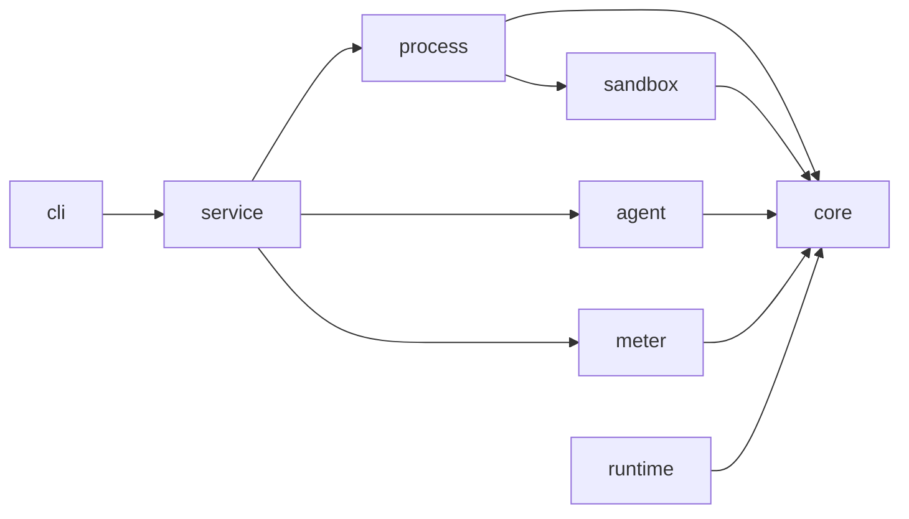
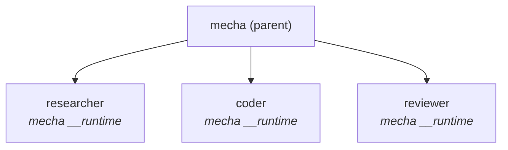

# Architecture

Technical overview of Mecha's internal architecture.

## Package Structure

Mecha is a TypeScript monorepo with 9 packages:

```
@mecha/core       ← Types, schemas, validation, ACL engine, identity (Ed25519)
@mecha/process    ← ProcessManager: spawn/kill/stop, port allocation, sandbox hooks
@mecha/runtime    ← Fastify server per CASA: sessions, chat SSE, MCP tools
@mecha/service    ← High-level API: casaSpawn, casaChat, casaFind, routing
@mecha/agent      ← Inter-node HTTP server for mesh routing
@mecha/sandbox    ← OS-level isolation: macOS sandbox-exec, Linux bwrap
@mecha/meter      ← Metering proxy: cost tracking, budgets, events
@mecha/cli        ← Commander-based CLI: 40+ commands
@mecha/dashboard  ← Next.js web UI (Phase 7)
```

### Dependency Graph



## Process Model

Each CASA is a child process of the `mecha` CLI:



The single `mecha` binary serves dual duty:
- **CLI mode** — when invoked with commands (`mecha spawn`, `mecha chat`)
- **Runtime mode** — when invoked as `mecha __runtime` (spawned internally as a child process)

This is how the bun single-binary distribution works — no separate runtime binary needed.

## Request Flow

### Chat Request

```mermaid
sequenceDiagram
  participant User as User (terminal)
  participant CLI as mecha CLI
  participant CASA as coder CASA (:7700)

  User->>CLI: mecha chat coder "refactor auth"
  CLI->>CLI: Parse args, read config.json
  CLI->>CASA: POST /api/sessions<br/>Authorization: Bearer &lt;token&gt;
  CASA-->>CLI: SSE stream
  Note right of CASA: progress: "Reading files..."<br/>assistant: "I'll refactor..."
  CLI-->>User: Print streamed response
```

### Mesh Query

```mermaid
sequenceDiagram
  participant coder as coder (alice)
  participant router as Alice Router
  participant agent as Bob Agent Server (:7660)
  participant analyst as analyst (bob)

  coder->>router: mesh_query("analyst@bob", ...)
  router->>router: ACL check: coder → analyst@bob → query
  router->>router: Resolve "bob" → host, port, apiKey
  router->>agent: POST /casas/analyst/query<br/>Bearer &lt;bob-api-key&gt;<br/>X-Mecha-Source: coder@alice
  agent->>agent: Validate auth + ACL
  agent->>analyst: Forward query
  analyst-->>agent: Response
  agent-->>router: Response
  router-->>coder: MCP tool result
```

## Data Storage

All state is plain files — no databases:

| Data | Format | Location |
|------|--------|----------|
| CASA config | JSON | `~/.mecha/<name>/config.json` |
| CASA state | JSON | `~/.mecha/<name>/state.json` |
| Sessions | JSONL + JSON | `~/.mecha/<name>/home/.claude/projects/` |
| Logs | Text | `~/.mecha/<name>/logs/` |
| ACL rules | JSON | `~/.mecha/acl.json` |
| Node registry | JSON | `~/.mecha/nodes.json` |
| Auth profiles | JSON | `~/.mecha/auth/profiles.json` |
| Identity | PEM | `~/.mecha/identity/` |
| Meter events | JSONL | `~/.mecha/meter/events/` |
| Meter snapshot | JSON | `~/.mecha/meter/snapshot.json` |
| Budgets | JSON | `~/.mecha/meter/budgets.json` |

All file writes use atomic tmp+rename to prevent corruption on crash.

## Quality Gates

Every change must pass before merge:

```bash
pnpm test           # 1500+ tests
pnpm test:coverage  # 100% statements, branches, functions, lines
pnpm typecheck      # tsc -b (strict TypeScript)
pnpm build          # clean compilation
```
